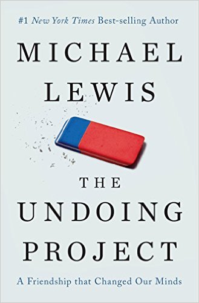

```{r setup, include=FALSE}
knitr::opts_chunk$set(echo = FALSE)
```

---

- Erik Gahner Larsen

- egl@sam.sdu.dk

- Videnskabelig assistent

---


# Dagsorden

- Praktisk information
    - Læseplan
    - Pensum
    - Eksamen

- Introduktion til adfærdsorienteret offentlig politik
    - Adfærdsorienterede perspektiver på menneskelig adfærd
    - Implikationer for offentlig politik

# Hvem er I?

- Navn
- **Studie/semester** 
- Interesser

# Læseplan

- Læseplanen er at finde på Blackboard
- Indeholder vigtige informationer
    - Information omkring de 15 lektioner
    - Information omkring eksamen
    - Henvisning til fagbeskrivelsen
- Vil blive opdateret i løbet af faget

# Faget: Fem blokke

1) Introduktion
2) Heuristikker og biases
3) Motivation og værdier
4) Applikation
5) Praktiske aspekter

# Undervisningsgange: Introduktion

1) **Introduktion: Adfærdsorienteret offentlig politik**
2) Introduktion: Dual process teori
3) Introduktion: Nudging

# Undervisningsgange: Heuristikker og biases

4) Heuristikker og biases: Introduktion
5) Heuristikker og biases: Evalueringer og opfattelser
6) Heuristikker og biases: Beslutninger og valg

--- 


# Undervisningsgange: Motivation og værdier

7) Motivation og værdier: Intrinsisk og ekstrinsisk motivation
8) Motivation og værdier: Grupper og sociale normer
9) Motivation og værdier: Tidspræferencer og hyperbolsk diskontering

# Undervisningsgange: Applikation

10) Applikation: Penge, opsparing og skat
11) Applikation: Samfund, miljø og velfærd
12) Applikation: Gæsteforelæsning

# Undervisningsgange: Praktiske aspekter

13) Praktiske aspekter: Metode og den politiske beslutningsproces
14) Praktiske aspekter: Etiske og metodiske overvejelser
15) Praktiske aspekter: Opsummering og eksamen

# Pensum


# Pensum


# Pensum

```{r pensum, fig.width=6, fig.height=4, fig.cap="Den kumulative læsemængde i faget", echo=FALSE}
library("ggplot2")

l1 <- 25+12+6+23+3+1
l2 <- 11+8+10+9+11+8+10+8+8
l3 <- 1+18+24+14+22+10+20+18
l4 <- 10+10+8+9+10+10+9+10+10
l5 <- 10+13+12+11+10+13+4
l6 <- 9+11+11+10+12+12+8+11+10+13
l7 <- 29+17+20+20
l8 <- 12+16+34
l9 <- 51+6+15
l10 <- 24+15+12+11+12
l11 <- 32+17+9+8+13
l12 <- 5+5+8+20+26
l13 <- 35+28+23
l14 <- 44+41
l15 <- 22+8+18+2

df <- data.frame(x = 1:15, y = c(l1,l2,l3,l4,l5,l6,l7,l8,l9,l10,l11,l12,l13,l14,l15))

ggplot(df, aes(x=x, y=cumsum(y))) +
  geom_line() +
  geom_point(size = 6, colour = "white") +
  geom_point(size = 3, shape = 1) +
  scale_y_continuous("Sider", breaks=cumsum(df$y)) +
  scale_x_continuous("Lektion", breaks=1:15) +
  theme_minimal()

```

# Slides

- Kommer på Blackboard/online

- *Efter* lektionen

- Format: `.pdf` (ikke `.ppt` eller `.doc`)

# Eksamen

- Prøveform: 77-timers individuel, skriftlig hjemmeopgave

- Eksamensbetingelser: Ingen

- *Alle* hjælpemidler tilladt

- Eksamensopgavens formål: 
    - Vise at I kan: redegøre for, anvende og diskutere teorier der gennemgås i pensum/lektionerne på en problemstilling i offentlig politik

# Evaluering (udklip)

- Har du sat dig ind i fagets fagbeskrivelse?

- Har underviseren introduceret til fagets fagbeskrivelse?

- Har den valgte litteratur sikret dig en god forståelse og et fagligt udbytte af faget?

- Har de valgte arbejdsformer og læringsaktiviteter bidraget til at give dig en god forståelse og et fagligt udbytte af undervisningen?

- Er du informeret om, hvad der forventes af dig til eksamen?

- Kan du se sammenhængen mellem arbejdsformer og aktiviteter i undervisningen og den valgte eksamensform?

# Pensum til i dag

- Wilson (2011): The Contribution of Behavioral Economics to Political Science (25 sider)
- Amir et al. (2005): Psychology, Behavioral Economics, and Public Policy (12 sider)
- van der Linden et al. (2015): Improving Public Engagement With Climate Change: Five “Best Practice” Insights From Psychological Science (6 sider)
- Schnellenbach og Schubert (2015): Behavioral political economy: A survey (23 sider)
- Thaler (2013): Public Policies, Made to Fit People (3 sider)
- Bæksgaard (2016): Vil Sophie Løhde kopiere Obamas puffevåben? (1 side)

# Hvad går faget ud på?

](newyorker.png)

# Adfærdsorienteret offentlig politik

- Adfærdsorienterede perspektiver på offentlige politikker
    - Anvendelse af psykologisk og økonomisk forskning

- _Behavioral economics_
    - Adfærdsøkonomi: Anvendelsen af psykologisk forskning i udviklingen af økonomisk teori
    - Loewenstein et al. (2008): "Behavioral economics: a subdiscipline of economics that incorporates more psychologically realistic assumptions to increase the explanatory and predictive power of economic theory" (s. 649)
        
- Adfærdsøkonomi + offentlig politik = adfærdsorienteret offentlig politik

# Adfærdsøkonomi og offentlig politik

- Hvorfor inddrage psykologisk realistiske antagelser?
    - For bedre at forstå effekterne af offentlige politikker
    - Forkerte antagelser kan få os langt, men ikke langt nok

- Vigtigt med bedre teoretiske perspektiver på, hvordan mennesker agererer i relation til offentlige politikker

- Dan Ariely (citeret i Information):
      »Hver gang du laver politik, har du en teori om den person, som politikken rammer. Det gælder alt fra kriminalitet til skattebetaling. Hvis du har den forkerte teori om den person, er oddsene for at du får en held med politikken meget lille. Du bliver nødt til at lave politik, der medregner menneskets natur. Derfor har adfærdsøkonomi en kæmpe rolle at spille der.«

# Adfærdsorienteret offentlig politik, opsummeret

- **Behavioral public policy**
    - Adfærdsøkonomi med et fokus på offentlig politik

- Adfærdsorienterede perspektiver på offentlig politik
    - Politologi, økonomi, psykologi, sociologi, jura

- Camerer (1999): "Behavioral economics can also provide a more realistic and thoughtful basis for making economic policy. Because rational people make few mistakes, policies aren’t necessary to help them. Relaxing rationality assumptions therefore permits reasoned argument about how people can be helped." (s. 10577)

---

- Meget oppe i tiden (cf. dagens Politiken)

- Nyt tidsskrift i år


# Kært barn har mange navne

- _Behavioral economics_, adfærdsøkonomi

- _Behavioral public policy_, adfærdsorienteret offentlig politik

- Relaterede felter
    - _Behavioral political economy_
        - Fokus på politikere og andre politiske aktører
    - _Behavioral public administration_
        - Fokus på administration og forvaltning

# Hvorfor fokus på adfærdsorienteret offentlig politik?

- Efterspørgsel efter evidensbaseret offentlig politik
    - Randomiserede kontrollerede studier

- Den finansielle og økonomiske krise
    - Ressourceudnyttelse
    - Kritik af traditionel økonomisk teori

- Interesse for psykologisk forskning i andre discipliner
    - Daniel Kahneman, Nobelpris i økonomi

---




# Udgangspunkt: Rationelle borgere

- Traditionel offentlig politik anvender bestemte antagelser

- Udgangspunktet for mange offentlige politikker: borgerne er rationelle

- Antagelser om rationelle borgere, især anvendt af økonomer:
    - Bayesiansk bearbejdning af information
    - Veldefinerede og stabile præferencer
    - Nyttemaksimerende
    - Drevet af egeninteresse
    - Eksponentiel diskontering af fremtidig nytte
    - Fokus på absolutte udfald, ikke ændringer
    - Information og evalueringer har instrumentel funktion

# Udgangspunkt: Rationelle borgere

- Rationelle borgere har komplette præferencer

- Borgere kan - rationelt - sammenligne forskellige alternativer 
    - A>B, B>A, eller A=B

- Hvis en borger kan vælge mellem A og B, og borgeren vælger A, så foretrækkes A frem for B

- Borgere har transitive præferencer
    - Hvis A>B og B>C, så A>C

# Offentlig politik med rationelle borgere

- Implikationer
    - Borgerne ved godt, hvad de vil have
    - Borgeren ved godt, hvordan de bedst får det

- Borgerne er kompetente
    - Offentlige politikker spiller en begrænset rolle

- Hvad skal regeringen stå for?
    - Omfordeling, redistribution
    - Hindre markedsfejl (negative eksternaliteter)

# Udfordringen i offentlig politik

- Borgerne er ikke rationelle
    - Offentlige politikker indrettet til rationelle borgere har ikke nødvendigvis de tilsigtede effekter
    - Offentlige politikker kan indrettes bedre

- Ikke nødvendigvis et demokratisk problem, at borgerne ikke er rationelle
    - Hvis politikere, embedsmænd osv. har mere information og kigger mere fremadrettet

- Borgere har begrænsninger ift. opmærksomhed, tid, information osv.

# Udfordringen i offentlig politik

- Borgerne er ikke rationelle
    - ... men økonomiske modeller holder ofte
        - ikke enten eller

- Ikke stokastisk, men systematisk
    - Begrænset rationalitet (cf. Herbert Simon), men også noget vi kan forklare systematisk

- Hvordan afviger borgerne fra det rationelle ideal? 
    1) Ikke-standard præferencer
    2) Ikke-standard/ukorrekte opfattelser
    3) Ikke-standard beslutninger


# Afvigelser: Ikke-standard præferencer

- Forskellige typer af præferencer
    - Tidspræferencer
    - Risikopræferencer
    - Sociale præferencer

# Afvigelser: Ikke-standard/ukorrekte opfattelser

- Forskellige forhold, der påvirker opfattelser
    - Forkerte forudsigelser
        - Konvergens mellem nutidige og fremtidige præferencer
    - Overvurdering af egne evner
    - 'Gambler’s fallacy'
    - Heuristikker

# Afvigelser: Ikke-standard beslutninger

- Forskellige forhold, der påvirker beslutninger
    - Framing
    - Heuristikker
        - Komplekse beslutninger bliver gjort simple
    - Socialt pres
    - Følelser 

# Psykologi i adfærdsøkonomisk forskning

- Tre overoverdnede discipliner (og deres anvendelse)
    1) Perceptionspsykologi
        - Hvordan borgerne ser og fortolker verden
    2) Socialpsykologi
        - Hvordan adfærd og opfattelser påvirkes af den sociale kontekst
    3) Kognitionspsykologi
        - Hvordan tankeprocesser finder sted og beslutninger træffes

# Implikationer for den offentlige politik

- Politikerne kan udnytte, at borgerne ikke er rationelle

1) Borgerne er ligeglade
    - Ligeglade med viden om hvordan politikker fungerer - og hvilke der fungerer bedst

2) Borgerne er nærsynet
    - Kigger ikke langt frem eller tilbage i tid

3) Borgerne ved ikke hvad der er relevant information
    - Kan ikke altid adskille begivenheder og dermed vurdere hvad der er politikernes skyld 

4) Borgerne er motiveret/_biased_
    - Partipolitiske motivationer

# Implikationer for den offentlige politik

- Politikerne har muligheder for at påvirke borgerne med offentlige politikker på andre måder, end traditionel økonomisk teori foreskriver

- Regler og regulering er ikke det eneste politiske værktøj, politikere og embedsmænd har til rådighed

- "There has been the assumption that central government can only change people’s behaviour through rules and regulations. Our government will be a much smarter one, shunning the bureaucratic levers of the past and finding intelligent ways to encourage support and enable people to make better choices for themselves." (David Cameron og Nick Clegg, 2010)

- Økonomer har været førende i at rådgive politikere i forhold til offentlig politik
     - Politologer, psykologer, sociologer m.v. inddrages mere

# Libertariansk paternalisme

- Borgerne træffer irrationelle valg, men vil gerne træffe bedre valg

- Offentlige politikker kan indrettes således, at de hjælper borgerne
    - *Uden* at tage frihed frihed fra borgeren

- Normalt diskuteret i relation til nudging (men ikke det samme!)

- Hvordan? Ændre *frames*, *default options* m.v.

# Eksempel: pensionspolitik

- En borger med problemer med at spare op, vil gerne hjælpes
    - Pensionspolitikker kan indrettes derefter

- Udfordring: Hvis der kommer en lønstigning, vil borgeren gerne have mere i løn eller spare mere op?
    - Hvad kan man gøre for at hjælpe borgeren?
        - Hint: Save More Tomorrow

# Anvendelsen af psykologiske indsigter: klimaforandringer

- van der Linden et al (2015): Improving Public Engagement With Climate Change

- Fem simple men vigtige _guidelines_ for, hvad offentlige politikker skal tage højde for
    1. Personlig erfaring slår statistik
    2. Gruppenormer har en vigtig betydning
    3. Aktuel information vejer mest (psykologisk distance)
    4. Der er forskel på tab og gevinster
    5. Der er flere måder at motivere en borger på (mere end penge)

# Metodiske refleksioner

- Evidensbaseret politik
    - Eksperimentel metode som et ideal

- Mange studier, men...
    - Især fra USA, lader sig ikke nødvendigvis generalisere til en amerikansk kontekst
    - Varierende kvalitet

# Dagens diskussion

1) Overvej hvor klassiske økonomiske antagelser giver mindst mening i offentlig politik
    a) Hvordan kan mere "realistiske" antagelser hjælpe os?

- Diskuter med din sidemand

# Opsummering

- Borgerne er komplekse, offentlige politikker er komplekse og den politiske beslutningsproces er kompleks

- Ikke simple svar, ej heller simple antagelser

- Borgerne er ikke (altid) rationelle
    - Implikationer for den offentlige politik

- Hovedfokus i adfærdsorienteret offentlig politik
    - Adfærdsorienterede perspektiver på offentlige politikker
        - _(Behavioral) economics, public policy, political economy, administration_

# Næste gang

- Introduktion: Dual process teori

- Onsdag den 15. februar

- Pensum
    - Kahneman (2011): The Characters of the Story, kapitel 1 (11 sider) 
    - Kahneman (2011): Attention and Effort, kapitel 2 (8 sider)
    - Kahneman (2011): The Lazy Controller, kapitel 3 (10 sider)
    - Kahneman (2011): The Associative Machine, kapitel 4 (9 sider)
    - Kahneman (2011): Cognitive Ease, kapitel 5 (11 sider)
    - Kahneman (2011): Norms, Surprises, and Causes, kapitel 6 (8 sider)
    - Kahneman (2011): A Machine for Jumping to Conclusions, kapitel 7 (10 sider) 
    - Kahneman (2011): How Judgments Happen, kapitel 8 (8 sider)
    - Kahneman (2011): Answering an Easier Question, kapitel 9 (8 sider)

