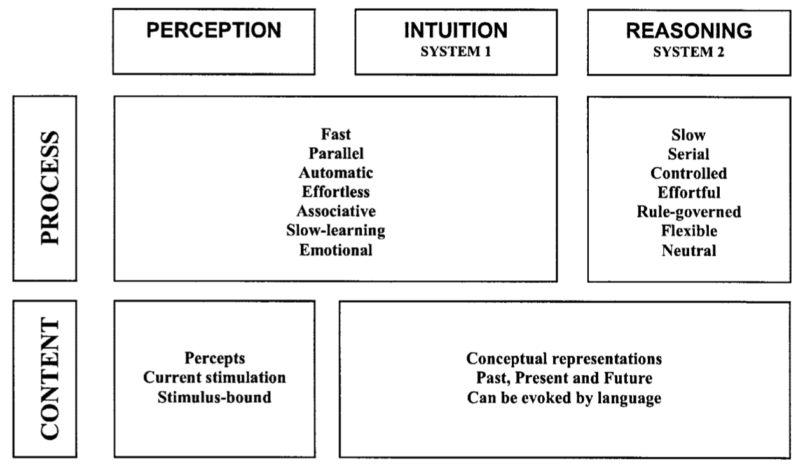
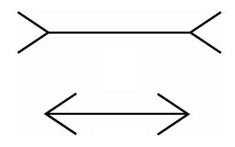
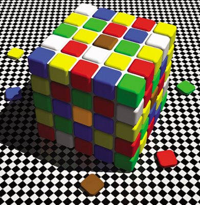
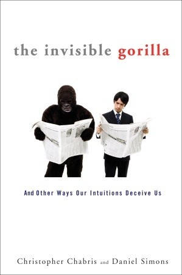
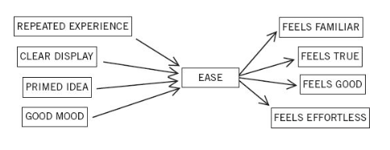
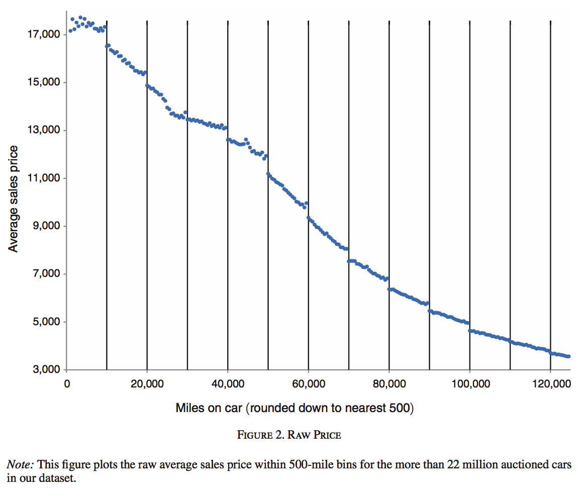

```{r setup, include=FALSE}
knitr::opts_chunk$set(echo = FALSE)
```


# Dagsorden

- Praktisk information
    - Fagbeskrivelse
    - Eksamen

- Opsamling

- Dual process teori
    - Logikken bag System 1 og System 2
    - Relationen mellem System 1 og System 2

# Læseplan

- Opdateret læseplan er at finde på Blackboard
- Indeholder vigtige informationer
    - Information omkring de 15 lektioner
    - Information omkring eksamen
    - Henvisning til fagbeskrivelserne
        - Begge to!
- Vil blive (og er blevet) opdateret i løbet af faget

# Pensum

- For 4. semesters samfundsfagsstuderende:
    - 800 sider

- For kandidatstuderende:
    - 1200 sider

- Forskelle er angivet i læseplanen (med *)

# Eksamen

- Fælles for alle:
    - Prøveform: skriftlig hjemmeopgave
    - Eksamensbetingelser: Ingen
    - *Alle* hjælpemidler tilladt

# Eksamen, synopsis

- For 4. semesters samfundsfagsstuderende: synopsis

- Kan danne grundlag for bachelorprojekt

- Skal indeholde skitse til: 
    - problemformulering
    - teoretisk tilgang
    - metode
    - forventede konklusioner

# Undervisningsgange

2) **Introduktion: Dual process teori**
3) Introduktion: Nudging
4) Heuristikker og biases: Introduktion
5) Heuristikker og biases: Evalueringer og opfattelser
6) Heuristikker og biases: Beslutninger og valg
7) Motivation og værdier: Intrinsisk og ekstrinsisk motivation
8) Motivation og værdier: Grupper og sociale normer
9) Motivation og værdier: Tidspræferencer og hyperbolsk diskontering
10) Applikation: Penge, opsparing og skat
11) Applikation: Samfund, miljø og velfærd
12) Applikation: Gæsteforelæsning
13) Praktiske aspekter: Metode og den politiske beslutningsproces
14) Praktiske aspekter: Etiske og metodiske overvejelser
15) Praktiske aspekter: Opsummering og eksamen

# Pensum til i dag


# Pensum til i dag

- Kahneman (2011): The Characters of the Story, kapitel 1 (11 sider) 
- Kahneman (2011): Attention and Effort, kapitel 2 (8 sider)
- Kahneman (2011): The Lazy Controller, kapitel 3 (10 sider)
- Kahneman (2011): The Associative Machine, kapitel 4 (9 sider)
- Kahneman (2011): Cognitive Ease, kapitel 5 (11 sider)
- Kahneman (2011): Norms, Surprises, and Causes, kapitel 6 (8 sider)
- Kahneman (2011): A Machine for Jumping to Conclusions, kapitel 7 (10 sider) 
- Kahneman (2011): How Judgments Happen, kapitel 8 (8 sider)
- Kahneman (2011): Answering an Easier Question, kapitel 9 (8 sider)


# Opsamling

- I offentlig politik laver vi antagelser om borgerne
    - Hvorfor?
        - For at forudsige adfærd

- Traditionelt perspektiv i offentlig politik
    - Rationelle borgere med ...
        - ... nyttemaksimerende motiver
        - ... præferencer drevet af egeninteresse
        - ... veldefinerede og stabile præferencer

- Realistiske antagelser?
    - Urealistiske antagelser $\rightarrow$ urealistiske/forkerte forudsigelser

# Opsamling

- Borgere er ikke altid rationelle
    1) Ikke-standard præferencer
        - Tidspræferencer, risikopræferencer, sociale præferencer
    2) Ikke-standard opfattelser
    3) Ikke-standard beslutninger

- Tre overoverdnede discipliner, vi kigger på
    1) Perceptionspsykologi
        - Hvordan borgerne ser og fortolker verden
    2) Socialpsykologi
        - Hvordan adfærd og opfattelser påvirkes af den sociale kontekst
    3) Kognitionspsykologi
        - Hvordan tankeprocesser finder sted og beslutninger træffes

# Opsamling

- Traditionelt perspektiv: rationel adfærd i offentlig politik
- Nyere perspektiv: adfærdsorienteret offentlig politik
- Takeaway message:
    - Borgere er ikke altid rationelle (bruger ikke altid System 2)
    - Kognitive begrænsninger m.v.
    - Implikationer for offentlige politikker
- I dag: et skridt tilbage
    - Teoretisk ramme/model
        - Heuristisk model for kognitionens arkitektur
        - Vores fokus: dual process teori

# Heuristikker og biases

- Fokus i senere lektioner, men et par termer
    - Bias: systematisk fejl
    - Heuristik: tommelfingerregel

- Brugen af heuristikker resulterer i forudsigelige biases i forudsigelser/gæt

- Heuristikker er ikke altid problematiske
    - Tversky og Kahneman (1974): "In general, these heuristics are quite useful, but sometimes they lead to severe and systematic errors” (p. 1124).

# Kognitionens arkitektur: Dual process teori

- To systemer der laver vurderinger og træffer beslutninger
    - System 1: automatisk (hurtigt), intuition
    - System 2: kontrolleret (langsomt), ræsonnere

- Ikke alle vurderinger laves kontrolleret og langsomt, men via System 1
    - De fleste vurderinger laves intuitivt
    - Den måde intuitive vurderinger laves følger samme principper som perception
        - Derfor flere visuelle eksempler i pensum

- Kognitive biases kan finde sted i både System 1 og System 2

# Hvorfor dual process teori?

- Generelt framework, teoretisk ramme
    - Ikke nødvendigvis en 1:1 skildring af virkeligheden

- Anvedeligt i senere lektioner
    - Implikationer for offentlige politikker
    - Forståelse af, hvordan borgerne tænker 

# Dual process teori: System 1


# Dual process teori: System 1

- System 1 opererer automatisk og hurtigt med lille eller ingen indsats

- System 1 laver associationer hurtigt, ofte med følelser, drevet af vaner
    - Kan være svære at kontrollere og ændre ("_old habits die hard_")

- Mange beslutninger kræver ikke større overvejelser
    - Kræver ikke kognitivt krævende refleksioner

- Evolutionært: Vigtigt hurtigt at kunne vurdere om noget er godt (som skal opnås) eller dårligt (som skal undgås)

# Karakteristika ved System 1

- Genererer indtryk og følelser som, når godkendt af System 2, bliver til opfattelser, holdninger og hensigter

- Opererer automatisk og hurtigt med ingen eller minimal indsats

- Udfører kompetente reaktioner og intuitioner

- Skaber et sammenhængende mønster af aktiverede ideer 

- Forbinder en kognitiv lethed til bestemte følelser og opfattelser

- Adskiller det overraskende fra det normale

- Kan programmeres af System 2 til at rette opmærksomhed mod noget når et bestemt mønster opdages

- Infererer og opfinder årsager og motiver

# Karakteristika ved System 1

- Ignorerer tvetydighed og undertrykker tvivl

- Er _biased_ til at bekræfte

- Overdriver emotionel konsistens (_halo effekt_)

- Fokuserer på eksisterende evidens og ignorerer fraværende evidens (WYSIATI)

- Bruger heuristikker

- Er mere sensitivt til relative forandringer (_prospect theory_)

- Overvurderer små sandsynligheder

- Viser aftagende sensitivitet til kvantitet (er ikke god til statistik)

- Reagerer stærkere på tab end på gevinster (_loss aversion_)

# System 1, eksempler

- Se at et objekt er længere væk end et andet

- Orientere i retning af en pludselig lyd

- Spore fjendtlighed i en stemme

- Udregne 2+2

- Læse simple ord

- Køre bil på en tom vej

- Finde et godt træk i skak (hvis du er god til skak)

- Forstå simple sætninger

# System 2


# Dual process teori: System 2

- System 2 allokererer opmærksomhed til kognitivt krævende aktiviteter

- System 2 operationer er:
    - bevidste/kontrolleret
    - langsommere
    - serielle
    - kognitivt krævende

- System 2 er involeret i alle evalueringer
    - System 1 genererer indtryk, men disse bliver til vurderinger gennem System 2

# System 2, eksempler
- Fokusere på stemmen af en specifik person i et rum

- Se efter en kvinde med hvidt hår

- Søge i hukommelsen for at genkende en bestemt lyd

- Gå i et hurtigere tempo end naturligt

- Give svaret på 50 * 149

- Rette opmærksomhed mod en klovn i et cirkus

- Sørge for at opføre sig passende i en social situation

- Tælle antallet af a'er på en side i en tekst

- Fortælle nogen dit telefonnummer

- Lave en svær parkering 

- Sammenligne to vaskemaskiner på forskellige parametre

- Udfylde skattepapirer

- Undersøge validiteten af et komplekst logisk argument

# Karakteristika ved System 1 og System 2

| System 1    | System 2     |
|-------------|--------------|
| Hurtigt     | Langsomt     |
| Parallelt   | Serielt      |
| Automatisk  | Kontrolleret |
| Nemt        | Svært        |
| Associativt | Regler       |
| Emotionelt  | Neutralt     |
| Holistisk   | Analytisk    |
| Social      | Asocial      |

# Forskellige dual process teorier (Stanovich og West 2000)

|               | System 1                   | System 2                   |
|---------------|----------------------------|----------------------------|
| Sloman        | associative system         | rule-based system          |
| Evans         | heuristic processing       | analytic processing        |
| Evans & Over  | tacit thought processes    | explicit thought processes |
| Reber         | implicit cognition         | explicit learning          |
| Levinson      | interactional intelligence | analytic intelligence      |
| Epstein       | experiential system        | rational system            |
| Pollock       | quick modules              | intellection               |
| Hammond       | intuitive cognition        | analytical cognition       |
| Johnson-Laird | implicit inferences        | explicit inferences        |

---



---



---




# Opmærksomhed og begrænsede ressourcer 

- Borgere kan ikke fokusere på mange opgaver samtidigt 
    - To opgaver i System 2 samtidigt? Nej

- Den samlede kapacitet er begrænset

- Opgaver i System 2 afbryder hinanden, flere opgaver kan finde sted parallelt i System 1

- System 2 monitorerer aktiviteterne i System 1 
    - Eksempel: ``A bat and a ball cost \$1.10 in total. The bat costs \$1 more than the ball. How much does the ball cost?'' 
        - Hvis System 2 har gang i flere opgaver (evt. at huske en liste med ord), vil sandsynligheden for et forkert svar stige
  
---



# Relation mellem System 1 og System 2: Intuition og accept

- Når system 1 møder problemer, tages system 2 i brug

- Ting der giver intuitivt mening (System 1) har vi med at acceptere (System 2)

- Arbejdsdelingen mellem systemerne er meget effektiv

- Konflikter kan opstå
    - Eksempler i pensum med tekst til højre og venstre

# Hvornår tager System 1 over? 

- Flere forskellige kognitivt krævende opgaver
- Tidspres
- Stress (biologisk)
- Følelsesladet
- Individuelle forskelle
    - Intelligens, need for cognition
- Tilgængelighed (kan læres)

# Hvornår tager System 1 over? Kognitiv lethed




# Hvornår tager System 1 over? Også når der er penge involveret

- Lacetera et al. ([2012](https://www.aeaweb.org/articles?id=10.1257/aer.102.5.2206)): Heuristic Thinking and Limited Attention in the Car Market

- Argument: Købere er biased i deres køb af bil

- Data: Auktionssalg af 27. mio brugte biler, USA, januar 2002-september 2008

- "These findings reveal that information-processing heuristics matter even in markets with large stakes and easily observed information. We model left-digit bias in an inattention framework and structurally estimate the inattention parameter."

---




# Implikationer for offentlig politik

- Borgerne bruger ikke udelukkende System 2
    - Mange politikker er designet således

- Offentlige politikker skal tage hensyn til, at borgerne bruger System 1 og System 2

- Forskellige måder hvorpå det kan gøres
    - Nudging (næste gang)

# Dagens diskussion

Vi vil gerne have folk til at bruge System 2 mere end System 1, når de får informationer fra det offentlige (evt. via mail)

1) Forestil at du skal stå for at udarbejde informationsmateriale, der skal informere dagpengemodtagere om nye regler. Hvordan kan dette gøres bedst i en mail?
    - Hvordan kan det gøres mindre kognitivt ressourcekrævende?
    - Hvordan kan man sørge for at borgeren bruger System 2 og ikke System 1? 

- Diskuter med din sidemand

# Begrænsninger

- Ikke alle studier beskrevet i pensum kan replikeres
    - Vær kritisk! 

- Især i forhold til udsagn som: "The idea you should focus on, however, is that disbelief is not an option. The results are not made up, nor are they statistical flukes. You have no choice to accept that the major conclusions of these studies are true."

- Subliminal priming, øjne der kigger osv. har sandsynligvis ikke så store effekter som beskrevet

# Begrænsninger: Ego depletion

- Argument: "If you have had to force yourself to do something, you are less willing or less able to exert self-control when the next challenge comes around. The phenomenon has been named ego depletion."

- Læs: [Ego depletion, an influential theory in psychology, may have just been debunked](http://www.slate.com/articles/health_and_science/cover_story/2016/03/ego_depletion_an_influential_theory_in_psychology_may_have_just_been_debunked.html):
    - "A paper now in press, and due to publish next month in the journal Perspectives on Psychological Science, describes a massive effort to reproduce the main effect that underlies this work. Comprising more than 2,000 subjects tested at two-dozen different labs on several continents, the study found exactly nothing. A zero-effect for ego depletion: No sign that the human will works as it’s been described, or that these hundreds of studies amount to very much at all."

# Begrænsninger: Kapitel 4 i Thinking, Fast and Slow

- Læs: [Reconstruction of a Train Wreck: How Priming Research Went off the Rails](https://replicationindex.wordpress.com/2017/02/02/reconstruction-of-a-train-wreck-how-priming-research-went-of-the-rails/)
    - "This result confirms Kahneman’s prediction that priming research is a train wreck and readers of his book “Thinking Fast and Slow” should not consider the presented studies as scientific evidence that subtle cues in their environment can have strong e ects on their behavior outside their awareness."

- Læs også Kahnemans kommentar: "What the blog gets absolutely right is that I placed too much faith in underpowered studies."


# Opsummering

- Forskellige logikker bag System 1 og System 2
    - System 1 er _hurtigt_ (thinking fast), System 2 er _langsomt_ (thinking slow)
    
- Ikke tilfældigt hvornår System 2 bruges mere

- Implikationer for offentlig politik
    - Vi kan ikke designe politikker til borgere der udelukkende styres af System 2
    - Nudging er ét blandt flere policy-instrumenter

# Næste gang

- Introduktion: Nudging

- Onsdag den 22. februar

- Pensum
    - Bohannon (2016): Government ‘nudges’ prove their worth (1 side)
    - Thaler og Sunstein (2008): Introduction (18 sider)
    - Thaler og Sunstein (2008): Biases and Blunders, kapitel 1 (24 sider)
    - Thaler og Sunstein (2008): Resisting Temptations, kapitel 2 (14 sider)
    - Thaler og Sunstein (2008): Following the Herd, kapitel 3 (22 sider)
    - Thaler og Sunstein (2008): When Do We Need a Nudge?, kapitel 4 (10 sider)
    - Thaler og Sunstein (2008): Choice Architecture, kapitel 5 (20 sider)
    - _Mols et al. (2015): Why a nudge is not enough: A social identity critique of governance by stealth (18 sider)_