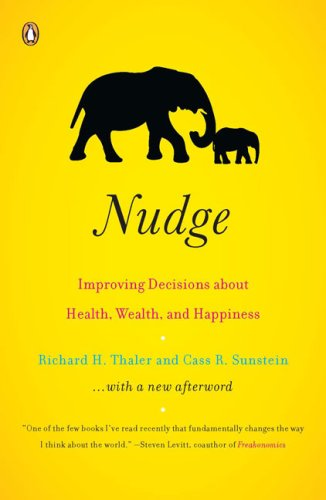
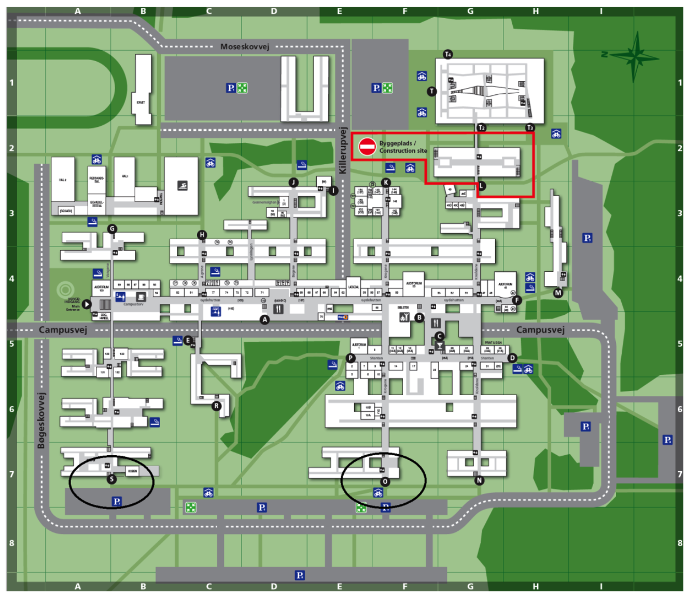
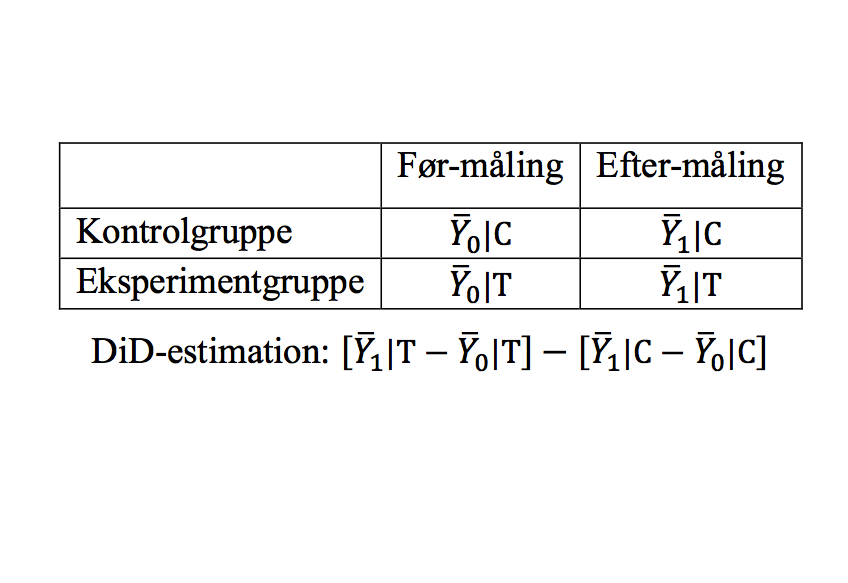

```{r setup, include=FALSE}
knitr::opts_chunk$set(echo = FALSE)
```

# Dagsorden

- Kort om læseplanen/eksamen

- Policy-instrumenter

- Nudging
    - Definition
    - Libertariansk paternalisme
    - Valgarkitektur
    - Eksempler, diskussion og kritik

# Læseplanen

- Opdateres stadig

- Pensum ligger i udgangspunktet fast
    - Ny litteratur vil blive tilføjet som anbefalet videre læsning

- Forslag og kommentarer til pensum modtages gerne
    - For svært? For let? 
    - Noget der mangler?

# Eksamen, synopsis

- Kan afleveres i grupper

- Der bør maksimalt være 3 i en gruppe

- Det _skal_ angives, hvem der har skrevet hvad

# Undervisningsgange

3) **Introduktion: Nudging**
4) Heuristikker og biases: Introduktion
5) Heuristikker og biases: Evalueringer og opfattelser (_dato ikke fastlagt_)
6) Heuristikker og biases: Beslutninger og valg
7) Motivation og værdier: Intrinsisk og ekstrinsisk motivation
8) Motivation og værdier: Grupper og sociale normer
9) Motivation og værdier: Tidspræferencer og hyperbolsk diskontering
10) Applikation: Penge, opsparing og skat
11) Applikation: Samfund, miljø og velfærd
12) Applikation: Gæsteforelæsning
13) Praktiske aspekter: Metode og den politiske beslutningsproces
14) Praktiske aspekter: Etiske og metodiske overvejelser
15) Praktiske aspekter: Opsummering og eksamen


# Pensum til i dag



# Pensum til i dag

- Bohannon (2016): Government ‘nudges’ prove their worth (1 side)
- Thaler og Sunstein (2008): Introduction (18 sider)
- Thaler og Sunstein (2008): Biases and Blunders, kapitel 1 (24 sider)
- Thaler og Sunstein (2008): Resisting Temptations, kapitel 2 (14 sider)
- Thaler og Sunstein (2008): Following the Herd, kapitel 3 (22 sider)
- Thaler og Sunstein (2008): When Do We Need a Nudge?, kapitel 4 (10 sider)
- Thaler og Sunstein (2008): Choice Architecture, kapitel 5 (20 sider)
- _Mols et al. (2015): Why a nudge is not enough: A social identity critique of governance by stealth (18 sider)_

# Opsamling

- Første lektion: Hinsides rationelle aktører i offentlig politik

- Anden lektion: Dual process teori
    - To systemer der laver vurderinger og træffer beslutninger
        - System 1: automatisk (hurtigt), intuition
        - System 2: kontrolleret (langsomt), ræsonnere

- Ikke alle vurderinger laves kontrolleret og langsomt, men via System 1
    - De fleste vurderinger laves intuitivt
    - Ikke tilfældigt hvornår System 2 bruges mere

# Karakteristika ved System 1 og System 2

| System 1    | System 2     |
|-------------|--------------|
| Hurtigt     | Langsomt     |
| Parallelt   | Serielt      |
| Automatisk  | Kontrolleret |
| Nemt        | Svært        |
| Associativt | Regler       |
| Emotionelt  | Neutralt     |
| Holistisk   | Analytisk    |
| Social      | Asocial      |

# Implikationer for offentlig politik

- Borgerne bruger ikke udelukkende System 2
    - Mange politikker er designet således

- Offentlige politikker skal tage hensyn til, at borgerne bruger System 1 og System 2

- Forskellige måder hvorpå det kan gøres
    - Nudging er ét policy-instrument
        - Hvilke andre er der?

# Implikationer for offentlig politik

- Adfærdsøkonomisk forskning har tre implikationer for offentlig politik 
    1) Nye policy-instrumenter
        - Blandt andet _nudges_
    2) Bedre forudsigelser af effekterne af eksisterende politikker
    3) Nye implikationer for vores måde at forstå og diskutere velfærd på

# Politiske værktøjer/policy-instrumenter

- Der er forskellige måder at bruge offentlige politikker (_governance_)
    1) Hierarki
        - Regler, frygt for straf
    2) Marked
        - Incitamenter, maksimering af penge
    3) Netværk
        - Selvregulering, involvering
    4) Overbevisning/_persuasion_
        - Transformation af overbevisninger
    5) Nudging
        - Libertariansk paternalisme

# Hvad er et nudge?

- Et policy-instrument hvor man forsøger at påvirke menneskelig adfærd:
    - uden at reducere valgmulighederne 
    - uden at gøre det økonomisk dyrere
    - uden at indføre sanktioner
    - ved at udnytte kognitive biases og heuristikker

- Nudging: borgerne skal kunne træffe valg, men have 'hjælp til' at træffe 'rigtige' valg
    - Forskellige definitioner af nudging
    - Teoretisk udgangspunkt: Dual process teori
    - Normativt udgangspunkt: Libertariansk paternalisme

# Hvad er et nudge?

- Thaler og Sunstein (grundbogen):
    - "A nudge ... is any aspect of the choice architecture that alters people's behavior in a predictable way without forbidding any options or significantly changing their economic incentives. To count as a mere nudge, the intervention must be easy and cheap to avoid. Nudges are not mandates. Putting the fruit at eye level counts as a nudge. Banning junk food does not." (p. 6)

- Halpern ([2015](https://www.amazon.com/Inside-Nudge-Unit-Changes-Difference/dp/0753556553)):
    - "A ‘nudge’ is essentially a means of encouraging or guiding behaviour, but without mandating or instructing, and ideally without the need for heavy financial incentives or sanctions."

# Hvad er et nudge?

- Hausman and Welch (2010): 
    - "Nudges are ways of influencing choice without limiting the choice set or making alternatives appreciably more costly in terms of time, trouble, social sanctions, and so forth. They are called for because of flaws in individual decision-making, and they work by making use of those flaws." (p. 126)

- Hansen (2016): 
    - "A nudge is a function of the choice architecture that alters people’s behaviour in a predictable way (1) that is called for because of cognitive boundaries, biases, routines, and habits in individual and social decision-making and which (2) works by making use of those boundaries, biases, routines, and habits as integral parts of the choice architecture. Thus a nudge amongst other things works independently of: (i) forbidding or adding any rational relevant choice options, (ii) changing incentives, whether regarded in terms of time, trouble,
social sanctions, economic and so forth, or (iii) the provision of factual information or rational argumentation." (p. 16)

# _Libertariansk_ paternalisme

- Libertarianisme 
    - Beslægtet med liberalisme
    - Mennesker ved bedst, hvad der er bedst for dem selv
    - De bedste til at træffe valg, er borgerne selv
    - Offentlige politikker: maksimere borgerens frihed til at vælge
        - Friedman: _Free to choose_

# Libertariansk _paternalisme_

- Paternalisme
    - Andens forvaltning af de beslutninger, der angår en selv
    - Mennesker træffer ikke valg, der er gode for dem
        - Borgerne træffer ikke valg, der er i deres egen interesse
    - Mennesker ved godt, hvad der er bedst for dem selv
        - Har brug for hjælp, til at opnå det
    - Offentlige politikker: maksimere borgerens velfærd
    - Paternalisme $\neq$ tvang

# Libertariansk paternalisme

- Thaler og Sunstein: "we are not for bigger government, just for better governance"

- Nudging er libertariansk paternalisme
    - _Libertariansk_ fordi valg ikke er blokeret, gjort betydeligt sværere eller på anden måde forhindret
    - _Paternalistisk_ fordi der arbejdes med at påvirke borgerens valg til det bedre (som vurderet af dem selv)

- Eksempel:
    - Rygning
        - Mange vil gerne stoppe med at ryge
    - Pension
        - Mange vil gerne spare mere op til pension

# Design af offentlig politik: Valgarkitekter

- Offentlige politikker skal indrettes på den bedste måde
    - Ligesom når en arkitekt skal tegne et hus

- Et neutralt design findes ikke
    - Det er ikke muligt _ikke_ at påvirke valg

- En valgarkitekt har ansvar for at organisere den kontekst hvori beslutninger træffes
    - Udarbejde og evaluere interventioner (herunder _nudges_)

- Thaler og Sunstein argumenterer for, at det skal hjælpe de mennesker, der træffer valg, for at være et nudge
    - Altså ikke kun maksimere profit m.v. for dem der designer offentlige politikker

- Vigtige elementer i valgarkitektur: defaults, fejl, feedback og incitamenter

# Valgarkitektur: defaults

- Defaults er standardvalget i et design
    - Det valg folk træffer, hvis de intet gør
        - _Least effort path_

- Offentlige politikker skal designes så standardvalg er det bedste valg for borgeren

- Mere i lektion 6

# Valgarkitektur: fejl

- Borgere laver fejl
    - Adfærdsdesign til System 1
    - Man skal forvente fejl
    
- Offentlige politikker skal designes således at fejl:
    1) Er besværlige at lave (gerne umulige)
    2) Ikke har implikationer for valg, når de laves

# Valgarkitektur: feedback og incitamenter

- Borgere har brug for feedback
    - Kortsigtet og langsigtet feedback

- Incitamenter er ikke ligegyldige
    - Vigtigt at tage højde for hvilken rolle incitamenter spiller
        - Hvem bruger politikken?
        - Hvem vælger politikken?
        - Hvem betaler for politikken?
        - Hvem profiterer på politikken?

# Hvornår nudging?

- Hvornår er der brug for nudging? 
    - Erfaring, information, feedback


- Hvornår skal borgerne nudges? 
    - Hvornår træffer borgerne gode valg?
    - Hvornår træffer borgerne forkerte valg?

- Især når beslutningerne er svære og sjældne

# Hvornår nudging?

- Fordele og omkostninger
    - Når der er en asymmetri hvor omkostningerne først kommer langt ud i tid
        - Kviklån
- Sværhedsgrad 
    - Når det er svært at overskue og sammenligne forskellige alternativer
    - Når det er svært at oversætte alternativer til nytte
- Frekvens
    - Når det er beslutninger man ikke er vant til
- Feedback
    - Når man ikke får hurtig feedback
        - Konsekvenser af usund kost

# Hvorfor virker nudges ikke (altid)?

- Det er ikke selvskrevet, at et nudge vil virke efter hensigten
    - Vigtigt med teori!
    - Vigtigt med evaluering!
        - Ikke tilfældigt hvilken offentlig politik, der bliver evalueret

- Nogle nudges har:
    - Et frustrerende/kompliceret design
    - Kortsigtede effekter
    - Heterogene effekter

# Hvad kan man gøre når nudges ikke virker?

- Tre overordnede muligheder
    1) Lav et bedre nudge
        - Kræver viden om, hvorfor et nudge ikke virkede
    2) Brug et andet policy-instrument
        - Regler, incitamenter m.v.
    3) Gør ingenting
        - Hvis intet af ovenstående virker

# Diskussion: Teori

- Udfordring: Hvor går grænsen for, hvad der tæller som et nudge?

- Gigerenzer (1998): _One-Word Explanations_
    - "The first species of theory surrogate is the one-word explanation. Such a word is a noun, broad in its meaning and chosen to relate to the phenomenon. At the same time, it specifies no underlying mechanism or theoretical structure. The one-word explanation is a label with the virtue of a Rorschach inkblot: a researcher can read into it whatever he or she wishes to see." (p. 2)

- Mols et al. (2015): "many successful nudges are not in fact nudges"


# Diskussion: Teori

- Spørgsmål relateret til afgrænsningen af et nudge:
    - Hvor store skal ændringer i incitamenter være, før der ikke længere er tale om et nudge?
    - Er det at lave en informationskampagne det samme som et nudge?
    - Skal det kunne spores tilbage til en libertariansk paternalistisk tilgang?
    - Kan man tilføje flere valg og stadig kalde det et nudge?
    - Kan man tale om _social nudges_? 

# Diskussion: Teori, social nudges

- Er der forskel på persuasion/social influence og nudging?
    - Mols et al. (2015): "why this topic is important for our purposes is that one of the most effective ways to nudge (for good or evil) is via social influenece" (p. 58)

- To kategorier for _social influence_:
    1) information
    2) gruppepres/_peer pressure_

- Pointe: Diskussion om hvorvidt _social nudges_ er nudges

# Diskussion: Teori, social nudges

- Hvorfor ikke kalde social nudges for nudges?

- Mols et al. (2015): 
    - "Certainly, humans have cognitive limitations and will use cues and heuristics to inform their judgements and behaviour in a range of situations. However, what the cognitive miser perspective overlooks is the fact that humans are social beings who derive meaning and direction from groups whose norms they embrace and enact, and who derive significant value – not only socially, but also intellectually – from identity-affirming behaviour."
    - "[S]ocial influence is an inherently social process; people actively engage with norms and, at times, challenge and question their validity; for lasting behaviour change to occur, people need to internalise norms and use them as guides for their own behaviour; and policy makers should accept the reality and validity of social norms, and work with them rather than against them."
        
# Diskussion: Teori, social nudges

- Mols et al. (2015): 
    - "Specifically, whereas proponents of nudge tactics conceive of humans as fallible decision makers (as per the ‘bounded rationality’ model) and thus as benefitting from nudges (because they prevent erroneous decisions), we propose an approach which recognises that enduring behaviour change involves an identity-change process whereby people proactively choose to engage in behaviour that is perceived as identity-consistent and therefore seen as ‘the right thing to do’. We argue that if policy makers are mindful of this, they are more likely to encourage effective and lasting change."
    - "Even though, according to Thaler and Sunstein (2008) nudging also includes informing ‘people about what other people are doing’, as we will outline below, this is hardly a new insight and has been at the heart of the classic social-psychological literature on social influence."

# Diskussion: Nudgings potentiale

- Kan vi opnå de ønskede målsætninger ved at tappe ind i kognitive biases?
    - Tom Goodwin (2012): "[Nudging is] not an effective strategy for bringing about the kind of behavioural changes required to solve society’s ‘big problems’ – problems around climate change and public health, for example."

- Modargumenter:
    - Ingen har nogensinde påstået det
        - Skal ikke revolutionere verden
    - Større effekter end mange andre policy-instrumenter


# Diskussion: Status quo bias

- Jo mindre effekter nudging har, desto mere vil vi opretholde status quo
    - Når vi ikke fjerner muligheder fra borgerne, opretholder vi status quo

- Nudging kan dermed være en konservativ tilgang (status quo-bevarende)
    - Styrke eksisterende normer for hvad der skal være muligt

# Diskussion: Valgarkitekter

- Valgarkitekter ("_choice architects_") er også mennesker
    - Har de samme kognitive begrænsninger som borgerne
    - Pointe: Valgarkitekter er ikke fejlfri
 
 - Modargument:
    - Valgarkitekter har mere information
    - Valgarkitekter nyder ikke de hurtige fordele
        - Kan se på de langsigtede effekter
    - Valgarkitekter kan eksperimentere med forskellige løsninger

# Diskussion: Etik

- Er nudging etisk forsvarligt? 
    - Manipulation af borgerne?
    
- Ved valgarkitekter hvad der udgør "det gode liv"?

- Hvilke implikationer har det for demokratisk repræsentativitet?

- Mere i lektion 14

# Eksempler: små ændringer på beskeder fra det offentlige

- Nudge: Reference til andre i populationen
    - Besked: "Other parents have had courts lower their child support by \$200 to \$500 per month."
    - Population: Fængslede forældre i Texas
    - Resultat: +11% flere applikationer

- Diskussion
    - Er det et nudge?
    - Er det en stor effekt? 
    - Kan det appliceres på en politik i Danmark?

# Eksempler: små ændringer på beskeder fra det offentlige

- Nudge: Fremhæv tab 
    - Besked: "By not attending your appointment, you may: LOSE up to \$2508 a year in cash benefits."
    - Population: Familier med behov for velfærd i Californien
    - Resultat: +3.6% flere fremmødte

- Diskussion
    - Er det et nudge?
    - Er det en stor effekt? 
    - Kan det appliceres på en politik i Danmark?

# Eksempler: små ændringer på beskeder fra det offentlige

- Nudge: Påmindelser
    - Besked: "Your child support payment is due in 3 days. Pay on time to avoid penalties."
    - Population: Forældre der er forsinket med deres børnebidrag
    - Resultat: +2.9% flere betalinger

- Diskussion
    - Er det et nudge?
    - Er det en stor effekt? 
    - Kan det appliceres på en politik i Danmark?

# Eksempel: gangadfærd

- Afhængig variabel: gangadfærd
    - Udfordring: mange mennesker på gangene
        - Fylder meget, besværligt at komme frem

- Intervention: markører på gangene

- Design: difference-in-difference
    - To gange, intervention på én gang
    - Før og efter måling på begge gange

- Eksempel på, hvordan en opgave kan laves
    - Seminaropgave

---



---


---



# Dagens diskussion

- Diskuter med din sidemand

1) Hvor er potentialet for nudging størst i den offentlige sektor?
    - Hvor er potentialet for nudging _mindst_?

2) Hvordan ville man kunne eksperimentere med forskellige initiativer på SDU? 

# Opsummering

- Forskellige policy-instrumenter

- Nudging er et (relativt) nyt styringsredskab

- Rodfæstet i libertariansk paternalisme (cf. Thaler og Sunstein)

- Diskussion omkring teori
    - Hvad er et nudge?

- Diskussion omkring praksis
    - Metodiske og etiske aspekter

# Opsummering, introduktion

- Tre introduktionsgange:
    1. Introduktion
    2. Dual process teori
    3. Nudging

- Nu er den teoretiske ramme på plads
    - De næste lektioner: heuristikker og biases

# Næste gang

- Heuristikker og biases: Introduktion

- Onsdag den 1. marts

- Pensum
    - Kahneman (2011): The Law of Small Numbers, kapitel 10 (10 sider)
    - Kahneman (2011): Anchors, kapitel 11 (10 sider)
    - Kahneman (2011): The Science of Availability, kapitel 12 (8 sider)
    - Kahneman (2011): Availability, Emotion, and Risk, kapitel 13 (9 sider) 
    - Kahneman (2011): Tom W’s Speciality, kapitel 14 (10 sider)
    - Kahneman (2011): Linda: Less is More, kapitel 15 (10 sider)
    - Kahneman (2011): Causes Trump Statistics, kapitel 16 (9 sider)
    - Kahneman (2011): Regression to the Mean, kapitel 17 (10 sider)
    - Kahneman (2011): Taming Intuitive Predictions, kapitel 18 (10 sider)