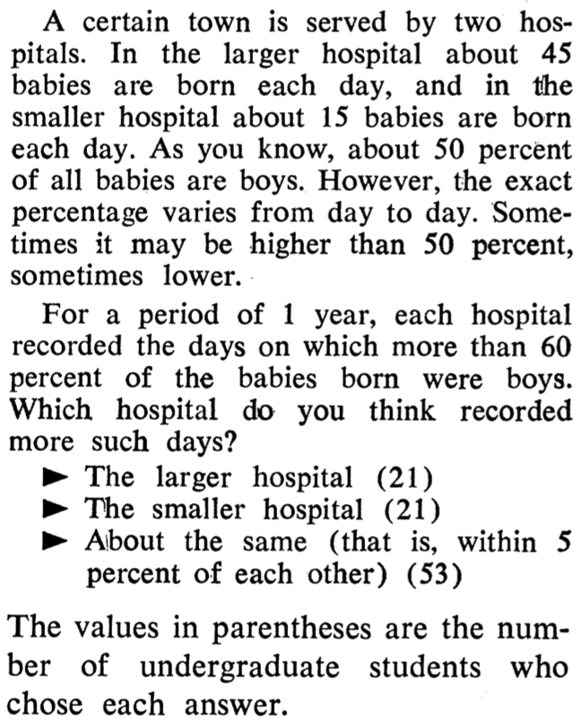
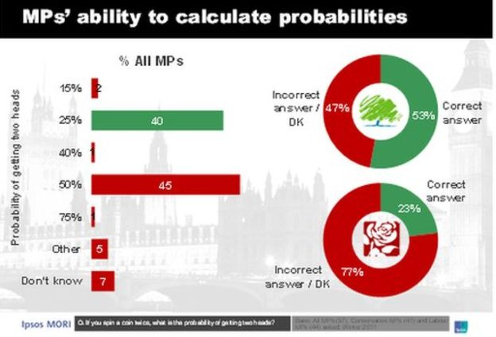

```{r setup, include=FALSE}
knitr::opts_chunk$set(echo = FALSE)
```

# Dagsorden

- Praktisk info

- Opsamling på modul 1

- Heuristikker og biases
    - Kognitive biases
    - Heuristikker
        - Repræsentativitet
        - Tilgængelighed
        - Justering og forankring

- Redskab: MINDSPACE

# Datoer for undervisning

- Flytning af undervisning

- Onsdag den 8. marts er der undervisningsfri om eftermiddagen
    - Tirsdag den 7. marts, kl. 10.15-12.00, lokale U172

- Onsdag den 12. marts er der påskeferie
    - Mandag den 10. april, kl. 10.15-12.00, lokale U172
    
- Læseplanen er opdateret

# Supplerende undervisningsaktivitet

- Forslag modtages gerne

# Eksamensopgave

- Omfang:
    - For 4. semester samfundsfagsstuderende, synopsis
        - En studerende: 5 sider
        - To studerende: 7½ sider
        - Tre studerende: 10 sider
    - For kandidatstuderende:
        - 7 sider

- Vil blive tilføjet til læseplanen

# Undervisningsgange

4) **Heuristikker og biases: Introduktion**
5) Heuristikker og biases: Evalueringer og opfattelser
6) Heuristikker og biases: Beslutninger og valg
7) Motivation og værdier: Intrinsisk og ekstrinsisk motivation
8) Motivation og værdier: Grupper og sociale normer
9) Motivation og værdier: Tidspræferencer og hyperbolsk diskontering
10) Applikation: Penge, opsparing og skat
11) Applikation: Samfund, miljø og velfærd
12) Applikation: Gæsteforelæsning
13) Praktiske aspekter: Metode og den politiske beslutningsproces
14) Praktiske aspekter: Etiske og metodiske overvejelser
15) Praktiske aspekter: Opsummering og eksamen

# Pensum til i dag


# Pensum til i dag

- Kahneman (2011): The Law of Small Numbers, kapitel 10 (10 sider)
- Kahneman (2011): Anchors, kapitel 11 (10 sider)
- Kahneman (2011): The Science of Availability, kapitel 12 (8 sider)
- Kahneman (2011): Availability, Emotion, and Risk, kapitel 13 (9 sider) 
- Kahneman (2011): Tom W’s Speciality, kapitel 14 (10 sider)
- Kahneman (2011): Linda: Less is More, kapitel 15 (10 sider)
- Kahneman (2011): Causes Trump Statistics, kapitel 16 (9 sider)
- Kahneman (2011): Regression to the Mean, kapitel 17 (10 sider)

# Opsamling

- Introduktion
    - Første lektion: Adfærdsorienteret offentlig politik
    - Anden lektion: Kognitive begrænsninger og dual process teori
    - Tredje lektion: Policy-instrumenter og nudging

- Den teoretiske ramme er på plads
    - Fagets fokus
    - Kognitiv model, psykologisk framework
    - Policy-instrumenter
    
# Opsamling, policy-instrumenter

- Forskellige policy-instrumenter
    1) Hierarki
    2) Marked
    3) Netværk
    4) Overbevisning/_persuasion_
    5) Nudging

- Diskussion om relationen mellem (5) og de fire andre 
    - Afhænger især af definition

# Opsamling, nudging

- Et policy-instrument hvor man forsøger at påvirke adfærd:
    - ved at udnytte kognitive biases og heuristikker
    - uden at reducere valgmulighederne 
    - uden at gøre det økonomisk dyrere
    - uden at indføre sanktioner

- Nudging: borgerne skal kunne træffe valg, men have 'hjælp til' at træffe 'rigtige' valg
    - Teoretisk udgangspunkt: Dual process teori
    - Normativt udgangspunkt: Libertariansk paternalisme

# Heuristikker og biases

- Udgangspunkt:
    - Borgerne har kognitive begrænsninger
        - System 1 og System 2
    - Offentlige politikker kan (og bør?) tage højde for dette

- To grundlæggende spørgsmål:
    - Hvordan påvirker kognitive biases og heuristikker borgernes evalueringer og beslutninger?
    - Hvilke implikationer har det for offentlige politikker?

- Heuristikker og biases
    - Forskningsprogram (_judgment and decision making_)
    - Fokus for dette modul (3 lektioner)

# Kognitive biases

- Bias: afvigelse fra adfærd, man ville forvente under en klassisk rationel model
    - Kognitiv bias fordi vi afviger fra en bestemt kognitiv model

- Afvigelse fra rationel model
    - Irrationalitet i opfattelser, vurderinger og beslutninger (i forhold til forventet _rationel_ adfærd)
    - Ikke blot tilfældig støj, men systematiske biases

- Kognitive biases findes i både System 1 og System 2
    - Ingen udtømmende liste eller komplet model over kognitive biases

# Kognitive biases

- Forskellige mekanismer og årsager
    - Motivationer og værdier 
        - Mere i lektion 7, 8 og 9
    - Kognitive begrænsninger
        - Informationsbehandling: Begrænsninger i vores evne til at bearbejde information
        - Informationslagring: Begrænsninger i vores hukommelse 

- Vi anvender 'genveje' i vores behandling af information
    - Heuristikker

# Heuristikker

- Grundbogens beskrivelse heuristikker: "substituting one question for another"
    - Kompliceret spørgsmål erstattes af et mere simpelt spørgsmål

- Mennesker benytter sig af heuristikker
    - Mentale genveje (_shortcuts_)
    - Anvendelse af tommelfingerregler (især for System 1)

- Tversky and Kahneman (1974): "In general, these heuristics are quite useful, but sometimes they lead to severe and systematic errors." (p. 1124)

# Kognitive biases og tre heuristikker

- Tversky and Kahneman (1974): Judgment under Uncertainty: Heuristics and Biases

- Interesseret i kognitive biases der stammer fra _judgmental heuristics_

- Artiklen fokuserer på tre heuristikker
    - Repræsentativitet
    - Tilgængelighed
    - Justering og forankring

# Heuristik: Repræsentativitet

- Hvordan vurderer vi sandsynligheden for om et objekt (A) tilhører kategori (B)?
    - 'Representativeness heuristic' 
    - Hvad er sandsynligheden for at B genererer A? 

- Automatisk vurdering af kategorier i hukommelsen

- Vi foretager intuitive vurderinger på baggrund af hvor repræsentativ objekt A er i hukommelsen
    - Lighed (_similarity_)  
        - Ser bort fra base rate
        - Eksempel: Linda, bibliotekar _og_ feminist
    - Tilfældigheder (_randomness_)
        - PPPKKK v. PKPKPK
        - Vi ser bort fra stikprøvestørrelser

# De små tals lov

- De små tals lov/_Law of small numbers_

- Statistisk udfald afhænger af stikprøvestørrelsen
    - Men vi tager ikke højde for den
    
- Vi fokuserer mere på indholdet af en besked end reliabiliteten

- Eksempel
    - Gør små skoler eleverne klogere?
    - Hospitaler (jf. næste slide)

- De små tals lov - Kahneman & Tversky, DR detektor: [youtube.com/watch?v=nExnDWVdM2w](https://www.youtube.com/watch?v=nExnDWVdM2w)

---



# Årsager slår statistik

- Vi er tilbøjelige til at fokusere på information omkring en case fra en population 
    - I stedet for information omkring populationen, som en case hører til

- Statistisk base rate
    - Viden omkring en population en case hører til, men som ikke er relevant for den individuelle case
    
- Kausal base rate
    - Information omkring den individuelle case som nemt kan kombineres med andre case-specifikke informationer

# Regression mod gennemsnittet

- En måling der ligger langt fra gennemsnittet vil generelt ligge tættere på gennemsnittet ved anden måling
    - Ikke en kausal effekt
    - Hvorfor? 

- Eksempel: Studie af 'ekstrem' gruppe, depressive børn
    - "Depressed children treated with an energy drink improve significantly over a three-month period"
    - Pointe? 
        - Vigtigt med kontrol/placebo grupper

# Heuristik: Tilgængelighed 

- Lethed i tilgængelighed af information (_availability heuristic_)

- Vurderering af frekvensen af udfald/begivenhed med udgangspunkt i hvor let tilgængelig information er
    - Eksempler/tilfælde der er tilgængelige i hukommelsen vil blive anvendt
    - Ny information vejer tungere end gammel information

- Kilder
    - Saliente begivenheder
    - Dramatiske begivenheder
    - Personlige oplevelser

# Heuristik: Tilgængelighed 

- Letheden i at finde tilfælde/eksempler er en System 1 heuristik 
    - Fokus på indhold når System 2 er mere engageret

- Hvornår anvendes tilgængelighedsheuristikken mere?
    - Når man er kognitivt beskæftiget med andre opgaver
    - Når man er 'vidende amatør' (modsat eksperter)
    - Når man føler sig magtfuld
    - Når man er i godt humør
    - Individuelle forskelle
        - Lave værdier på 'depression scale'
        - Høje værdier på 'faith in intuition scale'

- Tilgængelighedstommelfingerreglen - Kahneman & Tversky, DR detektor: [youtube.com/watch?v=HzWwX5qCiuY](https://www.youtube.com/watch?v=HzWwX5qCiuY)

# Tilgængelighed, følelser og risici

- Relateret: følelsesheuristik (_affect heuristic_)
    - Hvad _føler_ jeg omkring det i stedet for hvad jeg _tænker_ om det
    
- Påvirker vores evne til at forholde os til risici
    - Biased evalueringer af risici

- Små risici
    - Enten ignoreres de helt eller de tilskrives større sandsynlighed

- Hvilke risici under-/overvurderer vi?
    - Terrorisme?
    - Sygdomme?

# Terrorisme og sandsynligheder

- Shaver ([2015](https://www.washingtonpost.com/news/monkey-cage/wp/2015/11/23/youre-more-likely-to-be-fatally-crushed-by-furniture-than-killed-by-a-terrorist/)): "Americans have been no more likely to die at the hands of terrorists than being crushed to death by unstable televisions and furniture. Meanwhile, in the time it has taken you to read until this point, at least one American has died from a heart attack. Within the hour, a fellow citizen will have died from skin cancer. Roughly five minutes after that, a military veteran will commit suicide. And by the time you turn the lights off to sleep this evening, somewhere around 100 Americans will have died throughout the day in vehicular accidents."

# Politikere og sandsynligheder

- BBC: [What happened when MPs took a maths exam](http://www.bbc.com/news/uk-19801666)

- Britiske parlamentsmedlemmer fik et (simpelt) matematikspørgsmål (n=97)

- Spørgsmål: "if you spin a coin twice, what is the probability of getting two heads?"

- Overvej:
    - Hvad er det rigtige svar?
    - Hvor mange politikere svarede rigtigt?

# Politikere og sandsynligheder



# Heuristik: Forankring

- Brug af en information (et _anchor_) når man skal estimere et tal
    - Overvej en bestemt værdi før man skal estimere en anden værdi
    - Relevant eller irrelevant værdi
        - Eksempel: Lykkehjul og andelen af afrikanske lande i FN

- Forankringseffekten - Kahneman & Tversky, DR detektor: [youtube.com/watch?v=iXTZr6bslr8](https://www.youtube.com/watch?v=iXTZr6bslr8)


# Forankring: eksempel

- To grupper
    - Fem sekunder til at gætte/regne regnestykke

- Enten

\begin{center}
$8 \times 7 \times 6 \times 5 \times 4 \times 3 \times 2 \times 1$
\end{center}

- eller

\begin{center}
$1 \times 2 \times 3 \times 4 \times 5 \times 6 \times 7 \times 8$
\end{center}

- Korrekt svar: 40320
    - Mediangæt for øverste rækkefølge: 2250
    - Mediangæt for nederste rækkefølge: 512

# Forankring: System 1

- Hvilken mekanisme forklarer forankring?

- System 1: ikke bevidst omkring relevans

- Priming
    - Blot det at foreslå et tal påvirker vores tankeproces 
    - Ikke en justering af informationen

- Forklarer hvorfor irrelevante tal kan have en betydning

# Forankring: System 2

- System 2: overvejer relevans

- Justering i forhold til _anchor_ 
    - Søger grunde til at bevæge estimatet væk fra ankeret

- Hvorfor ikke tilstrækkelig justering?
    - Dovent/svagt System 2

- Grundbogen argumenterer for relevansen af både System 1 og System 2

# Kausalitet og korrelationer

- Korrelation er ikke kausalitet

- System 1 ser kausalitet, laver mønstre
    - Tænker ikke over spuriøsitet

- System 2 er kritisk
    - Tænker kritisk i forhold til korrelationer

---

](korrelation.png)

# Heuristisk framework: MINDSPACE

- Talrige kognitive biases og heuristikker 

- Implikationer for offentlig politik?
    - Hvad skal man være opmærksom på?

- Heuristisk framework til policy-makers
    - Tjekliste: MINDSPACE
        - **M**essenger, **I**ncentives, **N**orms, **D**efaults, **S**alience, **P**riming, **A**ffect, **C**ommitments, **E**go 

# MINDSPACE

- **M**essenger
    - Afsenderen af information har stor betydning for effekten
    - Eksempelvis autoritet

- **I**ncentives
    - Tab/gevinster
    - Referencepunkter
    - (Små) sandsynligheder
    - Mental budgettering
    - Hyperbolsk diskontering

# MINDSPACE

- **N**orms
    - Vi er sociale væsener
    - Information om ønskværdige normer
    - Gentagende information om normer
    - Konkretiseret information til målgruppen
    - Sociale netværk/smittende adfærd
    - Gruppenormer kan let have utilsigtede konsekvenser

# MINDSPACE

- **D**efaults
    - Standardvalg

- **S**alience
    - Salient, tilgængelig, simpel information

- **P**riming
    - Forskellige _primes_
        - Ord
        - Visuelle cues
        - Lugte
    - (Husk: Vær kritisk)

# MINDSPACE

- **A**ffect
    - Følelser

- **C**ommitments
    - Vi holder offentlige løfter
    - "Commitment device"

- **E**go 
    - Selvbillede
    - "Fundamental attribution error"

# Dagens diskussion

- Diskuter med din sidemand

1) Kan vi bruge viden om de tre heuristikker (repræsentativitet; tilgængelighed; justering og forankring) i den måde vi indretter politikker på?
    - Hvordan?
2) Hvor er potentialet for at anvende viden om de tre heuristikker størst?
    - Overvej gerne i forhold til et framework
        - **M**essenger, **I**ncentives, **N**orms, **D**efaults, **S**alience, **P**riming, **A**ffect, **C**ommitments, **E**go 

# Opsummering

- Systematiske afvigelser fra rationel adfærd

- Kan forklares med heuristikker og biases
    - Kognitive biases
    - Heuristikker
        - Repræsentativitet
        - Tilgængelighed
        - Justering og forankring

- Implikationer for offentlig politik

# Næste gang

- Heuristikker og biases: Evalueringer og opfattelser

- Tirsdag den 7. marts, kl. 10.15-12.00, lokale U172

- Pensum
    - Kahneman (2011): The Illusion of Understanding, kapitel 19 (10 sider)
    - Kahneman (2011): The Illusion of Validity, kapitel 20 (13 sider)
    - Kahneman (2011): Intuitions vs. Formulas, kapitel 21 (12 sider)
    - Kahneman (2011): Expert Intuition: When Can We Trust It?, kapitel 22 (11 sider) 
    - Kahneman (2011): The Outside View, kapitel 23 (10 sider)
    - Kahneman (2011): The Engine of Capitalism, kapitel 24 (13 sider)
    - _Pronin (2008): How We See Ourselves and How We See Others (4 sider)_