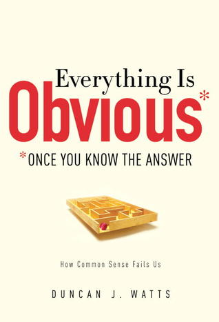
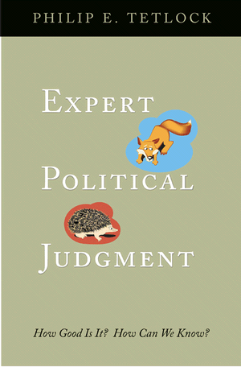
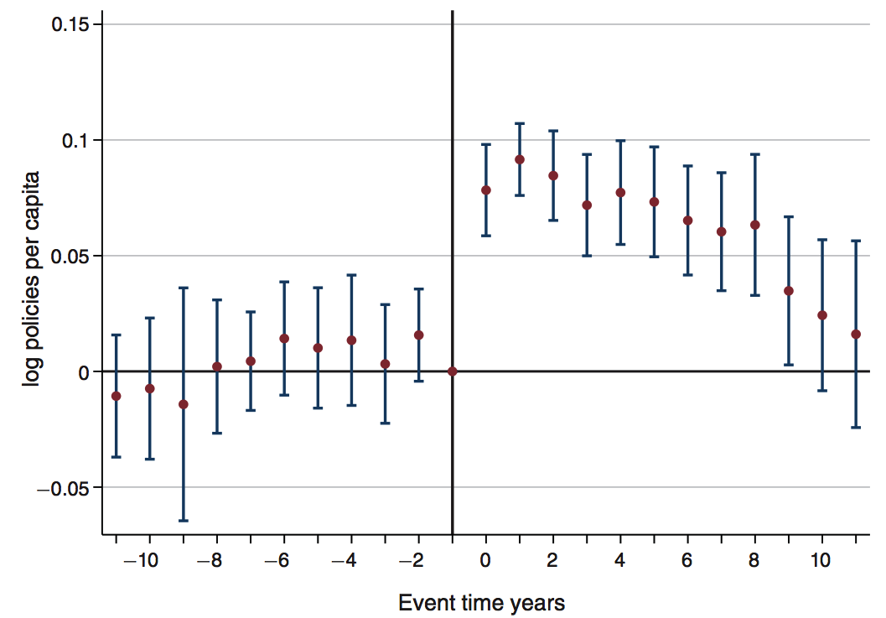
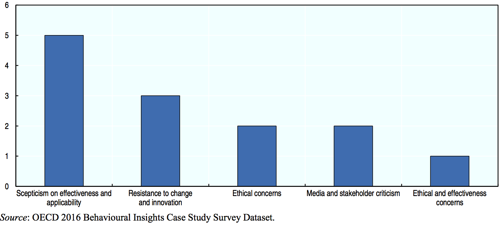
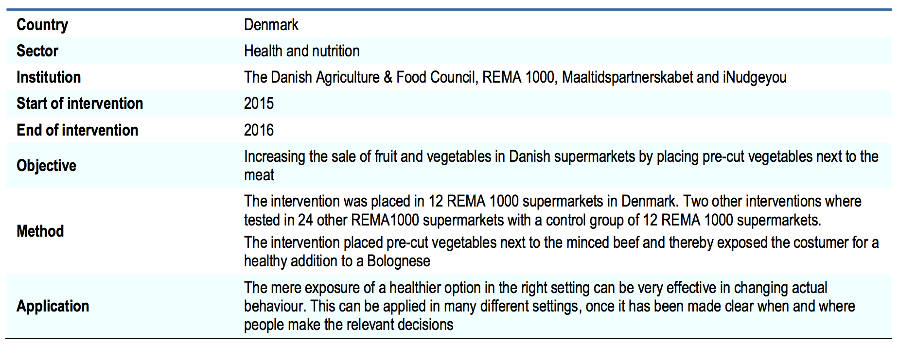

```{r setup, include=FALSE}
knitr::opts_chunk$set(echo = FALSE)
```

# Dagsorden

- Praktisk info

- Evalueringer og opfattelser
    - Bygge videre på forrige uge
    - Introducere nye begreber og mekanismer

- Selvopfattelse
    - Kognitive illusioner
    - I forhold til andre

- Applikation

# Supplerende undervisningsaktivitet

- Hvad er der størst stemning for?
    - Eksamensforberedende aktivitet
    - Oplæg
    - Studietur

- Supplerende forslag?

# Eksamen

- Eksempler på spørgsmål vil komme senere

- Eksamensopgaven skal vise at du kan:
    - Inddrage og bruge teori 
    - Applicere teori på empiri/case 
    - Diskutere teori i forhold til empiri/case

- Fokus senere i dag

# Undervisningsgange

5) **Heuristikker og biases: Evalueringer og opfattelser**
6) Heuristikker og biases: Beslutninger og valg
7) Motivation og værdier: Intrinsisk og ekstrinsisk motivation
8) Motivation og værdier: Grupper og sociale normer
9) Motivation og værdier: Tidspræferencer og hyperbolsk diskontering
10) Applikation: Penge, opsparing og skat
11) Applikation: Samfund, miljø og velfærd
12) Applikation: Gæsteforelæsning
13) Praktiske aspekter: Metode og den politiske beslutningsproces
14) Praktiske aspekter: Etiske og metodiske overvejelser
15) Praktiske aspekter: Opsummering og eksamen

# Pensum til i dag


# Pensum til i dag

- Kahneman (2011): The Illusion of Understanding, kapitel 19 (10 sider)
- Kahneman (2011): The Illusion of Validity, kapitel 20 (13 sider)
- Kahneman (2011): Intuitions vs. Formulas, kapitel 21 (12 sider)
- Kahneman (2011): Expert Intuition: When Can We Trust It?, kapitel 22 (11 sider) 
- Kahneman (2011): The Outside View, kapitel 23 (10 sider)
- Kahneman (2011): The Engine of Capitalism, kapitel 24 (13 sider)
- _Pronin (2008): How We See Ourselves and How We See Others (4 sider)_

# Opsamling, heuristikker og biases

- Borgerne har kognitive begrænsninger

- Bias: afvigelse fra adfærd, man ville forvente under en klassisk rationel model
    - Afvigelse fra rationel model
        - Ikke blot tilfældig støj, men systematiske biases

- Kognitive biases findes i både System 1 og System 2
    - Ingen udtømmende liste eller komplet model over kognitive biases

# Opsamling, heuristikker og biases

- Forskellige mekanismer og årsager
    - Motivationer og værdier 
    - Kognitive begrænsninger
        - Informationsbehandling: Begrænsninger i vores evne til at bearbejde information
        - Informationslagring: Begrænsninger i vores hukommelse 

- Heuristikker
    - Vi anvender mentale genveje (_shortcuts_) i vores behandling af information
    - Kompliceret spørgsmål erstattes af et mere simpelt spørgsmål
    - Anvendelse af tommelfingerregler (især for System 1)

# Opsamling, tre heuristikker

1) Repræsentativitet
    - Vi vurderer om A tilhører kategori B ved at bruge stereotypiske forestillinger
        - Automatisk vurdering af kategorier i hukommelsen (især System 1)
2) Tilgængelighed
    - Forskel i tilgængelighed af information
        -  Lethed i at finde tilfælde/eksempler (især System 1)
3) Justering og forankring
    - Brug af et anker (_anchor_) når man skal estimere et tal (System 1 og System 2)

# To næste lektioner

- I dag: Evalueringer og opfattelser
    - Hvilke biases påvirker hvordan borgerne opfatter sig selv?
    - Fokus på hvordan vi ser os selv og andre

- Næste uge: Beslutninger og valg
    - Hvilke biases påvirker hvordan borgerne træffer valg?

- Overlap
    - Mennesket træffer valg med udgangspunkt i bestemte opfattelser

# Udgangspunkt: Evalueringer og opfattelser 

- Opfattelser (_perceptions_) afspejler "virkeligheden" indirekte
    - Ikke en objektiv og neutral proces 
    - Evalueringer skabt af forskellige kognitive processer

- Vi antager ofte, at vi kan forholde os neutralt til virkeligheden
    - Uden at være påvirket af biases
        - Direkte afspejling af virkeligheden

- Manglende forståelse for sådanne processer får mennesker til at tro, at opfattelser er objektive
    - Overmodig, selvsikker, optimisme

# Kognitive illusioner og selvsikkerhed

- System 1 får os til at opfatte verden som mere simpel, forudsigelig, sammenhængende og struktureret end den er
    - Med andre ord: System 1 giver mening til verden

- Resulterer i en lang række af kognitive biases, blandt andet:
    - Optimismebias
    - Retrospektionsbias
    - Validitetsillusion
    - Kontrolillusion

# Optimismebias

- Mennesker er overoptimistiske
    - Undervurderer risikoen for at negative begivenheder finder sted
        - Eksempelvis: Sundhedseffekterne af rygning
    - Overvurderer sandsynligheden for at positive begivenheder finder sted
        - Eksempelvis: Lotto

- Relateret: Planlægningsfejlslutning
    - _Planning fallacy_
    - Planer laves ofte så de:
        - Er urealistisk tæt på best-case scenarier
        - Kunne styrkes ved at kigge på lignende cases

# Retrospektionsbias

- Mennesker underestimerer overraskelsen over tidligere begivenheder
    - Vi er gode til at efterrationalisere
    - _Hindsight bias_, _knew-it-all-along effect_

- Manglende evne til at vurdere hvad man vidste _før_ nye vilkår

- Relateret: Udfaldsbias (_outcome bias_)
    - Vi vurderer ikke processen, men om udfaldet var godt eller skidt

- Eksempler?

---



# Validitetsillusion

- Mennesker overestimerer muligheden for at forudsige fremtidige begivenheder
    - Subjektiv opfattelse af dømmekraft 
        - $\neq$ objektiv opfattelse
        - Følelse af sammenhæng i information
    - _Illusion of validity_

- Især relateret til System 1
    - WYSIATI

# Prospektivt: Hvor gode er vi til at lave forudsigelser?



# Kontrolillusion

- Vi overestimerer vores evne til at kontrollere begivenheder
    - Både retrospektivt og prospektivt fokuserer vi sjældent på tilfældigheder

- Igen: System 1 tillægger mening til verden
    - Ikke fravær af mening
        - Held
        - Tilfældigheder
        - Støj

- Implikationer?

# Opfattelse af os selv versus andre

- Vi evaluerer og opfatter os selv ud fra hvad vi tænker og føler
    - Påvirkes af kognitive biases
    - Omvendt evaluerer vi andre ud fra deres adfærd

- Vi har adgang til indre input om os selv og ydre input om andre
    - Os selv: Introspektion (tanker, følelser, intentioner)
        - Egne handlinger: kontekstuelle begrænsninger
    - Andre: Ekstrospektion (adfærd)
        - Andres handlinger: stabile, dispositionelle træk

- Pointe: Vi overser biases der former vores evalueringer og opfattelser, hvorfor de opfattes som objektive, mens andres opfattelser ses som værende _biased_

# Opfattelse af os selv versus andre

- Forskellige grunde til forskelle i opfattelser af os selv relativt til andre

1) Positive illusioner
    - Overoptimisme i forhold til sig selv og fremtiden (cf. tidligere slide)
        - Sandsynligheden for at blive rig
    - Overvurdering af positive karakteristika

2) Interpersonel viden
    - Overestimere hvor meget man kan lære ved korte møder
        - Asymmetri: Man kender andre bedre end de kender en
        - Jobsamtaler
    - Overstimere betydningen af adfærd relativt i forhold til sig selv

# Opfattelse af os selv versus andre

3) Pluralistisk ignorance
    - Mistolkning af andres motiver
    - Fælles opfattelser men manglende forståelse heraf

4) Miskommunikation
    - Kommunikation af opfattelser er ikke entydigt
    - Forventning om at andre kan opfange intentionen med kommunikationen

# Opfattelse af os selv versus andre

5) Konformitet
    - Mennesker påvirkes af gruppeadfærd
        - Men vi ser bort fra muligheden for gruppeindflydelse
    - Vi opfatter os selv som unikke i en flok
        - Ser kun at andre påvirkes af gruppedynamikker

# Implikationer

- Vi har opfattelser af os selv, der påvirkes af kognitive biases

- Vi overvurderer:
    - vores evne til at evaluere fortiden og fremtiden
    - vores evne til at påvirke begivenheder
    - sandsynligheden for at positive begivenheder finder sted
    - egne evner i forhold til andres
    - egne motiver i forhold til andres adfærd

- Politiske implikationer, eksempler
    - Rygning
    - Forsikringer

# Hvordan opfatter vi usikre og sjældne begivenheder?

- Gallagher ([2014](https://www.aeaweb.org/articles?id=10.1257/app.6.3.206)): Learning about an Infrequent Event: Evidence from Flood Insurance Take-Up in the United States

- Forskningsspørgsmål: Hvornår tegner borgere en forsikring mod oversvømmelser?
    - Hvordan evaluerer vi sandsynligheden for at en begivenhed finder sted?

- To hovedfund:
    1) Antallet af forsikringer stiger _efter_ en oversvømmelse
    2) Indirekte effekt via medierne 

---



# Behavioural Insights and Public Policy: Lessons from Around the World

- Ny rapport fra OECD: Behavioural Insights and Public Policy: Lessons from Around the World
    - Kan hentes her: http://dx.doi.org/10.1787/9789264270480-en

- Indsigter fra adfærdsforskning appliceret på offentlige politikker
    - _Behavioural Insights_ (BI)

- Oversigt over en lang række casestudier
    - Inden for: forbrugerbeskyttelse, uddannelse, energi, miljø, finans, sundhed, arbejde, forvaltning, skat, telekommunikation
    
# Grunde til modstand mod adfærdsforskning



# Dagens diskussion

- Læs én side, 'Increasing vegetable sales': fra side 240 til og med 'Results and impact' på side 241

- Svar på og diskuter følgende spørgsmål med din sidemand
    1) Hvilket problem vil studiet løse?
    2) Hvad er løsningen/interventionen?
        - Hvordan passer det ind med det teori, vi har læst?
        - Er det den bedste løsning?
    3) Hvad er den afhængige variabel i studiet? 
        - Hvordan måles effekten? Hvor stor er effekten?
    5) Hvad er den eksterne validitet?
        - Kan vi bruge det til at indrette offentlige politikker?
    6) Hvad kunne man ellers have gjort?
        - Teoretisk såvel som metodisk

---



# Opsummering

- Borgere påvirkes af kognitive biases og heuristikker i deres evalueringer og opfattelser

- Kognitive biases gør, at vi over- og undervurderer en lang række forskellige forhold

- Implikationer for, hvilke effekter offentlige politikker vil (og kan) have

# Næste gang

- Heuristikker og biases: Beslutninger og valg

- Onsdag den 15. marts, kl. 16.15-18.00, lokale U53

- Pensum
    - Kahneman (2011): Bernoulli’s Errors, kapitel 25 (9 sider)
    - Kahneman (2011): Prospect Theory, kapitel 26 (11 sider)
    - Kahneman (2011): The Endowment Effect, kapitel27(11sider) 
    - Kahneman (2011): Bad Events, kapitel 28 (10 sider)
    - Kahneman (2011): The Fourfold Pattern, kapitel 29 (12 sider)
    - Kahneman (2011): Rare Events, kapitel 30 (12 sider)
    - Kahneman (2011): Risk Policies, kapitel 31 (8 sider)
    - Kahneman (2011): Keeping Score, kapitel 32 (11 sider)
    - Kahneman (2011): Reversals, kapitel 33 (10 sider)
    - Kahneman (2011): Frames and Reality, kapitel 34 (13 sider)