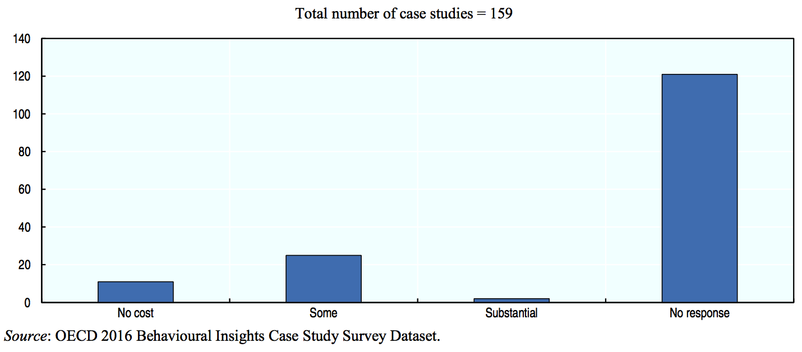
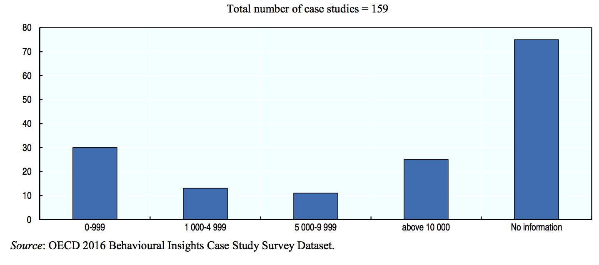
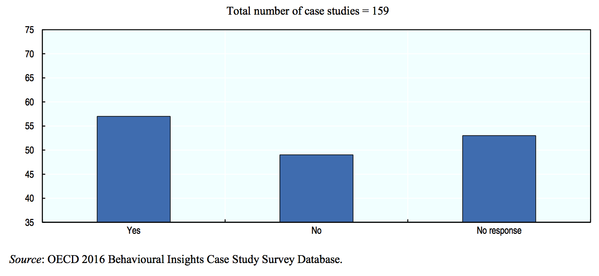
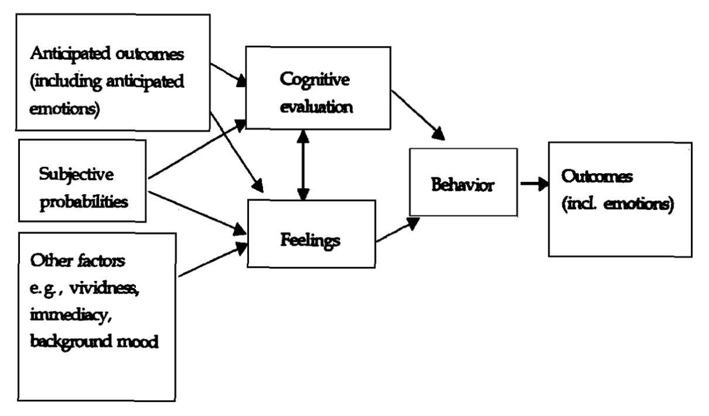
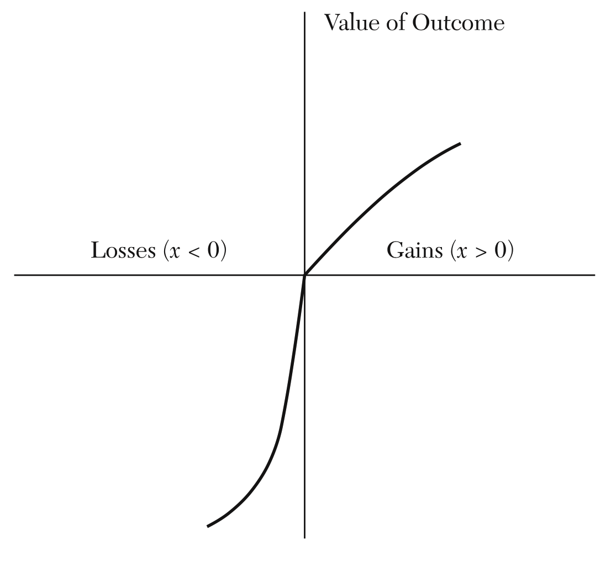

```{r setup, include=FALSE}
knitr::opts_chunk$set(echo = FALSE)
```

# Dagsorden

- Praktisk info og opsamling

- Beslutninger
    - Usikkerhed og risici
    - Følelser

- Prospect theory
    - Beslutninger med referencepunkt

- Beslutningsframes

- Status quo bias i beslutninger
    - Forskellige mekanismer 


# Supplerende undervisningsaktivitet

- Forslag: Eksamensforberedende aktivitet

- Opgaveskrivning
    - Formalia og struktur
    - Indhold

- To moduler
    - Synopsis
    - Kandidat

# Undervisningsgange

6) **Heuristikker og biases: Beslutninger og valg**
7) Motivation og værdier: Intrinsisk og ekstrinsisk motivation
8) Motivation og værdier: Grupper og sociale normer
9) Motivation og værdier: Tidspræferencer og hyperbolsk diskontering
10) Applikation: Penge, opsparing og skat
11) Applikation: Samfund, miljø og velfærd
12) Applikation: Gæsteforelæsning
13) Praktiske aspekter: Metode og den politiske beslutningsproces
14) Praktiske aspekter: Etiske og metodiske overvejelser
15) Praktiske aspekter: Opsummering og eksamen

# Pensum til i dag


# Pensum til i dag

- Kahneman (2011): Bernoulli’s Errors, kapitel 25 (9 sider)
- Kahneman (2011): Prospect Theory, kapitel 26 (11 sider)
- Kahneman (2011): The Endowment Effect, kapitel 27 (11 sider) 
- Kahneman (2011): Bad Events, kapitel 28 (10 sider)
- Kahneman (2011): The Fourfold Pattern, kapitel 29 (12 sider)
- Kahneman (2011): Rare Events, kapitel 30 (12 sider)
- Kahneman (2011): Risk Policies, kapitel 31 (8 sider)
- Kahneman (2011): Keeping Score, kapitel 32 (11 sider)
- Kahneman (2011): Reversals, kapitel 33 (10 sider)
- Kahneman (2011): Frames and Reality, kapitel 34 (13 sider)

# Opsamling, heuristikker og biases

- Bias: afvigelse fra adfærd, man ville forvente
    - Systematiske afvigelser fra rationel model

- Kognitive biases findes i både System 1 og System 2
    - Især System 1
    - Ingen udtømmende liste over kognitive biases

- Kognitive begrænsninger
    - Informationsbehandling: Begrænsninger i evne til at bearbejde information
    - Informationslagring: Begrænsninger i hukommelse 

# Opsamling, heuristikker og biases

- Heuristikker, anvendelse af tommelfingerregler
    - Vi anvender mentale genveje (_shortcuts_) i vores behandling af information
    - Kompliceret spørgsmål erstattes af et mere simpelt spørgsmål

- System 1 får os til at opfatte verden som mere simpel, forudsigelig, sammenhængende og struktureret end den er

- Resulterer i en lang række af kognitive biases, blandt andet:
    - Optimismebias
    - Retrospektionsbias
    - Validitetsillusion
    - Kontrolillusion

# Opsamling, opfattelse af os selv versus andre

- Forskelle i hvordan man evaluerer sig selv og andre

- Vi har adgang til indre input om os selv og ydre input om andre
    - Os selv: Introspektion (tanker, følelser, intentioner)
        - Egne handlinger: kontekstuelle begrænsninger
    - Andre: Ekstrospektion (adfærd)
        - Andres handlinger: stabile, dispositionelle træk

- Forskellige mekanismer
    1) Positive illusioner
    2) Interpersonel viden
    3) Pluralistisk ignorance
    4) Miskommunikation
    5) Konformitet

# Opsamling, case

- Effekten af placering på valg

- Teoretiske overvejelser
    - Mekanisme og effekter
    - Alternative forklaringer

- Metodiske overvejelser
    - Intern og ekstern validitet
    - Effektstørrelse
    - Information omkring design

# OECD, BI-rapport: fravær af information



# OECD, BI-rapport: fravær af information



# OECD, BI-rapport: fravær af information



# I dag: Beslutninger og valg

- Hvilke biases påvirker hvordan borgerne træffer valg?

- Vi ved at:
    - System 2 træffer valg, men under indflydelse af System 1
    - Beslutninger tager udgangspunkt i evalueringer og opfattelser 
        - Forrige lektion stadig relevant

- Fokus
    - Valg (og ikke-valg)
    - Risici og usikkerhed i beslutninger
    - Framing af beslutninger
    - Kognitiv (og motiveret) støtte til status quo

# Hvorfor relevant? Beslutninger, usikkerhed og risici

- Usikkerhed omkring udfald af valg

- Fravær af information
    - Manglende viden omkring udfaldsrum 
    - Manglende viden omkring sandsynligheder

- Valg er fyldt med risici og usikkerheder
    - Risiko: Sandsynlighed for at en begivenhed indtræffer
    - Usikkerhed: Usikkerhed omkring hvilke begivenheder der kan indtræffe

- Heuristikker og biases påvirker den måde vi bearbejder (fravær af) information på

- Eksempler
    - Uddannelsesvalg
    - Pensionsordninger
    - Huskøb

# Hvordan forholder vi os til risici? Kognitive vurderinger

- System 2: Vurdering af risici 
    - Kognitive begrænsninger
        - System 1

- Brug af heuristikker til at lave risikovurderinger
    - Repræsentativitetsheuristikken
    - Tilgængelighedsheuristikken 

- Ofte forkerte/fejlagtige vurderinger af risici

# Hvordan forholder vi os til risici? Følelser

- Loewenstein et al. (2001): Risk as Feelings
    - Argument: Vi er påvirket af følelser når vi forholder os til risici
    


# Prospect theory

- Kritik af teorier om hvordan rationelle mennesker vurderer forventet nytte

- Mennesker kigger ikke blot på endelige udfald

- Redigeringsfase
    - Brug af **heuristikker**
        - Simplifikation af kompliceret valg
    - Brug af **referencepunkt**
        - Vurdering af ændringer (relativt ift. referencepunkt)
        - Tab og gevinster

- Potentielle værdier af tab og gevinster er afgørende
    - Asymmetrisk forhold

---



# Aversion: Risiko

- Mennesker er risikoaverse
    - Dermed ikke:
        - Risikoneutrale (risikoindifferente)
        - Risikosøgere (risikoelskerende)

- Mennesker ønsker at minimere usikkerhed
    - Også når det har implikationer for den forventede nytte
    
- Pointe: Den forventede nytte kan være høj ved et valg, men hvis risikoen er stor, vil den forventede nytte ikke altid være afgørende

# Aversion: Tab

- Tabsaversion
    - Vi tillægger større vægt til tab end gevinster

- Et tab får en større værdi end værdien ved en tilsvarende gevinst
    - Værdien af et tab på 500 kroner er større end en gevinst på 500 kroner

- Et tab og en tilsvarende gevinst vil give et nettotab i nytte

# Framing af beslutninger

- Måden hvorpå information _frames_ (indrammes) påvirker beslutninger

- Beslutningsframes
    - Præsentationen af udfald og sandsynligheder ved forskellige valg i en beslutning

- _Frames_ kan udnytte forskellige kognitive biases

- Forskellige typer af _frames_
    - I mange tilfælde svært at sige, hvad der er _framing_ og hvad der er information

- Klip fra DR Detektor om framing: [youtube.com/watch?v=nrPdY8qwl10](https://www.youtube.com/watch?v=nrPdY8qwl10)

---

- Det asiatiske sygdomsproblem

)](asian.png)

# Status quo bias

- Mennesker har en stærk præference for status quo

- Rationelle grunde til at være for status quo
    - Erfaring med status quo
    - Omkostninger ved at skifte
    - Usikkerhed ved at skifte

- Selv når der ikke er omkostninger eller usikkerhed forbundet med at skifte status quo ud, er der en præference for status quo
    - Deraf status quo _bias_

- To forskellige muligheder
    - Gøre ingenting (træffe intet valg)
    - Preference for at vælge status quo

# Endowment effekter

- Vi har en præference for ting vi allerede har/ejer

- Implikationer
    - Vilje til at betale er større for ting man ejer
    - Vilje til at bytte for anden ting er lavere

- Forskellige mekanismer
    - Tabsaversion
    - Affektionsværdi
    - Bekræftelsesbias ved valg

# Status quo bias og tabsaversion 

- Status quo er et referencepunkt

- Omkostningerne forbundet med at skifte vægtes højere end potentielle gevinster

- Relativ fordel til status quo

- Fortrydelsesaversion
    - Undgå at tage ansvar for en forkert beslutning

# Eksponeringseffekt

- Jo mere man eksponeres til noget, desto mere kan man lide det
    - "Mere exposure"

- Gentagende eksponering giver genkendelighed og familiaritet
    - Øget support for status quo

- Når noget gentages, virker det mere plausibelt og sandfærdigt

- Eksempler?

# Rationalisering

- Motivation til at forsvare og støtte status quo
    - Også kaldt en 'konservativ bias'

- Mennesker ønsker at se verden som et retfærdigt sted
    - Motiveret til at forsvare eksisterende sociale strukturer

- Status quo bias som en motivation for det eksisterende som godt og fair 

# Eksistensbias

- Heuristik: Hvis noget findes, er det godt

- System 1 antager i udgangspunktet, at status quo - det eksisterende - er godt
    - Gør ikke forskel på 'er' og 'bør'

- Jo længere tid, desto bedre
    - Jo længere tid noget har eksisteret, desto bedre bliver det vurderet

# Defaults: Organdonation

- Hvordan får man borgere til at blive organdonorer?

- Forskellige redskaber
    - Lovpligtigt
    - Informationskampagner
    - Forsikringsordninger 
    - *Defaults*
        - Tilmelding (opt-in) eller (opt-out)
- To muligheder for fejlklassifikation

- Hvad virker?

---

)](organdonation.png)

---

](organdanmark.png)

# Politiske anbefalinger i defaults

- Ikke blot kognitive begrænsninger der skaber _default_ effekter

- Offentlige politikker giver _hints_ omkring ønsket adfærd

- Politikere signalerer implicit ønsket adfærd med _defaults_
    - _Default_: Anbefalet adfærd

- Politikere og embedsmænd skal være opmærksomme på forskellige mekanismer

# Dagens diskussion

- Vi vil gerne have flere unge til at betale deres studiegæld
    1) Hvordan kan vi udnytte **defaults** til at opnå dette?
    2) Hvordan kan vi udnytte **framing** til at opnå dette?
    3) Kan vi bruge andre indsigter gennemgået i dag?

- Diskuter med din sidemand

# Opsummering

- Heuristikker og biases påvirker beslutninger 

- Vigtige perspektiver og mekanismer
    - Prospect theory
    - Tabsaversion
    - Framing
    - Status quo bias

# Opsummering på modul 1 og 2

- Modul 1: Introduktion
    - Dual process teori
    - Nudging (og andre styringsinstrumenter)

- Modul 2: Heuristikker og biases
    - Forskellige kognitive biases
    - Forskellige heuristikker

# Næste gang

- Motivation og værdier: Intrinsisk og ekstrinsisk motivation

- Onsdag den 22. marts, kl. 16.15-18.00, lokale U53

- Pensum
    - Kamenica (2012): Behavioral Economics and Psychology of Incentives (29 sider)
    - Gneezy and Rustichini (2000a): A Fine is a Price (17 sider)
    - _Gneezy and Rustichini (2000b): Pay Enough or Don't Pay at All (20 sider)_
    - _Falk and Kosfeld (2006): The Hidden Costs of Control (20 sider)_