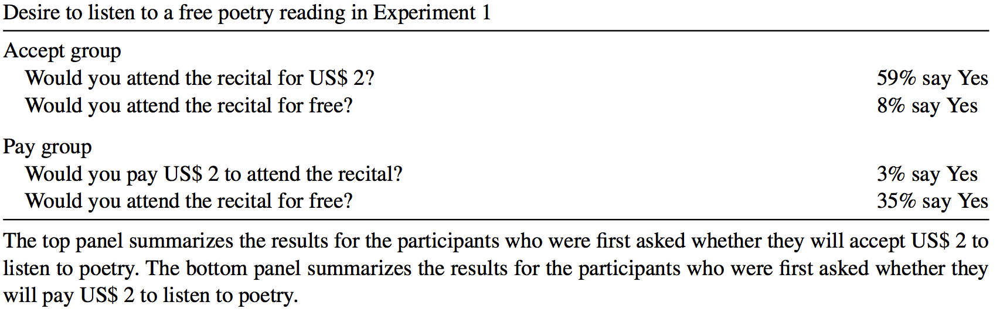
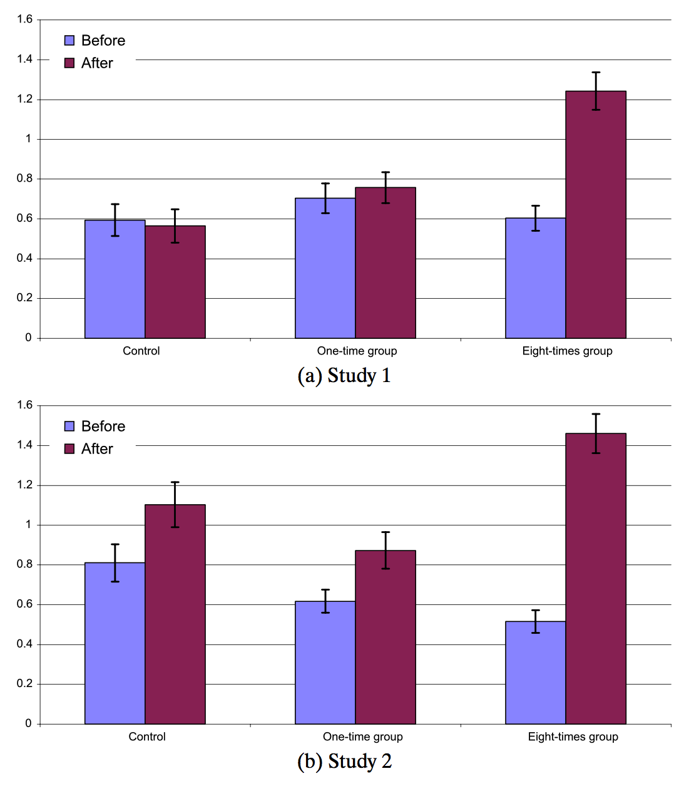
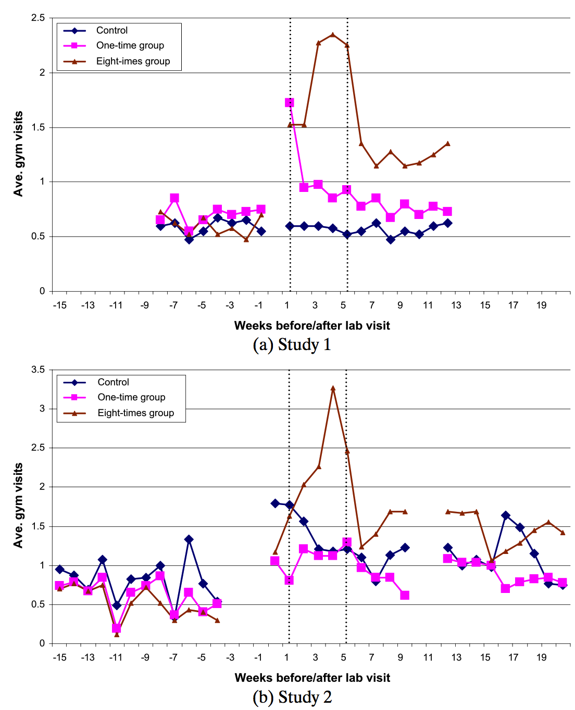
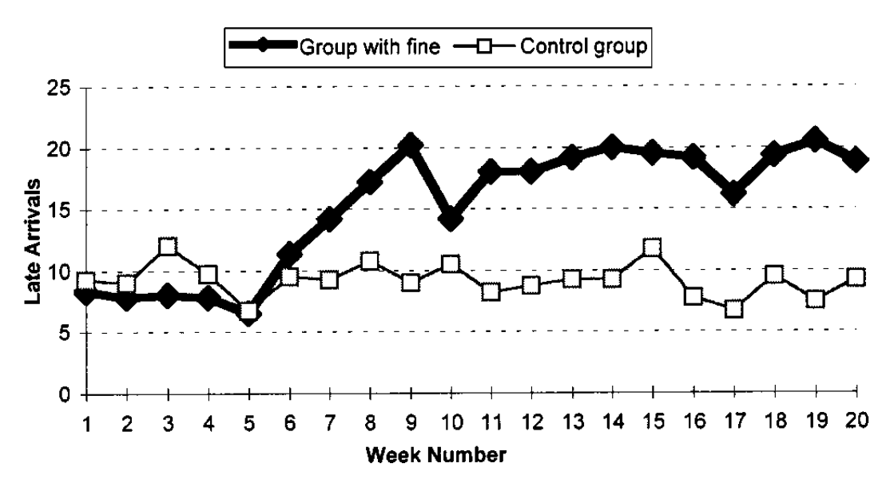
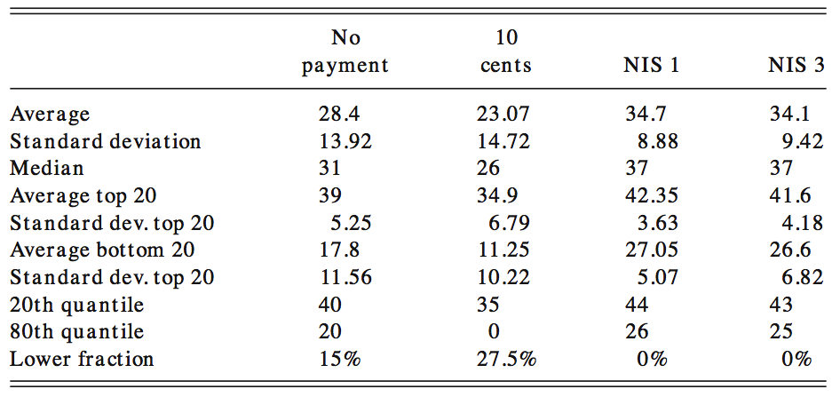

```{r setup, include=FALSE}
knitr::opts_chunk$set(echo = FALSE)
```

# Dagsorden

- Opsamling

- Motivation og værdier

- Rationelle borgere og stabile præferencer

- Offentlige politikker og egeninteresse

- Intrinsisk og ekstrinsisk motivation
    - Forskellige effekter af økonomiske incitamenter

- Implikationer for offentlig politik

# Opsamling: kognitive biases og heuristikker

- Hvilke biases påvirker hvordan borgerne træffer valg?

- Fokus på beslutninger
    - Valg (og ikke-valg)
    - Risici og usikkerhed i beslutninger
    - Framing af beslutninger
    - Kognitiv (og motiveret) støtte til status quo

- Usikkerhed omkring udfald af valg
    - Fravær af information
        - Manglende viden omkring udfaldsrum 
        - Manglende viden omkring sandsynligheder

- Valg er fyldt med risici og usikkerheder

# Opsamling: kognitive biases og heuristikker

- Prospect theory
    - Potentielle værdier af tab og gevinster er afgørende
        - Asymmetrisk forhold
    - Aversioner: Risiko og tab

- Framing
    - Måden hvorpå information _frames_ (indrammes) påvirker beslutninger

- Status quo bias
    - Endowment effekter
    - Eksponeringseffekt
    - Rationalisering
    - Eksistensbias

# Undervisningsgange

7) **Motivation og værdier: Intrinsisk og ekstrinsisk motivation**
8) Motivation og værdier: Grupper og sociale normer
9) Motivation og værdier: Tidspræferencer og hyperbolsk diskontering
10) Applikation: Penge, opsparing og skat
11) Applikation: Samfund, miljø og velfærd
12) Applikation: Gæsteforelæsning
13) Praktiske aspekter: Metode og den politiske beslutningsproces
14) Praktiske aspekter: Etiske og metodiske overvejelser
15) Praktiske aspekter: Opsummering og eksamen

# Pensum til i dag

- Kamenica (2012): Behavioral Economics and Psychology of Incentives (29 sider)
- Gneezy and Rustichini (2000a): A Fine is a Price (17 sider)
- _Gneezy and Rustichini (2000b): Pay Enough or Don't Pay at All (20 sider)_
- _Falk and Kosfeld (2006): The Hidden Costs of Control (20 sider)_

# Motivation og værdier

- Kognitive begrænsninger er vigtige, men ...
    - Potentialet i forhold til offentlig politik kan diskuteres
        - Nudging

- Vigtigt at studere og forstå hvad der motiverer borgerne
    - Overlap med kognitive perspektiver
        - Framing, status quo, heuristikker m.v.

- Fokus i dag: Motivation i forhold til (økonomiske) incitamenter

# Offentlig politik og rationelle borgere

- Antagelser om rationelle borgere, især anvendt af økonomer:
    - Bayesiansk bearbejdning af information
    - **Veldefinerede og stabile præferencer**
    - **Drevet af egeninteresse**
    - **Nyttemaksimerende**
    - Eksponentiel diskontering af fremtidig nytte
    - Fokus på absolutte udfald, ikke ændringer
    - Information og evalueringer har instrumentel funktion

# Har borgerne veldefinerede og stabile præferencer?

- Borgerne har ikke altid stabile præferencer

- Dette skyldes blandt andet:
    1) Beslutninger er sensitive i forhold til faktorer der ikke er relateret til den nytte et valg giver
        - Konteksten, framing m.v.
    2) Beslutninger bygger på minder om tidligere beslutninger, der ikke nødvendigvis afspejler reel nytte

- Implikation
    - Præferencer kan skabes i interaktion med offentlige politikker
        - Skal ikke blot tage højde for borgernes præferencer

---

)](preferences.png)

# Har borgerne veldefinerede og stabile præferencer?

- Ariely et al. ([2006](http://www.sciencedirect.com/science/article/pii/S0167268105001265)): Tom Sawyer and the construction of value



# Offentlige politikker og egeninteresse

- Borgerne har ikke altid stabile præferencer, men offentlige politikker kan udnytte borgernes egennyttemaksimerende adfærd
    - Opnå politiske målsætninger
    - Opnå den bedste udnyttelse af (begrænsede) ressourcer
    
- Offentlige politikker designet til egennyttemaksimerende borgere kan underminere målsætninger
    - Moralske værdier
    - Altruisme

- Pointe: Offentlige politikkers design skal studeres i relation til borgernes motivation
    - Især de økonomiske incitamentstrukturer

# Offentlige politikker og egeninteresse

- Grundtanke: Økonomiske incitamenter skal belønne indsats (arbejde)
    - _Pay for performance_
        - Jo større indsats, desto større belønning
        - Jo større incitament, desto større udbud af arbejde 

- De fleste politikker bygger på dette
    - Reformer af velfærdsstaten
    - _New Public Management_

# Effekten af økonomiske incitamenter: information

- Information omkring incitamenter er afgørende

- Der kan være:
    - fravær af information
    - uklar information

- Åbner op for:
    - kontekstuel inferens
    - heuristikker

# _Pay for performance_: motionscenter

- Charness og Gneezy ([2009](http://onlinelibrary.wiley.com/doi/10.3982/ECTA7416/abstract)): Incentives to Exercise

- Kan man få studerende til at motionere mere ved at betale dem for det?

- To felteksperimenter
    - Studie 1: University of Chicago
        - Kontrol: $0 for at motionere
        - Gruppe 1: $25 for at motionere én gang inden for en uge
        - Gruppe 2: $100 for otte gange inden for fire uger
    - Studie 2: University of California, San Diego
        - Kontrol: $175
        - Gruppe 1: $175 for at motionere én gang inden for en måned
        - Gruppe 2: $175 for at motionere otte gange inden for en måned

---



---



# De ikke-intenderede effekter af økonomiske incitamenter

- Økonomiske incitamenter kan have flere effekter
    - Signalere at selviskhed er en socialt acceptabel adfærd
    - Signalere disrespekt og mistillid
    - Skabe et læringsmiljø hvor man tilegner sig en motivation drevet af egeninteresse
    - Reducere følelsen af selvbestemmelse
    - Reducere betydningen af andre typer af motivation

# Økonomiske incitamenter og kontrol

- Incitamenter kan føre til dårligere indsats hvis det fører til mistillid

- Kontrolavers adfærd: mindre motivation til at udføre arbejde godt, hvis der er krav
    - Krav om minimumsadfærd 

- Offentlige politikker skal tage højde for omkostningerne (inkl. økonomiske omkostninger) ved at indføre økonomiske incitamenter

---

)](kontrol.png)

# Adfærd ikke drevet af egeninteresse

- Empirisk observation: mange typer af adfærd er ikke drevet af egeninteresse

- Eksempler
    - Frivilligt arbejde
    - Hjælp til fremmede 
    - Valgdeltagelse
    - Bloddonation

- Diskussion
    - Hvilke implikationer kunne det have at man:
        1) Gav borgerne penge for at donere blod?
        2) Gav borgeren penge for at stemme til kommunalvalget?


# Intrinsisk og ekstrinsisk motivation

- Forskellige motiver for at gøre noget
    - Ekstrinsisk motivation: Incitamenter kommer _udefra_ 
    - Intrinsisk motivation: Incitamenter kommer _indefra_

- Ekstrinisk motivation er ofte økonomiske incitamenter 
    - Undgå straf/få belønning

- Intrinsisk omtivation: indsats har en motivation i sig selv uafhængigt af økonomiske incitamenter og lignende faktorer
    - Eksempler?

- Komplekst
    - Individuelle forskelle
    - Flere typer af motivationer: omdømme, professionel m.v.

# Intrinsisk og ekstrinsisk motivation: Motivation crowding theory

- Relationen mellem eksintrisk og intrisisk motivation

- Bekymring: Økonomiske incitamenter kan underminere intrinsisk motivation
    - Tilstedeværelsen af økonomiske incitamenter påvirker andre motivers indflydelse

- Effekten har flere navne i litteraturen:
    - _crowding-out effect_
    - _overjustification effect_
    - _corruption effect_
    - _the hidden costs of rewards_
    - _the detrimental effects of rewards on performance_

---

](motivationcrowding.png)

# Intrinsisk og ekstrinsisk motivation

- Implikationer af økonomiske incitamenter på motivation
    1) Økonomiske incitamenter kan føre til _lavere_ intrinsisk motivation for at udføre (sociale) opgaver
    2) _Midlertidige_ økonomiske incitamenter for en indsats, der drives af intrinsisk motivation, kan have _permanente_ effekter
    3) Store økonomiske incitamenter kan føre til øget nervøsitet og dårligere indsats
    4) Lave økonomiske incitamenter kan være kontraproduktive

# Design af incitamentstruktur

- Offentlige politikker skal tage højde for interaktionen med borgernes motiver

- Incitamentstrukturen er ikke universel og virker bedre i nogle sammenhænge

- To vigtige pointer
    1) Standardincitamenter kan fejle
    2) Andre instrumenter kan virke bedre

- To generelle mønstre
    1) Færre penge (og færre muligheder) kan være mere effektivt
    2) _Framing_ (indramningen) af indsats påvirker motivationen

# Design af incitamentstruktur: Prosocial adfærd

- Prosocial adfærd motiveres af:
    1) Altruisme
        - Motivation ud fra andres nytte/velfærd
    2) Egennyttemaksimerende altruisme
        - Positiv følelse af at hjælpe
        - _Impure altruism_, _warm-glow_

- Økonomiske incitamenter kan reducere social adfærd
    - Mekanismer?
        - Afhænger af hvad adfærd motiveres af
  
- Eksplicitte økonomiske incitamenter kan føre til mindre motivation og dårligere indsats

- Politikere skal være varsom med at indføre _pay for performance_

# Eksempel: Effekten af at indføre bøder

- Gneezy og Rustichini ([2000](http://www.journals.uchicago.edu/doi/abs/10.1086/468061)): A Fine is a Price

- Kan man få forældre til at hente deres børn tidligere ved at indføre en bødestraf?

- Design:
    - 10 daginstitutioner, 20 uger med målinger
        - Fire første uger: måling af forældre der hentede børn for sent
        - 2-3 næste uger: indførelse af bøde i 6 ud af 10 daginstitutioner
        - 17 uger inde i projektet: afskaffelse af bøde

---



# Diskussion: Effekten af at indføre bøder

1) Er bøden stor nok? Hvad er 'not insiginificant'?
    - "A fine of NIS 10 is relatively small but not insignificant. In comparison, the fine for illegal parking is NIS 75; the fine for driving through a red light is NIS 1,000 plus penalties; the fine for not collecting the droppings of a dog is NIS 360. For many of these violations, however, detection and enforcement are low or, as in the case of dog dirt, nonexistent in practice.8 A baby-sitter earns between NIS 15 and NIS 20 per hour. The average gross salary per month in Israel at the time of the study was NIS 5,595."

2) Hvad kan vi sige om effekten af bøder generelt?

# Effekten af at betale for lidt

- Gneezy og Rustichini ([2000](https://academic.oup.com/qje/article/115/3/791/1828156/Pay-Enough-or-Don-t-Pay-at-All)): Pay Enough or Don't Pay at All

- Pointe: Økonomiske incitamenter skal have en bestemt størrelse, før de virker
    - Det at indføre en belønning er ikke tilstrækkeligt

- Resultat: "We found that the effect of monetary compensation on performance was not monotonic. In the treatments in which money was offered, a larger amount yielded a higher performance. However, offering money did not always produce an improvement: subjects who were offered monetary incentives performed more poorly than those who were offered no compensation."

---



# Økonomiske præferencer og sociale præferencer

- Sociale præferencer 
    - Anerkendelse i gruppe
    - Socialt pres/sociale normer
    - Gruppeidentitet
    
- Kan have direkte og indirekte effekter på adfærd
    - Indirekte: I interaktion med økonomiske incitamenter

- Mere næste gang

# Implikationer for offentlig politik

- Implikationer for forskellige områder
    - Forvaltningen
        - Markarbejdere
    - Offentlige sektor
        - Uddannelse
        - Sundhed
    - Offentlige politikker
        - Velfærdsydelser

# Implikationer for offentlig politik

- Hvorfor bruges økonomiske incitamenter oftest?

- Tre grunde
    1) Økonomiske incitamenter virker bedst
        - Områder hvor intrinsisk motivation ikke spiller en rolle
    2) Intrinsisk motivation påvirkes ikke
        - Selv når økonomiske incitamenter indføres, vil intrinsisk motivation spille en rolle
        - Lille _crowding-out effect_
    3) Politikere og embedsmænd overestimerer effekten af ekstrinsisk motivation 
        - Antager at borgere (og andre) primært motiveres af incitamenter

# Dagens diskussion

1) Overvej hvor der er størst potentiale for at udnytte hhv. intrinsisk og ekstrinsisk motivation i forhold til offentlige politikker

2) Overvej hvilken rolle kognitive begrænsninger har i forhold til økonomiske incitamenter
    - Overvej eksempelvis tilgængelighedsheuristikken i forhold til information omkring penge

- Diskuter med din sidemand

# Opsummering

- Forskellige motiver: Intrinsisk og ekstrinsisk motivation

- Borgere motiveres af forskellige forhold

- Økonomiske incitamenter kan ...
      - ... have forventede effekter (ekstrinsisk motivation)
      - ... have ingen effekt
      - ... have negative effekter (_crowding out_)

# Næste gang

- Motivation og værdier: Grupper og sociale normer

- Onsdag den 29. marts, kl. 16.15-18.00, lokale U53

- Pensum
    - Ariely, Bracha og Meier (2009): Doing Good or Doing Well? Image Motivation and Monetary Incentives in Behaving Prosocially (12 sider)
    - Gerber, Green og Larimer (2008): Social Pressure and Voter Turnout: Evidence from a Large-Scale Field Experiment (16 sider)
    - _Mas og Moretti (2009): Peers at Work (34 sider)_