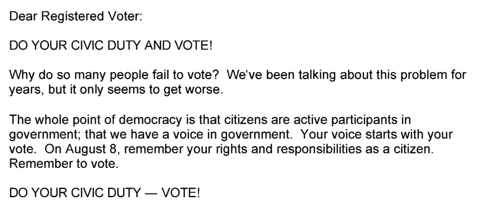
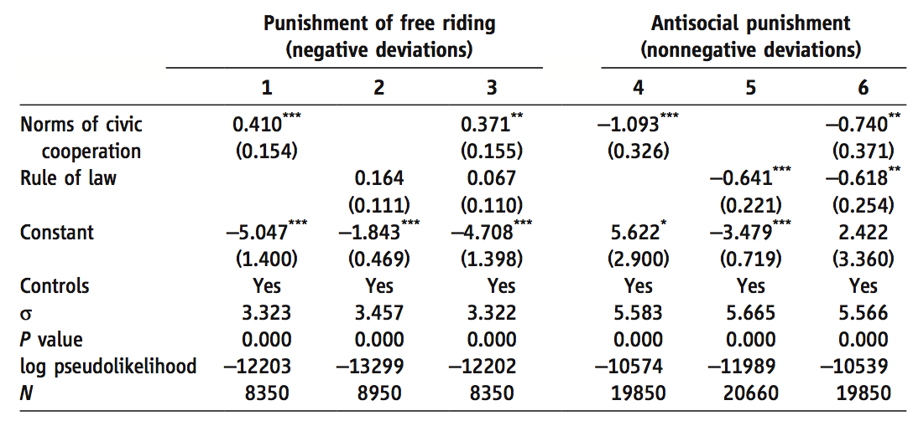

```{r setup, include=FALSE}
knitr::opts_chunk$set(echo = FALSE)
```

# Dagsorden

- Opsamling

- Social motivation og sociale præferencer

- Konformitet
    - Social konformitet
    - Autoritær konformitet

- Social påvirkning
    - Feedback på adfærd
    - Sociale normer
    - Altruisme

# Synopsis

- Overvejelser?

- Information?

# Undervisningsgange

8) **Motivation og værdier: Grupper og sociale normer**
9) Motivation og værdier: Tidspræferencer og hyperbolsk diskontering
10) Applikation: Penge, opsparing og skat
11) Applikation: Samfund, miljø og velfærd
12) Applikation: Gæsteforelæsning
13) Praktiske aspekter: Metode og den politiske beslutningsproces
14) Praktiske aspekter: Etiske og metodiske overvejelser
15) Praktiske aspekter: Opsummering og eksamen

# Pensum til i dag

- Ariely, Bracha og Meier (2009): Doing Good or Doing Well? Image Motivation and Monetary Incentives in Behaving Prosocially (12 sider)
- Gerber, Green og Larimer (2008): Social Pressure and Voter Turnout: Evidence from a Large-Scale Field Experiment (16 sider)
- _Mas og Moretti (2009): Peers at Work (34 sider)_

# Motivation og værdier: udgangspunkt

- Borgernes kognitive begrænsninger har implikationer for offentlig politik
    - Spørgsmål: Hvor store er implikationerne i forhold til offentlig politik?

- Mols et al. (2015): "Certainly, humans have cognitive limitations and will use cues and heuristics to inform their judgements and behaviour in a range of situations. However, what the cognitive miser perspective overlooks is the fact that humans are social beings who derive meaning and direction from groups whose norms they embrace and enact, and who derive significant value – not only socially, but also intellectually – from identity-affirming behaviour."

- Vigtigt at studere og forstå hvad der motiverer borgerne
    - Forrige uge: Motivation i forhold til (økonomiske) incitamenter
    - Fokus i dag: Motivation i forhold til sociale normer og grupper

# Opsamling: Økonomiske incitamenter

- Udgangspunkt: Borgerne reagerer på økonomiske incitamenter 

- Men:
    - Adfærd er ikke kun drevet af økonomiske incitamenter
        - Frivilligt arbejde, valgdeltagelse, bloddonation
    - Økonomiske incitamenter sender bestemte signaler
        - Kan signalere disrespekt, mistillid og at selviskhed er en socialt acceptabel adfærd
    - Økonomiske incitamenter påvirker motivationen
        - Økonomiske incitamenter kan føre til _lavere_ intrinsisk motivation for at udføre opgaver
        - _Midlertidige_ økonomiske incitamenter for en indsats, der drives af intrinsisk motivation, kan have _permanente_ effekter

# Opsamling: Økonomiske incitamenter

- Forskellige typer af motivation
    - Ekstrinsisk motivation: Incitamenter kommer _udefra_ 
        - Ekstrinisk motivation er ofte økonomiske incitamenter 
        - Undgå straf/få belønning
    - Intrinsisk motivation: Incitamenter kommer _indefra_
        - Indsats har en motivation i sig selv uafhængigt af økonomiske incitamenter og lignende faktorer

- Økonomiske incitamenter har implikationer for intrinsisk motivation
    - For kritisk perspektiv på dette, se Gerhart ([2017](http://www.sciencedirect.com/science/article/pii/S2215091917300019)): Incentives and Pay for Performance in the Workplace

# Social motivation og sociale præferencer

- I dag: Fokus på en tredje motivation
    1) Ekstrinsisk motivation
    2) Intrinsisk motivation
    3) _Social motivation_

- Ekstrinsisk og intrinsisk motivation er individuelle/personlige

- Sociale motivationer: gruppeorienteret
    - Sociale situtationer
    - Anerkendelse i grupper
        - Gruppeidentitet
    - Socialt pres/sociale normer

# Social motivation og sociale præferencer

- Social motivation $\rightarrow$ Sociale præferencer

- Sociale præferencer diskuteres ofte i relation til:
    - Fairness
    - Tillid
    - Gensidighed 
    - Altruisme
        - Motivation ud fra andres nytte/velfærd
    - Prosocial adfærd
    - Egennyttemaksimerende altruisme
        - Positiv følelse af at hjælpe

# Social motivation: Omdømmemotivation

- Prosocial adfærd kan fremmes af sociale motivationer
    - Forskellige måder at konceptualisere sociale motivationer på
        - Pensum: _Image motivation_

- Omdømmemotivation/signalmotivation (_image motivation_)
    - Tilbøjeligheden til at blive moviteret af andres opfattelser 
        - Ønske om at være vellidt og respekteret af andre
    - Borgerne er motiveret til at udøve adfærd der giver social anerkendelse

# Social motivation: Omdømmemotivation

- Synligheden af en prosocial aktivitet er vigtig
    - Hvis aktiviteten gøres mindre synlig, vil omdømmemotivationen betyde mindre
    - Borgere vil agere mere prosocialt i en offentlig end i en privat kontekst

- Relation til økonomiske incitamenter er vigtig
    - Økonomiske incitamenter er mindre effektive desto mere synlig den prosociale aktivitet er
    - Introduktionen af økonomiske incitamenter kan ændre framingen af et valg

---

- Ariely et al. ([2009](https://www.aeaweb.org/articles?id=10.1257/aer.99.1.544)): Doing Good or Doing Well? Image Motivation and Monetary Incentives in Behaving Prosocially


# Sociale normer og konformitet

- Konformitet i sociale situationer

- To typer af konformitet
    1) Social konformitet
        - Horisontalt
        - Påvirkes af andre i en gruppe
    2) Autoritær konformitet
        - Vertikalt
        - Påvirkes af autoritære personer/aktører
        
# Social konformitet

- Klassisk eksempel: Social situation og vurderingen af figurer (Asch 1956)


# Autoritær konformitet

- Klassisk eksempel: Social situation med autoritær person (Milgram 1974)


# Social påvirkning og offentlig politik: diskussion

1) Hvor finder man eksempler på brugen af henholdsvis _social_ og _autoritær_ konformitet?

2) Hvilke sociale udfordringer kan man nemmest løse ved hjælp af social og/eller autoritær konformitet?

# Social påvirkning og offentlig politik

- Offentlige politikker skal tage højde for sociale processer

- Mols et al. (2015): "[S]ocial influence is an inherently social process; people actively engage with norms and, at times, challenge and question their validity; for lasting behaviour change to occur, people need to internalise norms and use them as guides for their own behaviour; and policy makers should accept the reality and validity of social norms, and work with them rather than against them."

# Social påvirkning og valgdeltagelse

- Gerber et al. ([2008](https://www.cambridge.org/core/journals/american-political-science-review/article/div-classtitlesocial-pressure-and-voter-turnout-evidence-from-a-large-scale-field-experimentdiv/11E84AF4C0B7FBD1D20C855972C2C3EB)): Social Pressure and Voter Turnout: Evidence from a Large-Scale Field Experiment

- Hvordan kan man få flere til at stemme?
    - Stimuli: Breve
    
- Fire forskellige typer af indhold i breve
    - Borgerpligt 
    - Hawthorne effekten
    - Information om adfærd til en selv
    - Information om adfærd til naboer
    
---



---


---


---


---


---

- Bond et al. ([2012](http://www.nature.com/nature/journal/v489/n7415/full/nature11421.html)): A 61-million-person experiment in social influence and political mobilization


# Social påvirkning og valgdeltagelse: diskussion

- Valgdeltagelsen er høj i Danmark (ikke så relevant med GOTV?)

1) Hvilke områder inden for offentlig politik i en dansk kontekst ville kunne udnytte sociale beskeder (på facebook)?

# Social påvirkning og ... toiletadfærd

- Lagomarsino et al. ([2017](http://onlinelibrary.wiley.com/doi/10.1111/ecin.12437/full)): Peer Pressure: Experimental Evidence from Restroom Behavior


# Social påvirkning og ... fodbolddommere

- Garicano et al. ([2005](http://www.mitpressjournals.org/doi/abs/10.1162/0034653053970267)): Favoritism Under Social Pressure


# Sociale normer og altruisme

- Hvordan måles altruisme?

- Diktatorspillet
    - To spillere
        - Person A
        - Person B
    - Proces
        1) Person A får et beløb
        2) Person A skal vælge hvor stor en del af beløbet, Person B skal have
        3) Person B modtager dette beløb

- Hvor meget bør vi forvente, at Person A vil give? (jf. klassiske økonomiske perspektiver)
    - Hvad gives der?

# Sociale normer og spilteori  

- Forskellige spil der kan bruges til at undersøge sociale interaktioner
    - Ultimatumspillet
    - Tillidsspillet
    - Offentlige goder-spillet
    - Kylling
    - Fangernes dilemma

- Anvendes især i økonomisk forskning

# Framingen af sociale situationer

- Måden hvorpå sociale situationer _frames_ kan påvirke borgernes adfærd

- Fangernes dilemma kan præsenteres på forskellige måder

- Liberman et al. ([2004](http://journals.sagepub.com/doi/abs/10.1177/0146167204264004)): The Name of the Game: Predictive Power of Reputations versus Situational Labels in Determining Prisoner’s Dilemma Game Moves
    - To forskellige _frames_
        - Frame 1: _Community Game_ (fællesskab)
        - Frame 2: _Wall Street Game_

---


# Sociale normer og antisocial adfærd

- Herrmann et al. ([2008](http://science.sciencemag.org/content/319/5868/1362)): Antisocial Punishment Across Societies


---

- Herrmann et al. ([2008](http://science.sciencemag.org/content/319/5868/1362)): Antisocial Punishment Across Societies




# Dagens diskussion

1) Overvej muligheden for at lave et felteksperiment på SDU
    - Skal undersøge betydningen af sociale normer
    - Frit valg i forhold til afhængig variabel (altså hvad I ønsker at undersøge effekten af sociale normer på)

2) Hvilke udfordringer ville der være forbundet med eksperimentet?
    - Teoretisk og praktisk

- Diskuter med din sidemand

# Opsummering

- Borgere påvirkes af sociale værdier og normer

- Forskellige måder hvorpå borgerne kan påvirkes socialt
    - Implikationer for offentlig politik

- Måden hvorpå sociale normer fungerer afhænger af forhold vi har fokuseret på tidligere
    - Andre typer af motivationer
        - Ekstrinsisk motivation
        - Intrinsisk motivation
    - Framing

# Næste gang

- Motivation og værdier: Tidspræferencer og hyperbolsk diskontering

- Onsdag den 5. april, kl. 16.15-18.00, lokale U53

- Pensum
    - Ariely og Wertenbroch (2002): Procrastination, Deadlines, and Performance: Self-Control by Precommitment (6 sider)
    - Milkman, Rogers og Bazerman (2008): Harnessing Our Inner Angels and Demons: What We Have Learned About Want/Should Conflicts and How That Knowledge Can Help Us Reduce Short-Sighted Decision Making (15 sider)
    - _Frederick, Loewenstein og O’Donoghue (2002): Time Discounting and Time Preference: A Critical Review (51 sider)_