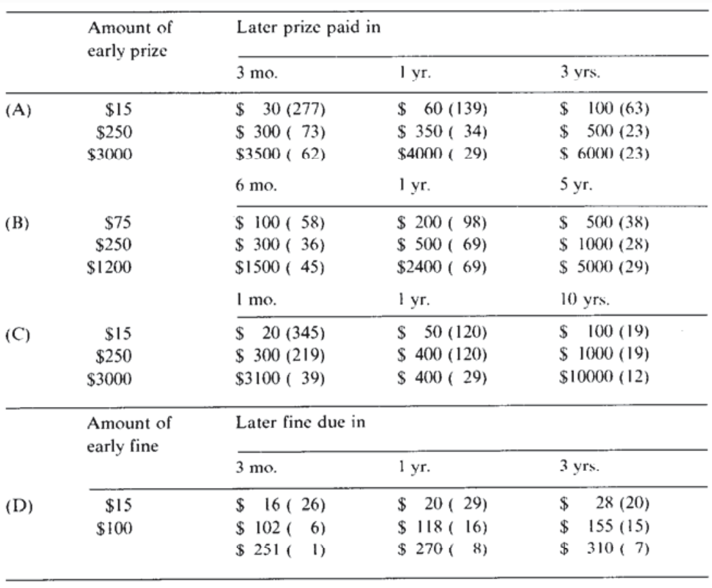
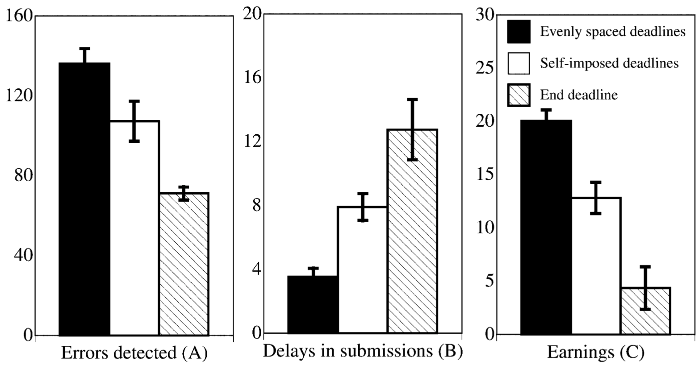
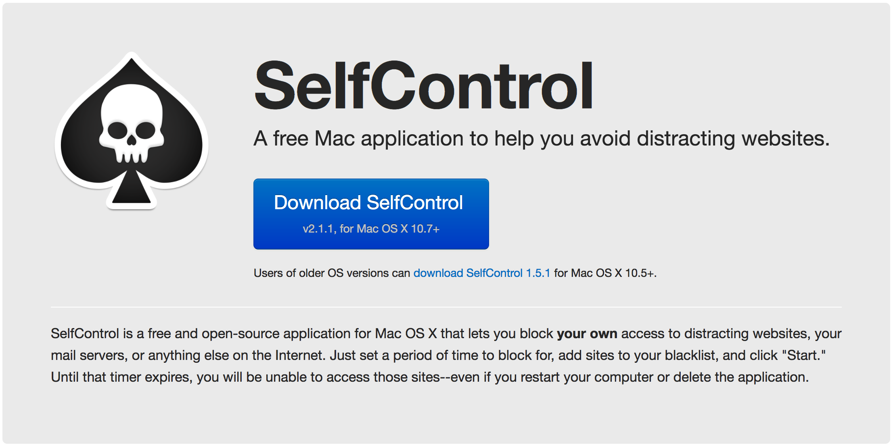
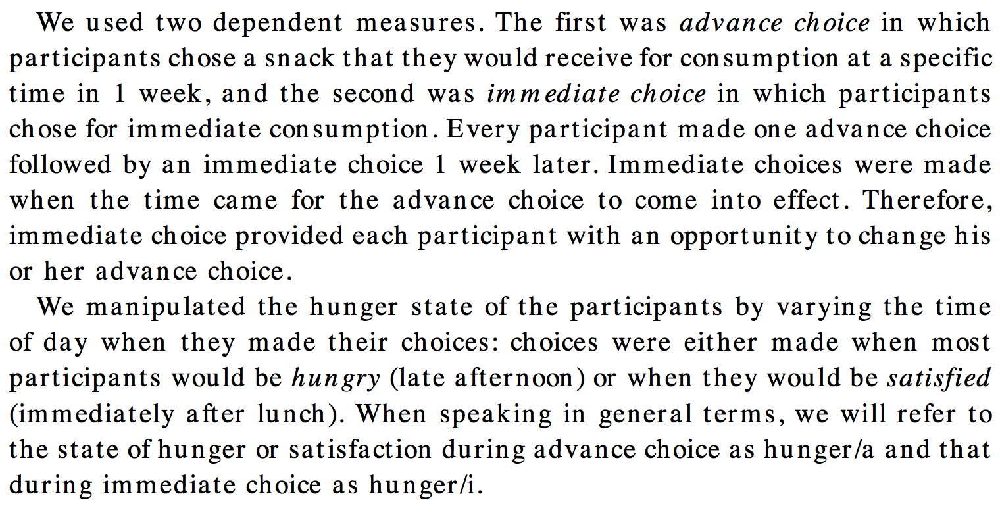
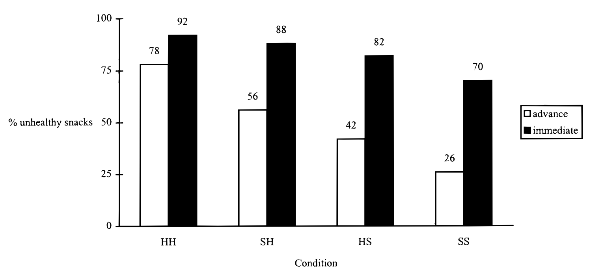
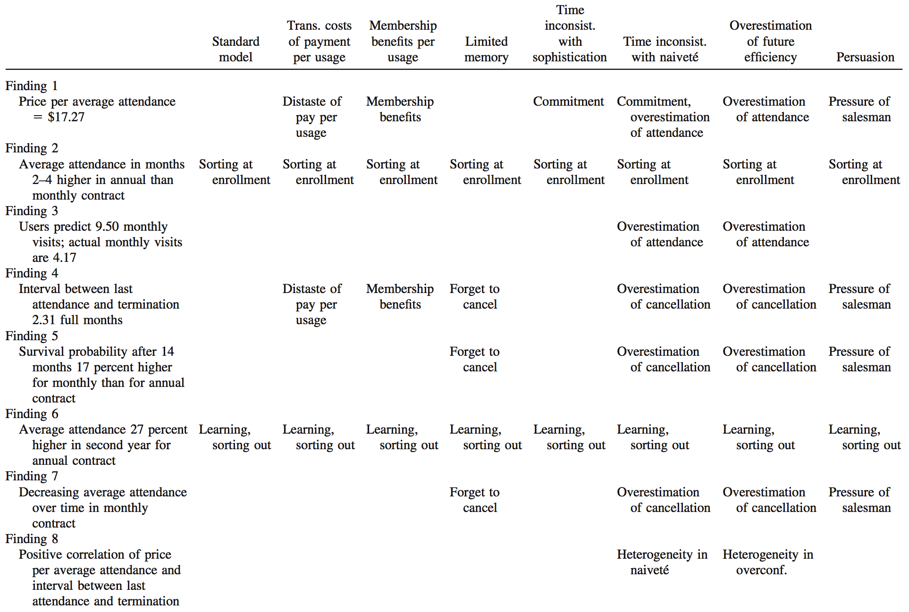
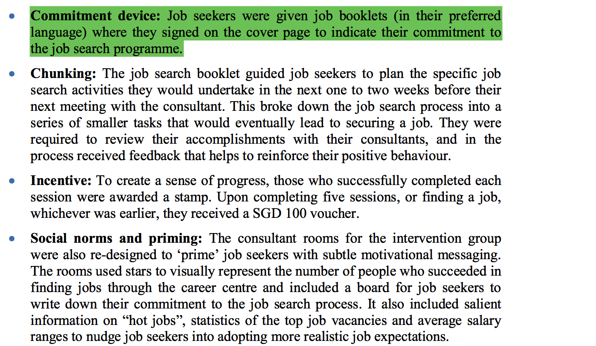

```{r setup, include=FALSE}
knitr::opts_chunk$set(echo = FALSE)
```

# Dagsorden

- Eksamen og opsamling

- Tidspræferencer
    - Tidsinkonsistente præferencer
    
- Tidsdiskontering

- Selvkontrol

- Forpligtelsesredskaber

# Eksamen og supplerende undervisningsaktivitet

- Eksamensdatoer
    - Synopsis: Torsdag 1. juni kl. 12.00
    - 77 timers: Fredag 23. juni kl. 10.00
        - Aflevering: Mandag 26. juni kl. 15.00

- Supplerende undervisningsaktivitet
    - Forslag
        - Synopsis: Hurtigst muligt
        - 77 timers: Senest muligt

# Opsamling: Social motivation og sociale præferencer

- Forskellige typer af motivationer (altså mere end bare én)
    1) Ekstrinsisk motivation
    2) Intrinsisk motivation
    3) Social motivation

- Ekstrinsisk og intrinsisk motivation er individuelle/personlige
- Sociale motivationer: gruppeorienteret
    - Social motivation $\rightarrow$ Sociale præferencer

# Opsamling: Social motivation og sociale præferencer

- Prosocial adfærd kan fremmes af sociale motivationer
    - Forskellige måder at konceptualisere sociale motivationer på
        - Fokus forrige uge: _Image motivation_

- Omdømmemotivation/signalmotivation (_image motivation_)
    - Tilbøjeligheden til at blive moviteret af andres opfattelser 

- Vigtigheden af synlighed og relation til økonomiske incitamenter
    - Hvis aktiviteten gøres mindre synlig, vil omdømmemotivationen betyde mindre
    - Økonomiske incitamenter er mindre effektive desto mere synlig den prosociale aktivitet er

# Opsamling: Social motivation og sociale præferencer

- Konformitet i sociale situationer

- To typer af konformitet
    1) Social konformitet
        - Horisontalt
        - Påvirkes af andre i en gruppe
    2) Autoritær konformitet
        - Vertikalt
        - Påvirkes af autoritære personer/aktører

# Undervisningsgange

9) **Motivation og værdier: Tidspræferencer og hyperbolsk diskontering**
10) Applikation: Penge, opsparing og skat
11) Applikation: Samfund, miljø og velfærd
12) Applikation: Gæsteforelæsning
13) Praktiske aspekter: Metode og den politiske beslutningsproces
14) Praktiske aspekter: Etiske og metodiske overvejelser
15) Praktiske aspekter: Opsummering og eksamen

# Pensum til i dag

- Ariely og Wertenbroch (2002): Procrastination, Deadlines, and Performance: Self-Control by Precommitment (6 sider)
- Milkman, Rogers og Bazerman (2008): Harnessing Our Inner Angels and Demons: What We Have Learned About Want/Should Conflicts and How That Knowledge Can Help Us Reduce Short-Sighted Decision Making (15 sider)
- _Frederick, Loewenstein og O’Donoghue (2002): Time Discounting and Time Preference: A Critical Review (51 sider)_

# Rationelle tidspræferencer

- Rationelle aktører er gode til at vurdere præferencer over tid
    - Tidskonsistente præferencer
        - Ingen konflikt mellem kortsigtede og langsigtede præferencer
        - Præference for A i stedet for B både i 't' og 't+x'

- Eksempel: Restaurantbesøg
    - Præference for crème brûlée
    - Hvad kan man gøre?

- Hvor er der ingen konflikt mellem kortsigtede og langsigtede præferencer?

# Konflikt mellem kortsigtede og langsigtede præferencer

- Præference for A på kort sigt kan være i konflikt med præference for A på længere sigt

- Konflikt mellem 'er' og 'bør'
    - Vi vælger A, selvom vi ved, at vi burde vælge B

- Især relateret til distributionen af fordele og omkostninger

- Intertemporale valg
    - Beslutninger har forskellige fordele og omkostninger:
        - Kortsigtede fordele, langsigtede omkostninger
        - Kortsigtede fordele, kortsigtede omkostninger
        - Langsigtede fordele, kortsigtede omkostninger
        - Langsigtede fordele, langsigtede omkostninger

# Tidsinkonsistente præferencer

- Tidsinkonsistente præferencer 
    - Vi vægter nutidig nytte meget højere end fremtidig nytte
        - Mindre belønning nu foretrækkes frem for større belønning i fremtiden
    - Præferencer er _biased_ til fordel for nutiden
    - Kan reflektere utålmodighed

- Også kaldet hyperbolske præferencer
    - Hyperbolsk diskontering
    - Kortsigtede valg med præference for nuet


# Tidsinkonsistente præferencer: eksempel

- Thaler ([1981](http://www.sciencedirect.com/science/article/pii/0165176581900677)): Some empirical evidence on dynamic inconsistency

- Hvor mange penge vil du have i fremtiden for at være indifferent i forhold til at modtage \$15 nu?
    - Om en måned?
    - Om et år?
    - Om ti år?

- Mediansvar: \$20, \$50 og \$100

- Årlig diskonteringsrate (vægt i nutiden i forhold til fremtiden): 345%, 120% og 19%

- Det er muligt at foretrække 550 kr. om 31 dage i stedet for 500 kr. om 30 dage, men stadig at foretrække 500 kr. nu i stedet for 550 kr. i morgen.

---




# Tidsdiskontering og tidspræferencer: overordnet

- Tidsdiskontering
    - En hvilken som helst grund til ikke at gå op i fremtidige konsekvenser
        - Usikkerhed omkring fremtidige konsekvenser
        - Skiftende præferencer

- Tidspræferencer
    - Specifik præference for nutidig nytte over fremtidig nytte

# Tidsdiskontering og tidspræferencer: implikationer

- Lavere forventet afkast på beslutninger
    - Hvis vi havde mere (tids)konsistente præferencer, kunne vi træffe bedre valg

- Åbner op for en rolle for offentlig politik
    - Hjælpe borgerne med at træffe 'rigtige' beslutninger
        - Offentlig politik som forpligtelsesredskab
        - Har vi eksempler på dette? Hvilke?


# Tidsdiskontering og tidspræferencer: tilgængelighedsheuristikken

- Hvorfor vægter vi nutiden mere end fremtiden?

- En forklaring: Tilgængelighedsheuristikken
    - Nutiden er salient
    - Fremtiden er diffus, abstrakt og alt andet end salient

- Vi forholder os primært til den saliente distribution af fordele og omkostninger i nuet

- Implikation: Ved at gøre fremtiden salient kan vi ændre adfærd
    - Hvordan kan dette integreres i offentlige politikker?

# Tidsdiskontering og tidspræferencer: selvkontrol

- Selvkontrol gør det muligt at fokusere på fremtidig nytte på bekostning af nutidig nytte

- Jo mere selvkontrol, desto mere tidskonsistente præferencer
      - Ingen selvkontrol: Nutidig nytte har 100% prioritet
      - Total selvkontrol: Nutidig nytte kalkuleres i forhold til fremtidig nytte

- Individuelle forskelle i selvkontrol

# Klassisk eksperiment: Skumfiduseksperiment

- Eksperiment med begrænset selvkontrol og behovsudsættelse

- Forsøg med børn: Få én skumfidus med det samme eller vent 15 minutter og få to

- Lille gevinst nu (en skumfidus) eller stor gevinst senere (to skumfiduser)
    - Hvad måler det? Behovsudsættelse
    
- Hvad påvirker det? 
    - Senere valg og resultater
        - Uddannelse
        - BMI

- Men: Kritik af studiet
    - Målevaliditet
    - Ekstern validitet

# Problemer med selvkontrol

- Problemer med selvkontrol findes overalt

- Eksempler?
    - Motion/træning
    - Neglebidning
    - Rygning
    - Usikker sex
    - Overforbrug
    - Overspringshandlinger

# Problemer med selvkontrol: Overspringshandlinger

- Ariely og Wertenbroch ([2002](http://journals.sagepub.com/doi/abs/10.1111/1467-9280.00441)): Procrastination, Deadlines, and Performance: Self-Control by Precommitment

- Mennesker har problemer med overspringshandlinger
    - Løsning? 
        - Forskellige typer af deadlines

- Deadlines kan hjælpe med at overkomme problemer med selvkontrol
    - Forskellige typer af deadlines har forskellige effekter


---




# En løsning på problemer med selvkontrol

- Løsning: Forpligtelsesredskaber (_commitment devices_)

- Brug af ressourcer på at forhindre sig selv i at udøve bestemt adfærd
    - Præventive værktøjer

- Eksempler?
    - Opsparingskonto
    - Slankekure
    - Antabus

---



# Selvkontrol og mad: Frugt og chokolade

- Read og van Leeuwen ([1998](http://www.sciencedirect.com/science/article/pii/S0749597898928035)): Predicting Hunger: The Effects of Appetite and Delay on Choice

- Hvornår vælger man sund mad i stedet for usund mad? 
    - Antagelse: Vi vil gerne leve sundt, men vælger det usunde

- Data: 200 medarbejdere i forskellige firmaer i Amsterdam

- Design: Eksperiment
    - Fire grupper
        - HH: Langsigtede valg som sulten, valg senere som sulten
        - HS: Langsigtede valg som sulten, valg senere som mæt
        - SH: Langsigtede valg som mæt, valg senere som sulten
        - SS: Langsigtede valg som mæt, valg senere som mæt

- Resultat: 26% valgte usund mad ud i fremtiden, men 70% valgte usund mad i sidste instans (i SS)

---



---



# Overoptimisme

- Optimismebias: Mennesker er overoptimistiske
    - Overvurderer sandsynligheden for at positive begivenheder finder sted
    
- Fremskrivningsbias: Underestimering af hvor meget præferencer skifter over tid

- Planlægningsfejlslutning
    - _Planning fallacy_
    - Planer laves ofte så de:
        - Er urealistisk tæt på best-case scenarier
  
- Forventet fremtidig adfærd kan afvige fra aktuel fremtidig adfærd

# Forventet adfærd: Træningscenter

- DellaVigna og Malmendier ([2006](https://www.aeaweb.org/articles?id=10.1257/aer.96.3.694)): Paying Not to Go to the Gym
    - Data: Træningscenteradfærd på 7.752 medlemmer over 3 år

- Forskellige typer af betaling
    - Medlemsskab 
    - Titurskort

- Hvad er billigst?
    - Afhænger af hvor ofte man anvender træningscentret
    
- Resultat? Medlemmerne har i mange tilfælde ikke brug for deres medlemsskab

---



# Jobsøgning

- DellaVigna og Paserman ([2005](http://www.journals.uchicago.edu/doi/abs/10.1086/430286)): Job Search and Impatience

- Jobsøgning: umiddelbare omkostninger og forsinkede fordele

- Utålmodighed og jobsøgning
    - To typer af effekter
        - Utålmodige personer har sværere ved at se fremtidige fordele i at finde et job, hvorfor de søger mindre
        - Utålmodige personer vil acceptere det første job de bliver tilbudt

- Hvordan måles utålmodighed?
    - Rygning, bankkonto, præventionsmidler

- Resultat: Større utålmodighed fører til lavere jobsøgning og længere tids ledighed

# Jobsøgning: diskussion

- Hvordan kan man måle (u)tålmodighed?
    - Adfærd?
    - Spørgeskema?

- Anderledes i Danmark?
    - Hvilken rolle spiller offentlige politikker i forhold til borgernes motivationer?

# Jobsøgning: værktøjer

- Jobsøgningsprogram, 'Helping job seekers find employment' (OECD 2017)

- Forskellige redskaber
    - Forpligtelsesredskab
        - Ejerskab over jobsøgning
    - "Chunking"
        - Opdeling af opgave i mindre opgaver
    - Incitamenter
    - Sociale normer og priming
    
- Resultat
    - Kontrolgruppen: 32% havde fundet arbejde efter 3 måneder
    - Stimuligruppen: 49% havde fundet arbejde efter 3 måneder

---



# Implikationer af tidspræferencer for offentlig politik

- Politikernes incitamenter
    - Politikerne kan udnytte vælgernes manglende fokus på fremtiden
        - Genvalg, offentlig gæld

- Offentlige politikker
    - Skal tage højde for at borgernes præferencer ikke er tidskonsistente
        - Hvordan? Forskellige måder

---

](kviklaan.png)

# Dagens diskussion

1) Overvej forskellige måder hvorpå det kan undgås, at borgerne gældsætter sig selv via hurtige lån
    - Kviklån (14-30 dage rentefri)
    - Forbrugslån (løbetid på 1-5 år)
    - Varelån (Leasy)

- Diskuter med din sidemand

# Opsummering

- Forskellige udfordringer
    - Borgerne har tidsinkonsistente præferencer 
    - Borgerne har problemer med selvkontrol

- Offentlige politikker kan hjælpe borgerne med træffe 'rigtige' beslutninger
    - Forpligtelsesredskaber

# Næste gang

- Applikation: Penge, opsparing og skat

- Mandag den 10. april, kl. 10.15-12.00, lokale U172

- Pensum
    - Thaler og Sunstein (2008): Save More Tomorrow, kapitel 6 (15 sider)
    - Thaler og Sunstein (2008): Naïve Investing, kapitel 7 (12 sider)
    - Thaler og Sunstein (2008): Credit Markets, kapitel 8 (11 sider)
    - Thaler og Sunstein (2008): Privatizing Social Security: Smorgasborg Style, kapitel 9 (12 sider)
    - _Thaler og Benartzi (2004): Save More Tomorrow: Using Behavioral Economics to Increase Employee Saving (24 sider)_