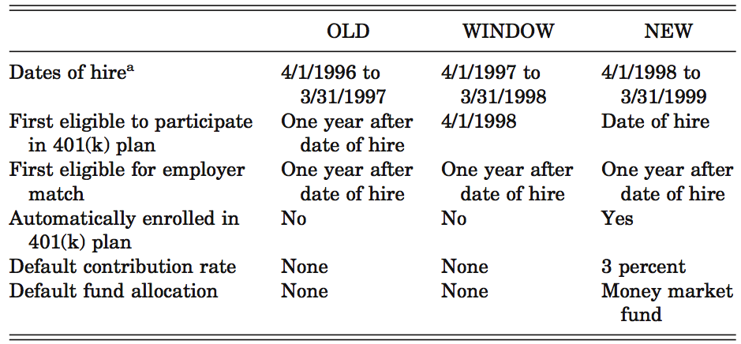
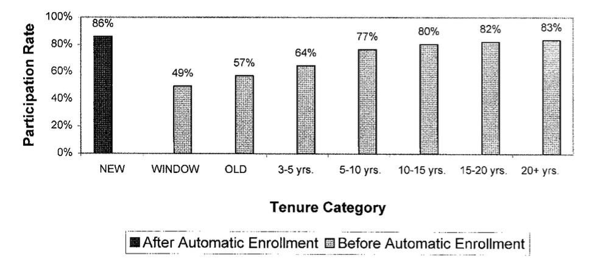
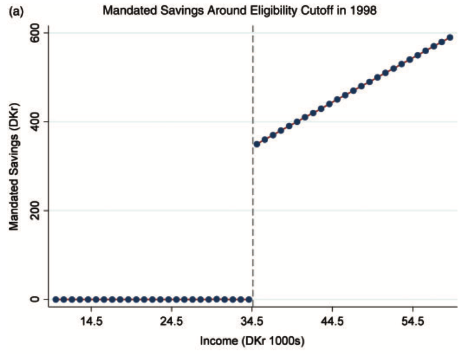
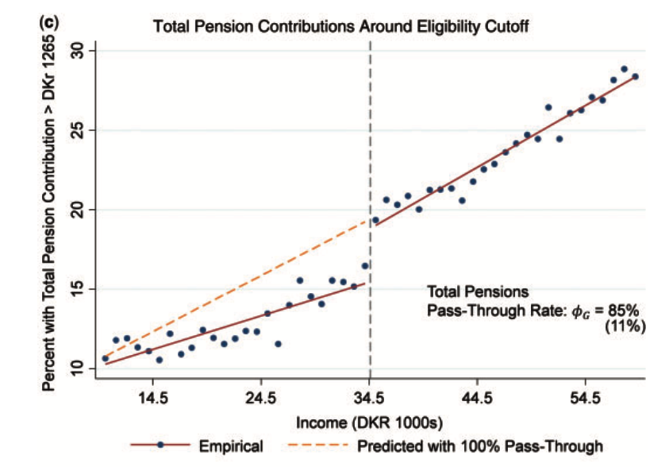
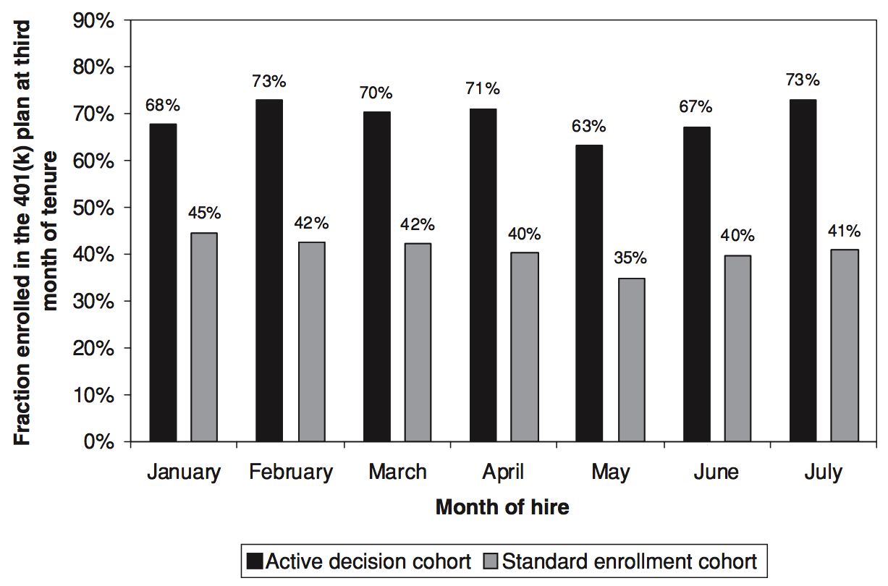
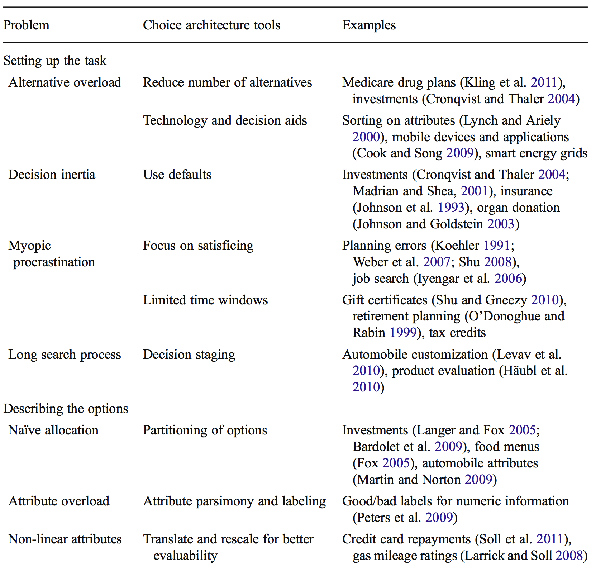
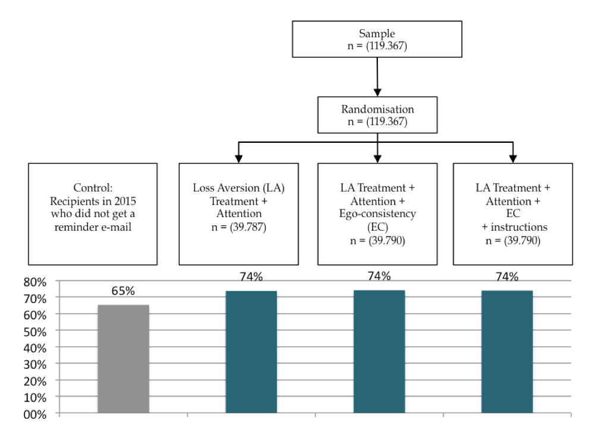
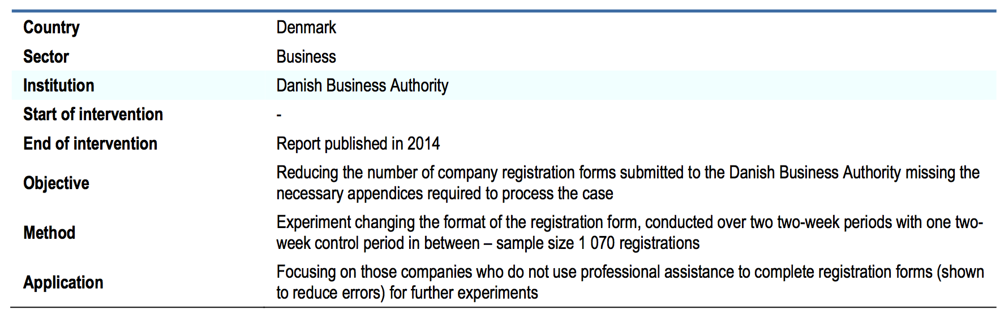

```{r setup, include=FALSE}
knitr::opts_chunk$set(echo = FALSE)
```

# Dagsorden

- Opsamling

- Applikation: Penge
    
- Opsparing
    - Automatisk tilmelding
    - Save More Tomorrow
    
- Investeringer og lån

- Virksomheder

# Undervisningsgange

10) **Applikation: Penge, opsparing og skat**
11) Applikation: Samfund, miljø og velfærd
12) Applikation: Gæsteforelæsning
13) Praktiske aspekter: Metode og den politiske beslutningsproces
14) Praktiske aspekter: Etiske og metodiske overvejelser
15) Praktiske aspekter: Opsummering og eksamen

# Pensum til i dag


# Pensum til i dag

- Thaler og Sunstein (2008): Save More Tomorrow, kapitel 6 (15 sider)
- Thaler og Sunstein (2008): Naïve Investing, kapitel 7 (12 sider)
- Thaler og Sunstein (2008): Credit Markets, kapitel 8 (11 sider)
- Thaler og Sunstein (2008): Privatizing Social Security: Smorgasborg Style, kapitel 9 (12 sider)
- _Thaler og Benartzi (2004): Save More Tomorrow: Using Behavioral Economics to Increase Employee Saving (24 sider)_

# Opsamling: Tidspræferencer

- Tidskonsistente præferencer
    - Ingen konflikt mellem kortsigtede og langsigtede præferencer
    - Præference for A i stedet for B både i 't' og 't+x'

- Tidsinkonsistente præferencer 
    - Præferencer er _biased_ til fordel for nutiden
    - Vi vægter nutidig nytte meget højere end fremtidig nytte
        - Mindre belønning nu foretrækkes frem for større belønning i fremtiden
    - Hyperbolsk diskontering
    - Kan reflektere utålmodighed/mangel på selvkontrol

# Opsamling: Selvkontrol og forpligtelsesredskaber

- Selvkontrol gør det muligt at fokusere på fremtidig nytte på bekostning af nutidig nytte
    - Problemer med selvkontrol findes inden for de fleste domæner

- Borgernes problemer med selvkontrol åbner op for en rolle for offentlig politik
    - Hjælpe borgerne med at træffe 'rigtige' beslutninger
        - Offentlig politik som forpligtelsesredskab (_commitment devices_)
        - Brug af ressourcer på at forhindre borgeren i at udøve bestemt adfærd

# Opsamling: Teoretiske moduler

- To teoretiske moduler
    1) Heuristikker og biases
        - Introduktion
        - Evalueringer og opfattelser
        - Beslutninger og valg
    2) Motivation og værdier
        - Intrinsisk og ekstrinsisk motivation
        - Grupper og sociale normer
        - Tidspræferencer og hyperbolsk diskontering

# Applikation

- Fokus: Applikation af teoretiske perspektiver

- Hvorfor?
    - Brug i praksis
    - Diskussion af forskellige teorier
        - Studier applicerer ofte ét teoretisk perspektiv på en problemstilling
    - Eksamen

- Hvordan?
    - Cases med empiriske problemstillinger

# Fokus i dag: Penge, opsparing og skat

- Hvorfor fokusere på penge?
    - Rationelle aktører har et nemt forhold til penge
        - Opsparing
        - Kviklån (jvf. forrige lektion)
        - Kreditkortregninger
    - Men mennesker afviger fra det rationelle ideal
        - Det meste vi har lært til nu har implikationer for økonomiske spørgsmål
        - Fokus: brug af indsigter på spørgsmål relateret til penge, opsparing og skat

- Aktører: Borgere og virksomheder

# Applikation: Opsparing

- Empirisk problemstilling: Borgerne sparer ikke nok op

- Pensionspolitikker er under pres: 1) Flere ældre, der får; 2) færre børn.

- Hvorfor sparer folk ikke mere op?
    - To problemer med rationel teori
        1) Antager at borgerne kan løse et komplekst matematisk problem og lave en plan
        2) Antager at borgerne har selvkontrol nok til at holde planen

- Fokus på især to løsninger
    1) Automatisk tilmelding
        - Skift standardvalg
    2) Save More Tomorrow

# Opsparing: Automatisk tilmelding

- Madrian og Shea ([2001](https://academic.oup.com/qje/article-abstract/116/4/1149/1903159/The-Power-of-Suggestion-Inertia-in-401-k)): The Power of Suggestion: Inertia in 401(k) Participation and Savings Behavior



---



# Opsparing: Effekten af politiske reformer


- Chetty et al. ([2014](https://academic.oup.com/qje/article-abstract/129/3/1141/1817647/Active-vs-Passive-Decisions-and-Crowd-Out-in)): Active vs. Passive Decisions and Crowd-Out in Retirement Savings Accounts: Evidence from Denmark
    - 85% af personerne i analyserne er ikke responsive til subsidier ("aktive opsparere") men reagerer kraftigst på automatiske bidrag ("passive opsparere")

- Reform i 1998
    - Formål: Undgå overophedning af økonomien
    - Ekstra opsparing: 1% af indkomst
    - Udelukkende for personer der tjente mere end 34.500DKK

---



---



# Opsparing: Alternativer til automatisk tilmelding

- Automatisk tilmelding udnytter at folk ikke tager stilling

- Alternative løsninger i stedet for at udnytte inerti
    1) Tvunget valg
        - Kræv at man _skal_ vælge en mulighed
        - Afskaffelse af standardvalg
      2) Simplificerede valg
          - Ofte mange komplicerede valgmuligheder

# Opsparing: Alternativer til automatisk tilmelding

- Carroll et al. ([2009](https://academic.oup.com/qje/article-abstract/124/4/1639/1917201/Optimal-Defaults-and-Active-Decisions)): Optimal Defaults and Active Decisions



---

- Johnson et al. ([2012](https://link.springer.com/article/10.1007/s11002-012-9186-1)): Beyond nudges: Tools of a choice architecture
    - Redskaber til at indrette valg



# Save More Tomorrow

- Kombination af forskellige indsigter, der kan få folk til at spare mere op
    - "Spar mere op i morgen"

- Grundidé: synkronisering af lønforhøjelser og opsparing
    - Når der kommer en lønforhøjelse, går noget til opsparing
    
- Implikation: Medarbejderen oplever aldrig et tab 
    - Øget pensionsopsparing opfattes ikke som et tab

# Save More Tomorrow: Fem principper

- Save More Tomorrow bygger på fem principper (beskrevet i grundbogen)

1) Borgerne har en interesse i at spare op
    - De siger, at de gerne vil
    - De planlægger at spare op
    - De får ikke gjort det

2) Problemer med selvkontrol er mindre i fremtiden
    - Nemmere at tage højde for problemer med selvkontrol når man skal planlægge adfærd for fremtiden
    - Pensum forrige lektion

# Save More Tomorrow: Fem principper
    
3) Tabsaversion
    - _Loss aversion_
    
4) Pengeillusion 
    - Vi forholder os til nominelle tal 
    - 1 dollar i 1995 er det samme som 1 dollar i 2005
    
5) Inerti
    - Tilbøjeligheden til ikke at gøre noget
    - Udnyttes ifm. automatisk tilmelding

---

)](smart.png)

# Kompleksitet: Investeringer

- Opsparing er i høj grad relateret til investeringer

- Vi er dårlige til at forholde os til risici
    - Usikkerheder i forhold til fremtiden

- Pointe: (Risikoaverse) mennesker er ikke gode til risikofyldte investeringer

- Især relevant for forholdet mellem aktier og obligationer
    - Ikke noget vi går i dybden med

# Kompleksitet: Lån

- Forskellige typer af lån
    - Realkreditlån/boliglån
    - Kreditkort

- Overordnet: Valg er betydeligt mere komplicerede, end de behøves at være
    - Kan udnyttes (og bliver udnyttet)

- Ikke noget vi går i dybden med
    - Se pensum fra forrige lektion

# Applikation: Virksomheders adfærd

- Fokus har i overvejende grad været på borgerne

- Virksomheder ledes af ... mennesker

- Individuelle biases $\rightarrow$ Virksomheders adfærd

- Applikation:
    1) SKAT og virksomheders selvangivelse
    2) Virksomhedsregistrering til Erhvervsstyrelsen

# Applikation: Virksomheders selvangivelse

- Hansen ([2017](http://inudgeyou.com/da/archives/85826)): Fik vi nudget dig til at selvangive til tiden i 2016?

- Mål: Få virksomheder til at indsende deres selvangivelse til tiden

- Mail til virksomhederne, tre forskellige stimuli
    - Variant 1: Tilføjede fremtrædenhed ved at benytte ordet ”BEMÆRK” foran teksten.
    - Variant 2: Tilføjede en indledende sætning, der sigtede på at aktivere ego-konsistente handlinger ved at gøre opmærksom på, om virksomheden tidligere har foretaget handlinger, der har forpligtet denne på at selvangive til tiden.
    - Variant 3: Bestod af både fremtrædenhed, ego-konsistens samt en handlingsanvisende vejledning i, hvordan man selvangiver.

---




# Dagens diskussion: ufuldstændige anmeldelser

- _Incomplete company registration forms_, OECD-rapporten
    - Læs side 307, 308 og 309 (til og med 'Results and impact')

- Diskuter følgende spørgsmål med din sidemand
    1) Hvad forsøger Erhvervsstyrelsen at gøre for at reducere fejl i virksomhedsregistreringer? 
    2) Hvad viser resultaterne? 
        - Er der information omkring hvor stor (eller lille) effekten er?
    3) 'Loss aversion' fremhæves som en mekanisme ved en af ændringerne. Hvorfor er der tale om _loss aversion_?
    4) Givet den viden de kommer med, hvad kunne man så anbefale fremover? 
        - Hvordan kunne et eksperiment undersøge om denne anbefaling virker?

---



---

](erhvervsstyrelsen.png)

# Adfærdsorienteret offentlig politik og markedet

- Når det handler om penge, opsparing og skat fylder markedet en væsentlig del

- Har adfærdsorienterede perspektiver forskellige implikationer for hhv. det offentlige og markedet?
    - Distinktion mellem 'government nudges' og 'market nudges'

- Debat om hvordan adfærdsøkonomiske indsigter kan bruges i relation til markedet og staten
    - Mere senere i faget

# Opsummering

- Forrige moduler: Introduktion til forskellige teoretiske perspektiver/værktøjer

- Dette modul: Applikation af teoretiske indsigter på empiriske problemstillinger
    - Ikke uden (praktiske/metodiske) udfordringer

- Fokus i dag:
    - Penge
    - Opsparing
    - Virksomheder

# Næste gang

- Applikation: Samfund, miljø og velfærd

- Onsdag den 19. april, kl. 16.15-18.00, lokale U53

- Pensum
    - Thaler og Sunstein (2008): Prescription Drugs: Part D for Daunting, kapitel 10 (17 sider)
    - Thaler og Sunstein (2008): How to Increase Organ Donations, kapitel 11 (9 sider)
    - Thaler og Sunstein (2008): Saving the Planet, kapitel 12 (8 sider)
    - Thaler og Sunstein (2008): Privatizing Marriage, kapitel 13 (13 sider)
    - _Sunstein og Reisch (2014): Automatically Green: Behavioral Economics and Environmental Pro- tection (32 sider)_