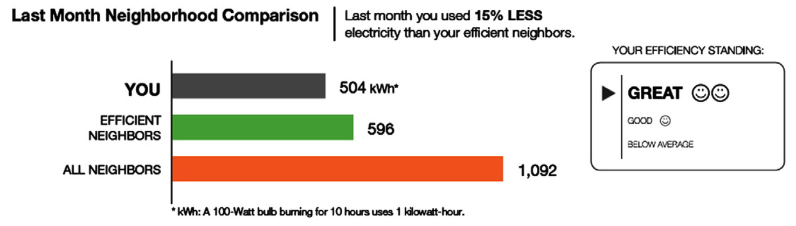
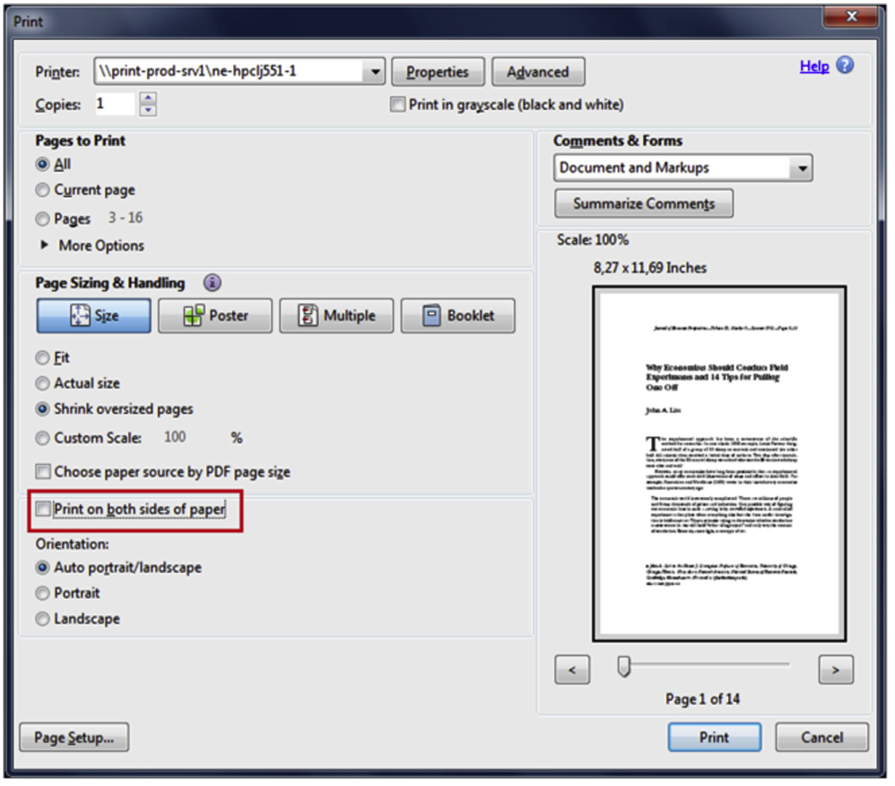

```{r setup, include=FALSE}
knitr::opts_chunk$set(echo = FALSE)
```

# Dagsorden

- Opsamling

- Applikation: Samfund, miljø og velfærd

- Grønne nudges

- Applikation:
    - Energiforbrug
    - Madforbrug
    - Transport
    - Organdonation

# Supplerende undervisningsaktivitet

- **Forslag** (ikke fastlagt)
    - Bachelor, sidefag: Mandag den 1. maj fra 10 til 13.
    - Kandidat: Mandag den 19. juni fra 10 til 13.

# Undervisningsgange

11) **Applikation: Samfund, miljø og velfærd**
12) Applikation: Gæsteforelæsning
13) Praktiske aspekter: Metode og den politiske beslutningsproces
14) Praktiske aspekter: Etiske og metodiske overvejelser
15) Praktiske aspekter: Opsummering og eksamen

# Pensum til i dag


# Pensum til i dag

- Thaler og Sunstein (2008): Prescription Drugs: Part D for Daunting, kapitel 10 (17 sider)
- Thaler og Sunstein (2008): How to Increase Organ Donations, kapitel 11 (9 sider)
- Thaler og Sunstein (2008): Saving the Planet, kapitel 12 (8 sider)
- Thaler og Sunstein (2008): Privatizing Marriage, kapitel 13 (13 sider)
- _Sunstein og Reisch (2014): Automatically Green: Behavioral Economics and Environmental Protection (32 sider)_

# Opsamling: Applikation

- Fokus: Applikation af teoretiske perspektiver

- Hvorfor?
    - Brug i praksis
    - Diskussion af forskellige teorier
        - Studier applicerer ofte ét teoretisk perspektiv på en problemstilling
    - Eksamen

# Opsamling: Penge og opsparing

- Empiriske problemstillinger: 
    - Spørgsmål relateret til penge, opsparing og skat
        - Borgerne sparer ikke nok op
        - Kviklån
        - Kreditkortregninger
        - Indberetning af skat

- Hvorfor sparer folk ikke mere op?
    - To problemer med rationel teori
        1) Antager at borgerne kan løse et komplekst matematisk problem og lave en plan
        2) Antager at borgerne har selvkontrol nok til at holde planen

# Opsamling: Opsparing

- Fokus på især to løsninger
    1) Automatisk tilmelding
        - Skift standardvalg
    2) Save More Tomorrow

- Automatisk tilmelding (udnytter at folk ikke tager stilling)

- Save More Tomorrow
    - Kombination af forskellige indsigter, der kan få folk til at spare mere op
    - Fem principper
        1) Borgerne har en interesse i at spare op
        2) Problemer med selvkontrol er mindre i fremtiden
        3) Tabsaversion
        4) Pengeillusion 
        5) Inerti

# Applikation: Samfund, miljø og velfærd

- I dag: Applikation på samfundsspørgsmål
    - Ikke alene om at få borgere til at spare op eller forholde sig fornuftigt til penge
    - Emner der er kollektive goder (miljø) eller fremmer velfærd (sundhed)
 
- Emner
    - Energi, klima og miljø
    - Sundhed, mad, transport
    - Organdonation

# Applikation: Mere end incitamenter

- Klassisk økonomi: Folk går op i miljøet og sundhed ... hvis det kan betale sig

- Indvendinger
    1) Mere end incitamenter
        - Sociale normer
    2) Individuelle forskelle
        - Nogle borgere går mere op i penge end andre

- Hvorfor kigge på mere end incitamenter?
    - Flere måder at opnå målsætninger på
    - Svært/dyrt med økonomiske incitamenter 
        - Politiske interesser og konflikter
        - Koncentrerede omkostninger, spredte fordele

# Applikation: Grønne nudges

- Simpelt framework: Grønne og grå tiltag
    - Eksempel: energi
        - Grøn energi: Bedst for samfundet
        - Grå energi: Billigst for borgeren
    - Ikke altid et trade-off, men oftest

- Grønne nudges: Pro-miljø, fremmer miljøvenlig adfærd
    - Bred enighed om, hvilken type adfærd, der er ønskværdig

# Applikation: Grønne nudges

- Schubert ([2017](http://www.sciencedirect.com/science/article/pii/S0921800916301860)): Green nudges: Do they work? Are they ethical?

- Tre typer af grønne nudges, der udnytter:
    1) Selvopfattelse
        - Eksempel: økologimærker
    2) Sociale normer/signal af grøn adfærd til andre
        - Eksempel: information omkring andres energiforbrug
    3) Standardvalg
        - Eksempel: valg af el

- _Ikke_ en udtømmende liste

# Applikation: Grønne nudges, standardvalg

- Ni måder at indrette standardvalg på (fra grøn til grå)
    1) Grøn lovgivning
    2) Grøn standard med omkostningstung fravælgelse
    3) Grøn standard med omkostningsfri fravælgelse
    4) Aktivt valg med pro-grøn framing
    5) Aktivt valg med neutral framing
    6) Aktivt valg med pro-grå framing
    7) Grå standard med omkostningsfri fravælgelse
    8) Grå standard med omkostningstung fravælgelse
    9) Grå lovgivning

- Hvilke er nudges?

# Applikation: Klimaforandringer

- van der Linden et al. ([2015](http://journals.sagepub.com/doi/full/10.1177/1745691615598516)): Improving Public Engagement With Climate Change: Five “Best Practice” Insights From Psychological Science

- Fem simple men vigtige _guidelines_ i forhold til klimaforandringer:
    1. Personlig erfaring slår statistik (kognitive biases og heuristikker)
    2. Gruppenormer har en vigtig betydning (motivation og værdier)
    3. Aktuel information vejer mest (kognitive biases og heuristikker)
    4. Der er forskel på tab og gevinster (kognitive biases og heuristikker)
    5. Der er flere måder at motivere borgerne på (motivation og værdier)

- Hvad kan vi ellers forestille os spiller en rolle?

# Applikation: Energiforbrug, madforbrug og transport

- Lehner et al. ([2016](http://www.sciencedirect.com/science/article/pii/S0959652615018041)): Nudging - A promising tool for sustainable consumption behaviour?

- Forskellige bud på, hvordan man bedst får borgerne til at forbruge mindre energi, mad og persontransport

- Fire nudges
    1) Simplifikation/framing af information
    2) Ændringer i det fysiske miljø
    3) Ændringer i standardvalg
    4) Brug af deskriptive sociale normer

# Energiforbrug: Simplifikation

- Applikation:
    - Feedback på energiforbrug
        - Informative regninger med simpel information
    - Mærkning af apparater og bygninger

- Evidens:
    - Forskellige estimater ift. feedback
        - Omkring 2% reduktion i energiforbrug
    - Masser af erfaring med mærkning, men begrænset evaluering

---


# Energiforbrug: Fysisk miljø

- Applikation:
    - Design af boliger og apparater 
        - Eksempel: Frysere der lukker automatisk
    - Påmindelser
        - Eksempel: Information om at huske at slukke lyset

- Evidens: 
    - Begrænset evaluering af effekten af design
    - Påmindelser kan have en effekt, men ikke nødvendigvis længerevarende og kan være irriterende

# Energiforbrug: Standardvalg

- Applikation:
    - Energibesparende standardvalg
    - Energimålende standardvalg
    
- Evidens:
    - Forbrugere går med energibesparende standardvalg (omkring 95-99%)
    - Energimålende teknologi reducerer forbrug

# Energiforbrug: Standardvalg

- Pichert og Katsikopoulos ([2008](http://www.sciencedirect.com/science/article/pii/S0272494407000758)): Green defaults: Information presentation and pro-environmental behaviour

- Flere studier med effekten af standardvalg

- Et af studierne: laboratorieeksperiment
    - To valgmuligheder
        - Grønt valg (_EcoEnergy_): Godt for miljøet, koster 30€ om måneden
        - Gråt valg (_Acon_): Bedste pris, koster 25€ om måneden 
    - Stimuli: Standardvalg som enten grøn, grå eller neutral (uden standardvalg)

# Energiforbrug: Standardvalg


# Energiforbrug: Standardvalg


# Energiforbrug: Sociale normer

- Applikation:
    - Feedback omkring andres forbrug
    
- Evidens
    - Store effekter i mindre studier (gennemsnitseffekt på 11% i reduktion)
    - Mindre effekter i større studier
        - Kan skyldes publikationsbias
        
# Energiforbrug: Sociale normer

- Allcott ([2011](http://www.sciencedirect.com/science/article/pii/S0047272711000478)): Social norms and energy conservation



# Energiforbrug: Sociale normer


        
# Madforbrug: Simplifikation

- Applikation:
    - Salient information på produkter
    
- Evidens:
    - Store effekter i mindre, kontrollerede studier
        - Forbrugere bruger salient information når de træffer beslutninger
    - Ingen større studier
    - Effekterne er potentielt større for bestemte typer af borgere
    
# Madforbrug: Fysisk miljø

- Applikation:
    - Ændre synligheden og tilgængeligheden
    - Ændre produktet (eksempelvis størrelsen)
    
- Evidens:
    - Stærk evidens fra kontrollerede miljøer (eksempelvis kantiner)
    - Evidens fra laboratorieeksperiment med produktstørrelser

# Madforbrug: Standardvalg

- Applikation:
    - Placering af produktvalg (også relateret til fysisk miljø)
        - Eksempelvis placering af produkter i supermarked 
    
- Evidens:
    - Store effekter (antages jf. supermarkeder)
    - Få systematiske studier af sunde produkter

# Madforbrug: Sociale normer

- Applikation:
    - Information omkring andres madforbrug og ideelt forbrug
    
- Evidens:
    - Især effektivt når:
        1) adfærd er offentlig
        2) der er usikkerhed omkring passende adfærd
        
# Madforbrug: forbehold

- Meget af forskningen i madforbrug er problematisk
    - Især den der omtales i pensum

- Studier fra Cornell Food and Brand Lab
    - Problemer med selvplagiering, tvivlsom dataduplikation, dataproblemer og statistiske problemer
    - Muligt at studierne kan replikeres, men vær kritisk i forhold til den evidens, der præsenteres

- For et overblik, se: [The Wansink Dossier: An Overview](http://www.timvanderzee.com/the-wansink-dossier-an-overview/)

# Transport: Simplifikation

- Applikation:
    - Rene veje
    - Klar information
        - Bilers benzinforbrug
    - Framing der tilskynder at cykle og gå
    - Feedback på transport
        - Smartphone apps
    
- Evidens:
    - Forskellige studier, intet systematisk overblik

# Transport: Fysisk miljø

- Applikation:
    - Byplanlægning (urbant design)
    - Design af veje
        - Linjer
        - Farver
        - Skilte
        - Bump
    
- Evidens:
    - Infrastrukturprojekter

# Transport: Standardvalg

- Applikation:
    - Autopilot i biler
    - Vejplanlægning
    - Cykelhjelm
    
- Evidens:
    - Overtrædelser af fartgrænsen m.v. kan reduceres

# Transport: Sociale normer

- Applikation:
    - Feedback på adfærd
        - Sociale normer 
        - Sociale netværk
    
- Evidens:
    - Blandede resultater
    - Lav validitet
        - Især på grund af omfanget af studierne (få deltagere)

# Applikation: Organdonation

- Diskuteret i tidligere lektioner

- Overordnet set tre kategorier
    - Eksplicit samtykke
    - Formodet samtykke
    - Tvunget valg (skal tage stilling)

# Applikation: Organdonationer

- Abadie og Gay ([2006](http://www.sciencedirect.com/science/article/pii/S016762960600004X)): The impact of presumed consent legislation on cadaveric organ donation: A cross-country study

- Giver formodet samtykke flere organdonationer?

- Kompliceret område: formodet samtykke $\neq$ organdonation
    - Forskellige forhold påvirker donationsrater
    - Kræver blandt andet:
        - God infrastruktur (eksempelvis Spanien)
        - Anledning til organdonation (eksempelvis ulykker)

# Applikation: Organdonationer


# Applikation: Organdonation i Danmark


# Applikation: Normer eller standardvalg?

- Egebark og Ekström ([2016](http://www.sciencedirect.com/science/article/pii/S009506961500090X)): Can indifference make the world greener?

- Hvad virker bedst - normer eller standardvalg?

- Design: felteksperiment, universitet
    - 54 printere på 31 institutter
    - Norm: moralsk appel
    - Standardvalg: fra print på én til flere sider
    - Afhængig variabel: Antal sider på hvert papir
    
# Normer eller standardvalg? Besked med moralsk appel

_Dear Colleague,_

_At X we strive to reduce our impact on the environment, and as an employee you can be part of this process. An easy way to save resources is to keep paper consumption low. You can contribute by choosing to print on both sides of a sheet. Duplex printing is available on most of the printers at X, and you can also make this printing mode the default option on your computer. If you need help with setting up your own printer settings, you are welcome to contact the IT media helpdesk by phone: XX-XXXXXX. Thank you for your cooperation!_

_Best regards_

---


---



---


---


---


# Dagens diskussion: print af papir

1) Hvordan kan man få folk til at udskrive mindre papir?
    - Diskuter hvilke redskaber, der vil fungere bedst

# Opsummering

- Indsigter fra tidligere lektioner kan appliceres på samfundsspørgsmål
    - Eksempelvis energiforbrug
    
- Forskellige måder at applicere adfærdsøkonomiske indsigter på
    1) Simplifikation/framing af information
    2) Ændringer i det fysiske miljø
    3) Ændringer i standardvalg
    4) Brug af deskriptive sociale normer

- Vigtigt at studere hvad der virker bedst!

# Næste gang

- Applikation: Gæsteforelæsning

- Onsdag den 26. april, kl. 16.15-18.00, lokale U53

- Pensum
    - Hansen (2013): Nudging: Hvordan får man folk til at ændre adfærd? (5 sider)
    - Hulgaard et al. (2016): Nudging Passenger Flow in CPH Airports (5 sider)
    - Schmidt et al. (2016): Nudging Smoke in Airports: a case study in nudging as a method (8 sider)
    - _Hansen (2016): The Definition of Nudge and Libertarian Paternalism: Does the Hand Fit the Glove? (20 sider)_
    - _Hansen og Jespersen (2013): Nudge and the Manipulation of Choice: A Framework for the Responsible Use of the Nudge Approach to Behaviour Change in Public Policy (26 sider)_