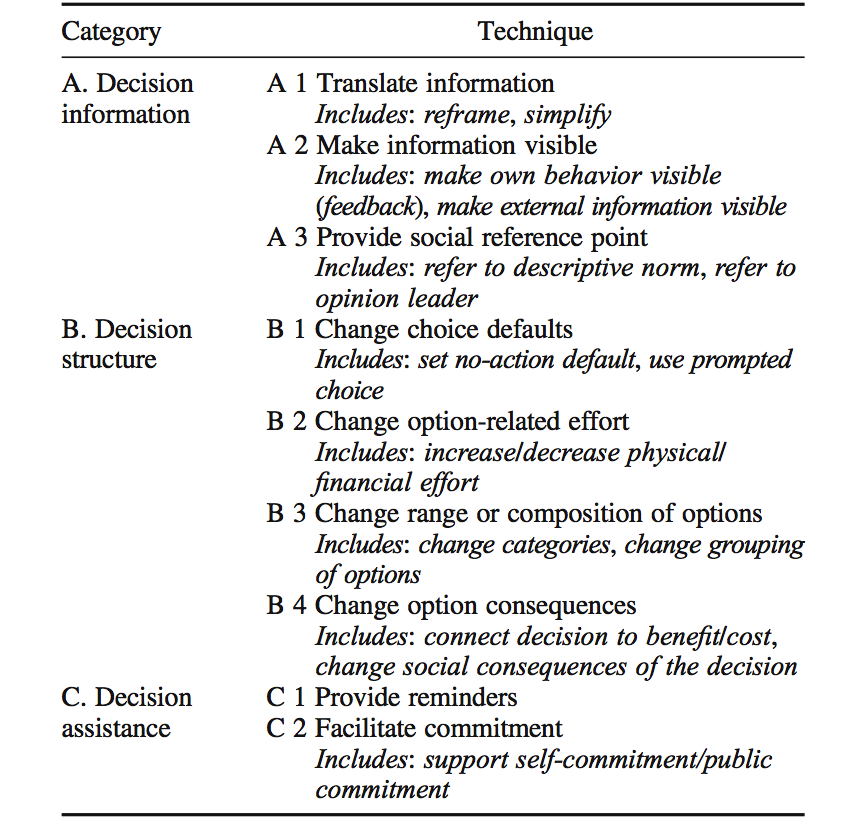
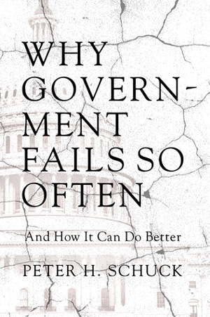
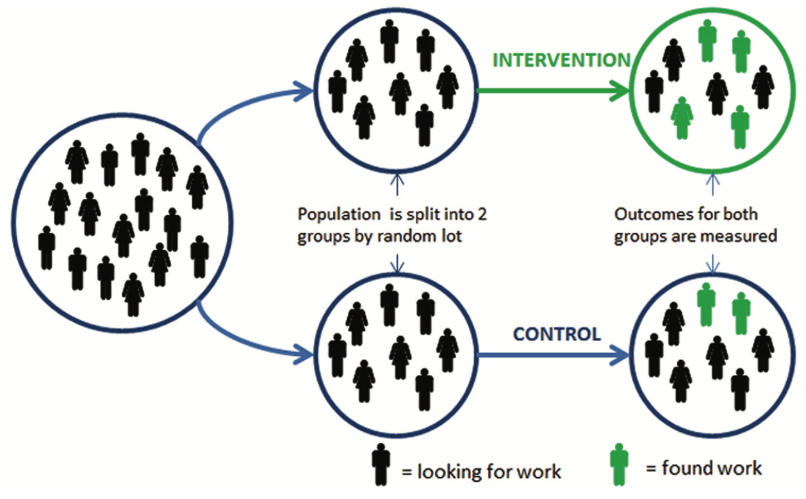
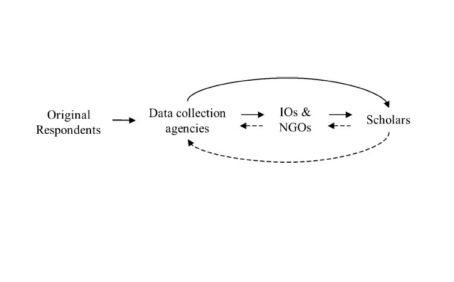
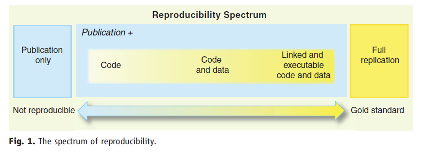
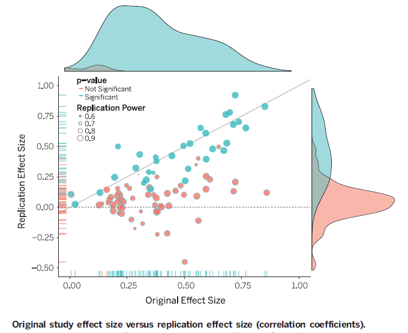
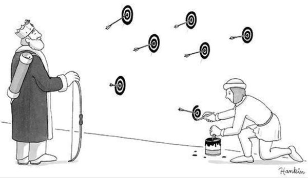

```{r setup, include=FALSE}
knitr::opts_chunk$set(echo = FALSE)
```

# Gæsteforelæsning

- Slides kommer på BlackBoard snart

- Feedback?

# Dagsorden

- Praktiske aspekter

- Effektive offentlige politikker

- Metodiske tilgange

- Datakvalitet

- Replikation og reproducerbarhed 

# Undervisningsgange

13) **Praktiske aspekter: Metode og den politiske beslutningsproces**
14) Praktiske aspekter: Etiske og metodiske overvejelser
15) Praktiske aspekter: Opsummering og eksamen

# Pensum til i dag

- Haynes et al. (2012): Test, Learn, Adapt: Developing Public Policy with Randomised Controlled Trials (35 sider)
- Dolan og Galizzi (2014): Getting policy-makers to listen to field experiments (28 sider)
- _Berggren (2012): Time for behavioral political economy? Ananalysis of articles in behavioral economics (23 sider)_

# Opsamling: Applikation på samfund, miljø og velfærd

- Applikation på samfundsspørgsmål
    - Emner der er kollektive goder (miljø) eller fremmer velfærd (sundhed)
 
- Emner: Energi, klima, miljø, sundhed, mad, transport, organdonation

- Fire nudges appliceret på energiforbrug, madforbrug og transport
    1) Simplifikation/framing af information
    2) Ændringer i det fysiske miljø
    3) Ændringer i standardvalg
    4) Brug af deskriptive sociale normer

# Applikation: Hvordan?

- Münscher et al. ([2016](http://onlinelibrary.wiley.com/doi/10.1002/bdm.1897/abstract)): A Review and Taxonomy of Choice Architecture Techniques

- Applikation af teori i design af intervention 

- Tre kategorier med i alt ni teknikker
    1) Beslutningsinformation
    2) Beslutningsstruktur
    3) Beslutningshjælp

---



# Praktiske aspekter

- Moduler
    1) Introduktion
    2) Heuristikker og biases
    3) Motivation og værdier
    4) Applikation
    5) **Praktiske aspekter**

- Forskellige relevante aspekter
    - Metodiske principper
    - Politisk beslutningsproces
    - Etiske spørgsmål

# Effektive offentlige politikker



# Effektivitet: Hvorfor gå op i hvad der virker? 

- Politikker der ikke virker kan have flere negative konsekvenser
    1) Spild af ressourcer
        - Bedre måde at bruge ressourcerne på
    2) Borgere har brug for effektive politikker
        - Især folk der har mest brug for det offentlige
    3) Fremtidig økonomisk vækst
    4) Legitimitet

# Effektivitet: Hvad man kan forvente

- Rossi ([1987](https://www.gwern.net/docs/1987-rossi)): The Iron Law of Evaluation and Other Metallic Rules
    - _The Iron Law of Evaluation_: Den forventede effekt af en politik er 0. 
    - _The Stainless Steel Law of Evaluation_: Jo bedre en politik evalueres, desto mere sandsynligt er det at effekten er 0.
    - _The Brass Law of Evaluation_: Jo mere en politik designes til at ændre mennesker, desto mere sandsynligt er det at effekten er 0.
    - _The Zinc Law of Evaluation_: Kun de politikker der kan fejle, vil blive evalueret.


# Kriterier i forhold til at vurdere effektivitet

- Hvordan vurderer man om en politik er effektiv?

- Fire aspekter der viser kompleksiteten
    1) I forhold til hvad er en politik effektiv?
    2) En politik kan fejle på én dimension men være succesfuld på andre
    3) Vurderingen af en politik kræver afgræsning, indsamling og analyse
    4) Der er uenigheder (også akademisk) omkring hvordan man bedst evaluerer en politik

# Guidelines til at vurdere effektivitet

1) Politikere skal kun lave en intervention, hvis der er brug for det
    a) Er der en markedsfejl?
    b) Er fejlen stor nok til at legitimere en intervention givet omkostningerne ved at gennemføre den?
    c) Vil interventionen sandsynligvis være succesfuld? 

2) En intervention bør maksimere fordele relativt til omkostninger

3) Det skal undersøges hvornår en intervention (ikke) er effektiv

4) En politik virker måske ikke på grund af et forkert redskab
    - Skatter, regulering, incitamenter, nudges

# Guidelines til at vurdere effektivitet

5) Vi skal også evaluere eksisterende politikker
    - Ikke kun nye forslag

6) At fjerne en mislykket politik er også en effektivitetsforbedring 

7) Evalueringen skal tage højde for tidshorisonten
    - Distinktion mellem kort- og langsigtede effekter

8) Evalueringen skal tage højde for den eksisterende sociale og institutionelle kontekst

9) Undgå Nirvana fejlslutninger
    - Når en politik fejler betyder det ikke, at den idé man har til en bedre politik automatisk vil virke

# Metodiske tilgange

- Eksperimenter
    - Laboratorieeksperiment
    - Surveyeksperiment
    - Felteksperiment
    - osv.

- Naturlige eksperimenter
    - Regressionsdiskontinuitetsdesigns
    - Instrumentel variabel regression
    - Difference-in-difference designs
    - osv.

- Observationsstudier
    - Matching, syntetisk kontrol
    - Spørgeskemaer
    - Kvalitative interviews
    - Etnografiske observationer
    - osv.

# Metodiske tilgange: Randomiserede kontrollerede forsøg



# Metodiske tilgange: Test, lær, tilpas

- Tre trin i forhold til at ændre offentlige politikker
    1) Test: Sørge for at måle effektiviteten af en intervention
    2) Læring: Analyse af hvad der virker og om effekten er ressourcerne værd
    3) Tilpas: Hvis nødvendigt, modifikation af interventionen

- Test 
    1) Find to eller flere interventioner, der kan sammenlignes
        - En gammel og en ny politik
        - Forskellige varianter af en politik
    2) Find et mål som politikken skal påvirke
        - Information om hvordan det vil blive målt
    3) Find ud af hvad der skal undersøges/randomiseres 
        - Personer, organisationer, geografiske områder

# Metodiske tilgange: Test, lær, tilpas

- Test (_fortsat_)
    4) Find ud af hvor mange enheder der skal inkluderes for at få robuste resultater
    5) Tildel hver enhed én intervention via en robust metode
    6) Introducer interventionen til den tildelte gruppe

- Lær
    7) Mål resultaterne og afgør om der er en effekt af interventionen
    
- Tilpas
    8) Tilpas interventionen med udgangspunkt i resultaterne
    9) Gå tilbage til (1) og blev bedre til at forstå, hvad der virker

# Metodiske tilgange: Datakvalitet

- Der kan være mange grunde til *ikke* at gennemføre et eksperiment
    - Metodiske
    - Praktiske
    - Etiske

- Uafhængigt af hvilken tilgang man bruger, får man nogle data

- Vi skal stillle kritiske og vigtige spørgsmål ift. evalueringen af data
    - Hvem har indsamlet/konstrueret data?
    - Hvilke interesser har disse aktører?
    - Hvorfor er disse data indsamlet?

- "Like all organizations, those that produce data are prone to problems of agency, bureaucratic incentives, shirking, and multiple principals and goals, all of which are likely to shape their output, that is, data." (Herrera og Kapur [2007](http://pan.oxfordjournals.org/content/15/4/365.abstract), 366)

# Datakvalitet: validitet, dækning, præcision

- Hvordan vurderer vi kvaliteten af de data, vi har?

- Hvordan kan vi sikre os, at det vi måler i adfærdsorienteret offentlig politik er validt?

- Tre elementer ved datakvalitet
    - Validitet
    - Dækning
    - Præcision

# Datakvalitet: Validitet

- Relationen mellem teoretisk koncept og indsamlet data

- Udgangspunkt: Definition af koncept
    - Ofte underteoretiseret
    
- Målevaliditeten: Relationen mellem dimensioner og data
    - Udfordring: Konsistens, sammenlignelighed, reliabilitet
        - Er mål sammenlignelige på tværs af lande?

# Datakvalitet: Dækning

- Har vi komplette data?
    - Hvis vi ikke har de data, vi skal bruge, er der problemer med dækningen

- Tilstedeværelsen (eller fraværet) af data er sjældent tilfældigt
    - Offentlighedsloven

- Er det tilfældigt hvilke data vi har fra Kina?

# Datakvalitet: Præcision

- Præcision angiver fraværet af fejl i de data, vi har

- Fejl i dataindsamlingen eller datapræsentationen reducerer præcisionen

- Udfordringer
    - Metodiske ændringer
    - Forkerte indtastninger

# Datakvalitet



# Datakvalitet: Aktører

- Respondenter
    - Husholdning
    - Firma
    - Offentligt ansat/bureaukrat

- Indsamlingsenheder
    - Ministerier
    - Analyseinstitutter

- Interesseorganisationer

- Akademia/universiteter

# Datakvalitet: Respondenter

- Incitamenter
    - Penge
    - Politisk support
    - Frygt for straf
    - Alternativomkostninger

- Kapaciteter
    - Tid
    - Viden
    - Uddannelse
    - Surveyadgang

- Datakvalitetsproblemer
    - Manglende svar
    - Bevidst forkerte svar
    - Selvselektion i svar

# Datakvalitet: Indsamlingsenheder

- Incitamenter
    - Professionelle normer
    - Penge
    - Eksternt pres

- Kapaciteter
    - Ressourcer
        - Viden
        - Penge

- Datakvalitetsproblemer
    - Mangelfuld indsamling af data
    - Manipulation af data
    - Selvselektion i svar

# Datakvalitet: Interesseorganisationer/NGO

- Incitamenter
    - Professionelle normer
    - Support fra andre aktører
    - Samarbejde

- Kapaciteter
    - Ressourcer
        - Viden
        - Penge

- Datakvalitetsproblemer
    - Manglende indsamling af data
    - Selvselektion i svar

# Datakvalitet: Akademia

- Incitamenter
    - Publikationer
    - Profesionelle normer

- Kapaciteter
    - Tid
    - Forskningsmidler
    - Viden

- Datakvalitetsproblemer
    - Manglende data
    - Vedvarende brug af dårlige data
    - Problematisk brug af eksisterende data
        - Matcher ofte ikke teoretisk dimension eller koncept

# Replikation og reproducerbarhed

- En valid test af en teori skal være transparent
    - Mulighed for at andre kan teste teorien

- Hvis ikke en analyse kan replikeres, er den ikke videnskabelig

- Distinktion mellem replikation og reproduktion
    - Reproducere: at skabe de *samme* resultater med det *samme* data
    - Replikere: at gennemføre en undersøgelse med *andre* data (evt. nye data)

# Reproducerbarhedskontinuum 

- Peng [2011](http://science.sciencemag.org/content/334/6060/1226)



# Hvorfor er det vigtigt?

- Meget forskning kan ikke replikeres
    - 'False positives' (Ioannidis [2005](http://journals.plos.org/plosmedicine/article?id=10.1371/journal.pmed.0020124))
    - Tidsskrifter publicerer primært artikler, der bekræfter en teori

- Penge brugt på forskning, der ikke kan replikeres 
    - Alene US$28,000,000,000 inden for præklinisk forskning i USA (Freedman et al. [2015](http://journals.plos.org/plosbiology/article?id=10.1371/journal.pbio.1002165))

- Et af de definerende karakteristika ved videnskab er, at det kan reproduceres. 
    - "the only way to understand and evaluate an empirical analysis is to know the exact process by which the data were generated and the analysis produced" (King [1995](http://journals.cambridge.org/action/displayAbstract?fromPage=online&aid=8810955&fileId=S1049096500057607))

# Hvorfor er det vigtigt?

- OSC ([2015](http://science.sciencemag.org/content/349/6251/aac4716)): Estimating the reproducibility of psychological science



# Mange måder at opnå signifikante resultater



# Praktiske aspekter: Politikere og adfærdsorienteret offentlig politik

- Hvordan får man politikerne til at lytte? 

- Hvorfor lytter politikere ikke?
    - Mange politikere har ikke en akademisk baggrund
        - Eller er ikke trænet i bestemte metoder og perspektiver
    - Politikere kender ikke til forskelle mellem forskellige forskningsdesigns
        - Mere interesseret i effekterne uafhængigt af metoden
    - Kender ikke til fordele, men fokuserer mere på omkostningerne ved at evaluere

# Praktiske aspekter: Politikere og adfærdsorienteret offentlig politik

- Vi har fokuseret på kognitive biases hos borgerne, men politikerne har selv biases og bestemte værdier

- Har dette implikationer for, hvilke politikker der gennemføres?
    - Hvornår er der rum for en offentlig politik?
    - Skal en politik altid gennemføres?

---

)](bpe.png)

# Opsummering

- Metodiske og praktiske udfordringer i adfærdsorienteret offentlig politik

- Spørgsmål relateret til evaluering af effektivitet
    - Hvad er effektivitet?
    - Hvordan vurderer vi bedst effektivitet?

- Data varierer i kvalitet
    - Vær opmærksom på hvordan data er genereret
    - Replikation og reproducerbarhed 

# Næste gang

- Praktiske aspekter: Etiske og metodiske overvejelser

- Onsdag den 10. maj, kl. 16.15-18.00, lokale U53

- Pensum
    - Sunstein og Thaler (2003): Libertarian Paternalism Is Not an Oxymoron (44 sider)
    - _Benjamin og Laibson (2003): Good Policies For Bad Governments: Behavioral Political Economy (41 sider)_
