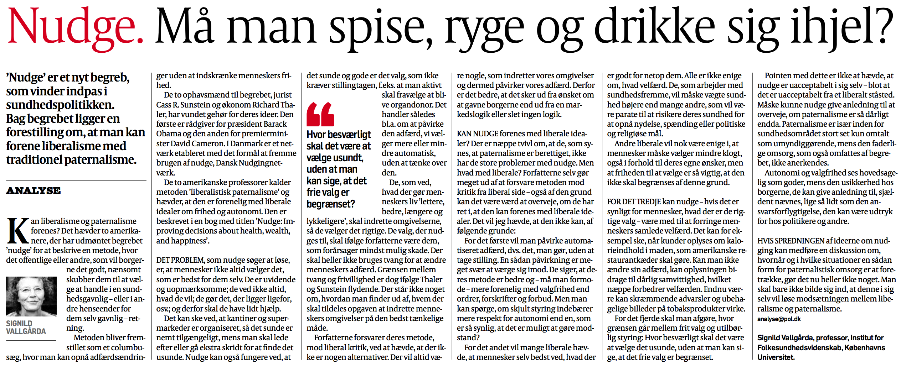

```{r setup, include=FALSE}
knitr::opts_chunk$set(echo = FALSE)
```

# Evaluering af spørgeskema

- I fik et spørgeskema forrige uge

1) Hvad synes I om det?
    - Fagligt
        - Valg af spørgsmål, svarmuligheder m.v.
    - Praktisk
        - For langt? 
        - For besværligt?

2) Hvad synes I om det rent etisk?
    - Hvilke forbehold skal der tages?

# Dagsorden

- Etik
    - Overordnet
    - Eksperimenter
    
- Libertariansk paternalisme

- Diskussion af nudging
    - Kritikpunkter
    - Eksempler

- Borgernes opbakning til nudging

# Supplerende undervisningsaktivitet: kandidat

- Nu: Lokale booket til mandag den 19. juni kl. 10-13

- Hvornår vil det passe flest muligt?

# Evaluering af faget

- Evaluering af Adfærdsorienteret offentlig politik

- Afsluttet: Ikke længere muligt at besvare spørgeskemaet
    - Hvis du ikke fik givet feedback: send gerne en mail, hvis der er noget vigtigt
    
- Næste uge: Opsamling på feedback

# Undervisningsgange

14) **Praktiske aspekter: Etiske og metodiske overvejelser**
15) Praktiske aspekter: Opsummering og eksamen

# Pensum til i dag

- Sunstein og Thaler (2003): Libertarian Paternalism Is Not an Oxymoron (44 sider)
- _Benjamin og Laibson (2003): Good Policies For Bad Governments: Behavioral Political Economy (41 sider)_

# Opsummering: Metode og den politiske beslutningsproces

- Forskellige metodiske tilgange
    - Guldstandard: Randomiserede kontrollerede forsøg

- Effektive offentlige politikker
    - Forskellige kriterier
    - Forskellige udfordringer

- Udfordringer i forhold til bestemte metoder
    - Politisk opbakning
    - Datakvalitet
    - Replikation og reproducerbarhed

# Etik: Overordnet

- Samfundsvidenskaberne: forskning med og om mennesker

- Etiske principper
    - Respekt for personer der deltager
    - Til fordel for deltagerne
    - Retfærdighed

- Husk især: 
    - Debriefing
    - Anonymitet 

# Etik: Eksperimenter

- Mange af de studier vi læser anvender eksperimenter

- Hvilke spørgsmål er i særdeleshed relevante, når det handler om eksperimenter?
    - Randomisering
        - Nogen får _ikke_ et stimuli/en bestemt politik
        - Ikke dem med det største behov der får et stimuli

- Forskellige måder at imødekomme etiske udfordringer ved randomisering
    - Regelbaseret tildeling af stimuli baseret på behov
    - Information til deltagerne, transparent randomisering

# Etik: _Libertariansk_ paternalisme

- Libertarianisme 
    - Beslægtet med liberalisme
    - Mennesker ved bedst, hvad der er bedst for dem selv
    - De bedste til at træffe valg, er borgerne selv
    - Offentlige politikker: maksimere borgerens frihed til at vælge
    - Princip: Ingen valgmuligheder skal fjernes

# Etik: Libertariansk _paternalisme_

- Paternalisme
    - Andens forvaltning af de beslutninger, der angår en selv
    - Mennesker træffer ikke valg, der er gode for dem
        - Borgerne træffer ikke valg, der er i deres _egen_ interesse
    - Offentlige politikker: maksimere borgerens velfærd
    - Paternalisme $\neq$ tvang
    - Princip: Borgere brug for hjælp til at opnå det de gerne vil have

# Etik: Libertariansk paternalisme

- Thaler og Sunstein: "we are not for bigger government, just for better governance"
    - Thaler og Sunstein ([2003](http://www.jstor.org/stable/3132220)): Libertarian Paternalism

- Nudging er libertariansk paternalisme
    - _Libertariansk_ fordi valg ikke er blokeret, gjort betydeligt sværere eller på anden måde forhindret
    - _Paternalistisk_ fordi der arbejdes med at påvirke borgerens valg til det bedre (som vurderet af dem selv)

- Eksempler?

# Skal vi diskutere etik i dette fag?

- Sunstein ([2016](https://www.cambridge.org/core/books/the-ethics-of-influence/E29EDE19EBCB53F6D8691730668115F7), 199): The Ethics of Influence: Government in the Age of Behavioral Science
    - "It is pointless to raise ethical objections to nudges and choice architecture as such. Human beings cannot live in a   world without them. Social norms nudge, and society cannot exist without social norms" 
    - "Such norms influence us every day, even when we do not notice them. They can emerge without any involvement from political actors, but the law has an expressive function, and what it expresses influences the content of norms."


---



# Diskussion af nudging

- Tre primære bekymringer
    1) Transparens
        - Staten manipulerer borgerne til at gøre noget uden at borgerne ved det
        - Staten tilbageholder information omkring hvad der bliver gjort
    2) Effektivitet
        - Små ændringer, store effekter?
        - Hvis store effekter, er det så libertariansk paternalisme?
    3) Ansvarlighed
        - Hvordan skal man holde politikerne ansvarlige for nudging?
        - Hvordan ved man om politikerne har gjort deres arbejde godt?
        - Demokratisk kontrol; relateret til transparens

# Diskussion af nudging: kritikpunkter

1) Beskytter ikke borgernes frihed (Rebonato [2014](https://link.springer.com/article/10.1007/s10603-014-9265-1))
2) Påvirker borgernes evne til at træffe beslutninger (Klick og Mitchell [2016](http://heinonline.org/HOL/Page?handle=hein.journals/rcatorbg39&div=20&g_sent=1&collection=journals))
3) Fører til en glidebane i forhold til offentlig kontrol (Rizzo og Whitman [2008](http://www.arizonalawreview.org/pdf/51-3/51arizlrev685.pdf))
4) Udviser disrespekt i forhold til borgerne som irrationelle (Hausman og Welch [2010](http://onlinelibrary.wiley.com/doi/10.1111/j.1467-9760.2009.00351.x/abstract))
5) Giver borgerne mindre autonomi og personlig integritet (Grüne-Yanoff [2012](https://link.springer.com/article/10.1007/s00355-011-0636-0); Schubert [2015](http://papers.ssrn.com/sol3/papers.cfm?abstract_id=2672970))

# Diskussion af nudging: kritikpunkter

6) Manipulerer borgernes (Hansen og Jespersen [2013](http://heinonline.org/HOL/LandingPage?handle=hein.journals/ejrr2013))
7) Overser dybere, strukturelle grunde til sociale problemer (Leggett [2014](http://www.ingentaconnect.com/content/tpp/pap/2014/00000042/00000001/art00001))
8) Fremmer en neoliberal agenda (Jones et al. [2010](http://onlinelibrary.wiley.com/doi/10.1111/j.2041-9066.2010.00037.x/abstract))
9) Giver mindre velfærd (Qizilbash [2012](https://link.springer.com/article/10.1007/s00355-011-0620-8))
10) Tager ikke højde for vigtigheden af lovgivning (Lepenies og Malecka [2015](https://link.springer.com/article/10.1007/s13164-015-0243-6))

# Er der forskel på nudges?

- Hansen og Jespersen ([2013](http://heinonline.org/HOL/LandingPage?handle=hein.journals/ejrr2013)): Nudge and the Manipulation of Choice: A Framework for the Responsible Use of the Nudge Approach to Behaviour Change in Public Policy

- Interventioner er forskellige på to dimensioner
    1) Transparens
        - Transparens eller ikke-transparens
    2) Kognitiv mekanisme
        - System 1 eller System 2

---


---


# Er der forskel på nudges? Private og offentlige nudges

- Schmidt ([2017](https://www.cambridge.org/core/journals/american-political-science-review/article/power-to-nudge/F0BD18EC604A63796B6BCC7F6467F95B)): The Power of Nudges

- Private nudges (bruges af virksomheder)
    - Får os til at:
        - Stifte mere gæld
        - Blive overvægtige
        - Spise sukker
        - Ryge

- Nudging kan give _mere_ autonomi
    - Demokratisering af nudges; ikke kun "private" nudges
    - Nudges i offentlig politik kan give mere information til borgerne
        - Hvis transparent og underlagt demokratisk kontrol

# Hvornår er manipiulation ok?

- Sunstein ([2015](http://ftp.nowpublishers.com/article/Details/JMB-0014)): Fifty Shades of Manipulation

- Argument: Der er forskel på manipulation; nogle gange kan det accepteres - andre gange ikke


# Eksempel: Toiletobservationer 

- Middlemist et al. ([1976](http://psycnet.apa.org/journals/psp/33/5/541/)): Personal space invasions in the lavatory

- Hvornår må man observere andre borgeres adfærd?

- "In a field experiment conducted in a men's lavatory at a midwestern U.S. university, subjects were randomly assigned to one of three levels of interpersonal distance. Men who entered a threeurinal lavatory to urinate were forced to use the leftmost urinal. A confederate was placed immediately adjacent to the subject, one urinal removed, or was absent from the lavatory. An observer stationed in a toilet stall timed the delay and persistence of micturation."

---


# Eksempel: Valgdeltagelse

- Hvornår må forskere gå ud og ændre/påvirke virkeligheden?
    - Må forskere påvirke vælgerne? 

- Er det OK at gennemføre GOTV-eksperimenter? 
    - GOTV: Når man forsøger at få flere til at stemme (ikke _hvad_ de stemmer på)
    - Hvornår er det mere acceptabelt?

- Hvilke etiske udfordringer er der forbundet med dette?

# Eksempel: Valgdeltagelse


# Eksempel: Skal det være lovpligtigt at stemme?

- Elliott ([2017](http://www.journals.uchicago.edu/doi/abs/10.1086/690711)): Aid for Our Purposes: Mandatory Voting as Precommitment and Nudge

- Mange borgere vil gerne stemme, men får ikke taget sig sammen og gjort det
    - A la: Mange borgere vil gerne tabe sig, men får ikke taget sig sammen og gjort det
        - Kan de to problemstillinger sammenlignes?
    - For de borgere der _ikke_ vil stemme: et nudge der sørger for, at borgeren beskytter deres egeninteresser
        - Herunder at overvåge politikerne

# Hvad synes borgerne om nudging?

-  Reisch og Sunstein ([2016](http://www.decisionsciencenews.com/sjdm/journal.sjdm.org/16/16202b/jdm16202b.pdf)): Do Europeans like nudges?

- Spørgeskemaundersøgelse i seks lande
    - Danmark, England, Frankrig, Tyskland, Italien og Ungarn
    
- Spørgsmål om opbakning til forskellige politiske tiltag
    - 15 "nudges"

# De 15 politiske tiltag

1. Kalorieinformation i restaurantkæder (som McDonald's og Burger King) 
2. Trafiksignalsymboler på madprodukter (grønne mærker på sund mad, gule mærker på hverken sunde eller usunde og røde mærker på usunde)
3. Opfordring til at el-leverandører lader grønne tiltag være standardvalg
4. Krav til at folk tager stilling til organdonation når de får deres kørekort
5. Krav til at supermarkeder placerer sunde produkter på prominente og synlige steder

# De 15 politiske tiltag

6. En oplysningskampagne der består af grafiske billeder og historier om trafikuheld for at få folk til at køre bil, når de kører bil
7. En oplysningskampagne til forældre med information der kan få dem til at træffe sundere valg for deres børn
8. Krav til at biografer sender _subliminale_ reklamer med henblik på at forhindre rygning og indtag af usunde produkter
9. Et standard kulstofudledningsgebyr på 10 euro på hver flybillet (som kan fravælges)
10. Et krav til at produkter med meget salt informerer herom samt at det er usundt at indtage for meget salt

# De 15 politiske tiltag

11. En automatisk donation på 50 euro til Røde Kors (eller et andet godt formål) på ens selvangivelse man kan fravælge
12. Krav til at biografer sender oplysningskampagner der opfordrer folk til ikke at ryge og spise usundt
13. Krav til at el-leverandører lader grønne tiltag være standardvalg
14. Krav til at der ikke er noget slik ved kassen i supermarkeder
15. Krav til at kantiner i offentlige institutioner har en kødfri dag om ugen

---


---


# Opbakningen til nudges: forskellige forklaringer

- Jung og Mellers ([2016](http://www.decisionsciencenews.com/sjdm/journal.sjdm.org/15/15824a/jdm15824a.pdf)): American attitudes toward nudges

- Sondring mellem System 1 og System 2 nudges
    - System 1 nudges: eksempelvis standardvalg
    - System 2 nudges: eksempelvis påmindelser
    
- Større opbakning til System 2 nudges

- Forskellige forklaringer og grunde til opbakningen til nudges

---


---


# Opsummering

- Etiske aspekter vigtige!
    - Især i samfundsvidenskaberne
    
- Libertariansk paternalisme - og nudging - kan diskuteres
    - Flere forskellige kritikpunkter
        - Normative omkostninger
        - Transparens
        - Autonomi/personlig integritet

# Næste gang

- Praktiske aspekter: Opsummering og eksamen

- Onsdag den 17. maj, kl. 16.15-18.00, lokale U53

- Pensum
    - Thaler (2016): Behavioral Economics: Past, Present and Future (22 sider)
    - _Thaler og Sunstein (2008): A Dozen Nudges, kapitel 14 (8 sider)_
    - _Thaler og Sunstein (2008): Objections, kapitel 15 (18 sider)_
    - _Thaler og Sunstein (2008): The Real Third Way, kapitel 16 (2 sider)_