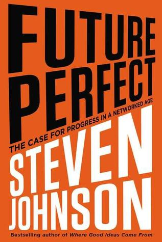
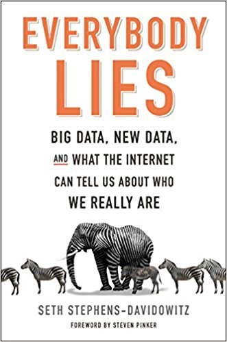
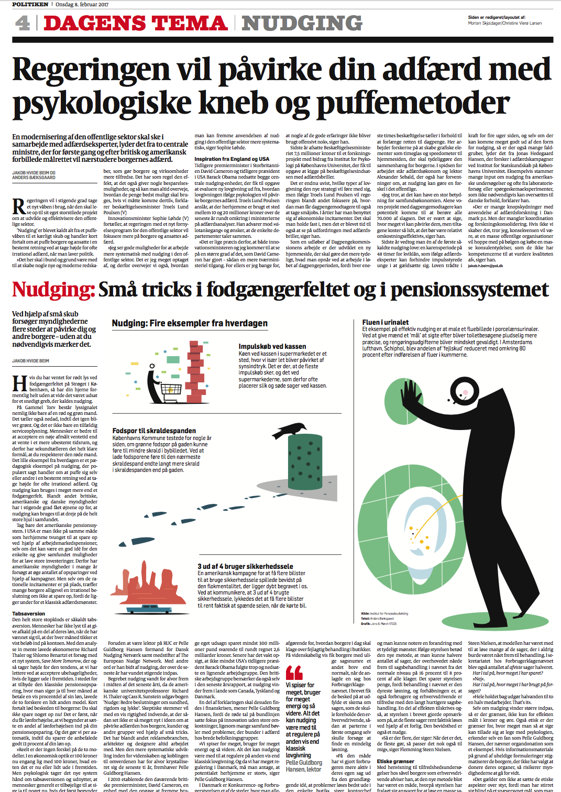

```{r setup, include=FALSE}
knitr::opts_chunk$set(echo = FALSE)
```

# Dagsorden

- Evaluering af faget
    - Opsamling på feedback

- Opsamling på faget
    - De overordnede linjer
    - Teoretiske perspektiver

- Eksamen
    - Et par generelle råd

# Supplerende undervisningsaktivitet, kandidat

- Onsdag den 21. juni 

- Fra klokken 14.15 til 17.00

- Lokale U48A

# Reeksamen, 4. semester samfundsfag

- Aflevering: **8. august 2017**

# Evaluering af faget, observationer

- Svarprocent: 43 (ikke _MCAR_)
    - Kunne være bedre

- Deltagelse
    - Overvejende tilfredshed
        - ... men også plads til forbedring

- Forberedelse: Meget variation
    - Men normalfordelt

- Relation mellem lektions- og eksamensform
    - Lidt variation

# Evaluering af faget, overordnet

- Engagement (_selection bias_)

- Bachelor- _og_ kandidatfag
    - Lektionsplan i forhold til eksamensform

- Lektionsstruktur

- Pensum
    - Nogle dele af pensum fungerer bedre end andre

# Undervisningsgange

15) **Praktiske aspekter: Opsummering og eksamen**

# Pensum til i dag


# Pensum til i dag

- Thaler (2016): Behavioral Economics: Past, Present and Future (22 sider)
- _Thaler og Sunstein (2008): A Dozen Nudges, kapitel 14 (8 sider)_
- _Thaler og Sunstein (2008): Objections, kapitel 15 (18 sider)_
- _Thaler og Sunstein (2008): The Real Third Way, kapitel 16 (2 sider)_

# Opsamling på faget

- _Mange_ empiriske studier
    - Anvender forskellige teoretiske perspektiver

- Fokus: De overordnede linjer

- Relevant i forhold til eksamen
    - Synopsis: applicere teorier på _selvvalgt_ emne
    - Kandidat: applicere teorier på _bestemt_ emne

# Fagets struktur

- Hav styr på de fem blokke
    1) Introduktion
        - Adfærdsorienteret offentlig politik
        - Dual process teori
        - Nudging
    2) Heuristikker og biases
    3) Motivation og værdier
    4) Applikation
    5) Praktiske aspekter

# Udgangspunkt: _Adfærdsorienteret_ offentlig politik

- Anvendelse af psykologiske og økonomiske perspektiver på offentlige politikker

- Relateret til adfærdsøkonomi (_behavioral economics_)
    - Adfærdsøkonomi: Anvendelsen af psykologisk forskning i udviklingen af økonomisk teori

- Mere _realistiske_ antagelser
    - Dan Ariely (citeret i Information):
          »Hver gang du laver politik, har du en teori om den person, som politikken rammer. Det gælder alt fra kriminalitet til skattebetaling. Hvis du har den forkerte teori om den person, er oddsene for at du får en held med politikken meget lille. Du bliver nødt til at lave politik, der medregner menneskets natur. Derfor har adfærdsøkonomi en kæmpe rolle at spille der.«

# Udgangspunkt: To typer af teoretiske modeller

- Nye tilgange til adfærdsøkonomisk forskning inkluderer to typer af teorier
    1) Normative modeller
        - Udvikling af optimale løsninger til specifikke problemer
    2) Deskriptive modeller
        - Beskrivelse af hvordan mennesker agerer 

- Deskriptive modeller har implikationer for validiteten af normative modeller

# Udgangspunkt: Politiske værktøjer

- Forskellige måder at indrette offentlige politikker
    1) Hierarki (regler, frygt for straf)
    2) Marked (incitamenter, maksimering af penge)
    3) Netværk (selvregulering, involvering)
    4) Overbevisning/_persuasion_
    5) Nudging (libertariansk paternalisme)

- Hovedpointe: Normative modeller bygger implicit eller eksplicit på deskriptive modeller

---



# Framework: Dual process teori

- Borgerne har begrænsninger der gør, at de ikke er rationelle, nyttemaksimerende aktører
    - Kognitive begrænsninger
        - Informationsbehandling: Begrænsninger i vores evne til at bearbejde information
        - Informationslagring: Begrænsninger i vores hukommelse 
    - Motivationer og værdier 

- To systemer der laver vurderinger og træffer beslutninger
    - System 1: automatisk (hurtigt), intuition
    - System 2: kontrolleret (langsomt), ræsonnere

# Karakteristika ved System 1 og System 2

| System 1    | System 2     |
|-------------|--------------|
| Hurtigt     | Langsomt     |
| Parallelt   | Serielt      |
| Automatisk  | Kontrolleret |
| Nemt        | Svært        |
| Associativt | Regler       |
| Emotionelt  | Neutralt     |
| Holistisk   | Analytisk    |
| Social      | Asocial      |

# Opsamling: Teoretiske moduler

- To teoretiske moduler
    1) Heuristikker og biases
        - Evalueringer og opfattelser
        - Beslutninger og valg
    2) Motivation og værdier
        - Intrinsisk og ekstrinsisk motivation
        - Grupper og sociale normer
        - Tidspræferencer og hyperbolsk diskontering

# Heuristikker og biases

- Heuristikker (anvendelse af tommelfingerregler)
    - Mentale genveje (_shortcuts_) i bearbejdning af information
    - Kompliceret spørgsmål erstattes af et mere simpelt spørgsmål

- Bias: afvigelse fra adfærd man ville forvente under en klassisk rationel model
    - Ikke blot tilfældig støj, men _systematiske_ biases

- Brugen af heuristikker resulterer i en lang række af kognitive biases
    - Optimismebias
    - Retrospektionsbias
    - Validitetsillusion
    - Kontrolillusion

# Heuristikker og biases

- Fokus på beslutninger: Valg (og ikke-valg), risici og usikkerhed i beslutninger, framing af beslutninger, kognitiv (og motiveret) støtte til status quo

- Prospect theory
    - Asymmetrisk forhold mellem værdien af tab og gevinster
    - Aversioner: Risiko og tab

- Framing: Måden hvorpå information _frames_ (indrammes) påvirker beslutninger

- Status quo bias: Endowment effekter, eksponeringseffekter, rationalisering (reduktion af kognitiv dissonans), eksistensbias

# Heuristikker og biases

1) Repræsentativitet
    - Vi vurderer om A tilhører kategori B ved at bruge stereotypiske forestillinger
        - Automatisk vurdering af kategorier i hukommelsen (især System 1)
2) Tilgængelighed
    - Forskel i tilgængelighed af information
        -  Lethed i at finde tilfælde/eksempler (især System 1)
3) Justering og forankring
    - Brug af et anker (_anchor_) når man skal estimere et tal (System 1 og System 2)

# Motivation og værdier

- Udgangspunkt: Heuristikker og biases gør det ikke alene!

- Mols et al. (2015): "Certainly, humans have cognitive limitations and will use cues and heuristics to inform their judgements and behaviour in a range of situations. However, what the cognitive miser perspective overlooks is the fact that humans are social beings who derive meaning and direction from groups whose norms they embrace and enact, and who derive significant value – not only socially, but also intellectually – from identity-affirming behaviour."

- Vigtigt at forstå hvad der motiverer borgerne

# Motivation og værdier

- Borgerne reagerer på økonomiske incitamenter, men...
    - Adfærd er ikke kun drevet af økonomiske incitamenter
        - Frivilligt arbejde, valgdeltagelse, bloddonation
    - Økonomiske incitamenter sender bestemte signaler og påvirker motivationen

- Forskellige typer af motivation
    - Ekstrinsisk motivation: Incitamenter kommer _udefra_ 
        - Undgå straf/få belønning
    - Intrinsisk motivation: Incitamenter kommer _indefra_
        - Indsats har en motivation i sig selv uafhængigt af økonomiske incitamenter og lignende faktorer
    - Social motivation
        
# Motivation og værdier

- Ekstrinsisk og intrinsisk motivation er individuelle/personlige
- Sociale motivationer: gruppeorienteret
    - Social motivation $\rightarrow$ Sociale præferencer
    - Omdømmemotivation/signalmotivation (_image motivation_)
        - Tilbøjeligheden til at blive moviteret af andres opfattelser 
        - Hvis aktiviteten gøres mindre synlig, vil omdømmemotivationen betyde mindre
        - Økonomiske incitamenter er mindre effektive desto mere synlig den prosociale aktivitet er

# Motivation og værdier

- Tidskonsistente præferencer
    - Ingen konflikt mellem kortsigtede og langsigtede præferencer
    - Præference for A i stedet for B både i 't' og 't+x'

- Tidsinkonsistente præferencer
    - Præferencer er _biased_ til fordel for nutiden
    - Vi vægter nutidig nytte meget højere end fremtidig nytte
        - Mindre belønning nu foretrækkes frem for større belønning i fremtiden
    - Hyperbolsk diskontering

# Motivation og værdier

- Selvkontrol gør det muligt at fokusere på fremtidig nytte på bekostning af nutidig nytte
    - Problemer med selvkontrol findes inden for de fleste domæner

- Borgernes problemer med selvkontrol åbner op for en rolle for offentlig politik
    - Hjælpe borgerne med at træffe 'rigtige' beslutninger
        - Offentlig politik som forpligtelsesredskab (_commitment devices_)
        - Brug af ressourcer på at forhindre borgeren i at udøve bestemt adfærd

# Applikation

- Applikation
    1) Penge, opsparing og skat
        - Pension, kviklån, kreditkortregninger, indberetning af skat
    2) Samfund, miljø og velfærd
        - Energi, klima, miljø, sundhed, mad, transport, organdonation

# Praktiske aspekter

- Praktiske aspekter
    - Metode
    - Den politiske beslutningsproces
    - Etiske og metodiske overvejelser

# Praktiske aspekter

- Vigtige spørgsmål at forholde sig til:
    1) Metode: Hvordan tester vi bedst vores teorier i praksis?
        - Husk på: Folk er ikke nødvendigvis ærlige omkring, hvorfor de gør hvad de gør
    2) Politik: Hvilke udfordringer er der forbundet med at teste og implementere forskellige teorier?
    3) Etik: Hvordan bør man undersøge og implementere forskellige teorier?

---




# Etik

- Etiske aspekter vigtige!

- Hvis I gennemfører egne studier, husk:
    - Debriefing
    - Anonymitet 

- Hvis du er i tvivl om hvorvidt noget er etisk forsvarligt: undlad at gøre det!
    - Vær **altid** på den sikre side

# Etik: Diskussion af nudging

1) Beskytter ikke borgernes frihed (Rebonato [2014](https://link.springer.com/article/10.1007/s10603-014-9265-1))
2) Påvirker borgernes evne til at træffe beslutninger (Klick og Mitchell [2016](http://heinonline.org/HOL/Page?handle=hein.journals/rcatorbg39&div=20&g_sent=1&collection=journals))
3) Fører til en glidebane i forhold til offentlig kontrol (Rizzo og Whitman [2008](http://www.arizonalawreview.org/pdf/51-3/51arizlrev685.pdf))
4) Udviser disrespekt i forhold til borgerne som irrationelle (Hausman og Welch [2010](http://onlinelibrary.wiley.com/doi/10.1111/j.1467-9760.2009.00351.x/abstract))
5) Giver borgerne mindre autonomi og personlig integritet (Grüne-Yanoff [2012](https://link.springer.com/article/10.1007/s00355-011-0636-0); Schubert [2015](http://papers.ssrn.com/sol3/papers.cfm?abstract_id=2672970))
6) Manipulerer borgernes (Hansen og Jespersen [2013](http://heinonline.org/HOL/LandingPage?handle=hein.journals/ejrr2013))
7) Overser dybere, strukturelle grunde til sociale problemer (Leggett [2014](http://www.ingentaconnect.com/content/tpp/pap/2014/00000042/00000001/art00001))
8) Fremmer en neoliberal agenda (Jones et al. [2010](http://onlinelibrary.wiley.com/doi/10.1111/j.2041-9066.2010.00037.x/abstract))
9) Giver mindre velfærd (Qizilbash [2012](https://link.springer.com/article/10.1007/s00355-011-0620-8))
10) Tager ikke højde for vigtigheden af lovgivning (Lepenies og Malecka [2015](https://link.springer.com/article/10.1007/s13164-015-0243-6))

# Eksamen

- Formål med eksamensopgaven: Overbevis mig om, at I har læst, forstået og kan bruge pensum

- Med udgangspunkt i pensum skal I kunne:
    - Redegøre
    - Analysere
    - Diskutere

- Læs pensum med eksamensformen in mente!

# Eksamen

- Forstå de overordnede linjer
    - Fokuser på hvad forskellige teorier kan og ikke kan
        - Den ene teoris styrke er den anden teoris begrænsning
    - De enkelte studier er mindre vigtige

- Gå i dybden med en eller to teorier, brug andre teorier til at diskutere

- Vis at I kan diskutere de aspekter, vi har diskuteret i lektionerne
    - Vær konstruktiv og kritisk

# Eksamen

- Undgå at inddrage hele pensum
    - Hav et fokus, skriv en sammenhængende besvarelse
    - Lav en disposition
        - Vis at I kan forholde jer til det, der er relevant
        
- Overhold de formelle krav

- Brug hinanden i det omfang det giver mening

- Send mig gerne en mail hvis der er spørgsmål forud for eksamen
    - Når eksamensopgaven er udleveret svarer jeg ikke

---



# Næste gang

- Eksamen**!**

- (Og supplerende undervisningsaktivitet)

---

- Tak for denne gang

- Held og lykke til eksamen

- Mail: egl@sam.sdu.dk
